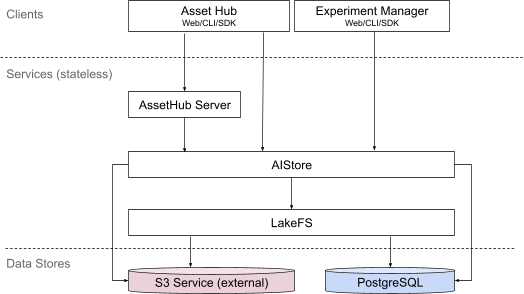

# AI data

TensorStack AI 平台的 AI-Data 功能由客户端、服务层、数据存储层构成。

**客户端**支持 Web UI 进行方便的交互式操作，并提供命令行和 Python SDK 以支持命令行终端及脚本中使用。

**服务层**采用方便支持水平扩展的无状态服务模式（stateless service），可根据需要支持不同服务容量和 HA 等级。服务层的子模块如下：

* Asset-Hub：用于存储数据集和模型；通过网页、命令行和 Python SDK 提供使用接口。
* Experiment-Manager：用于存储和分析训练过程的元数据（metadata）；通过网页、命令行和 Python SDK 提供使用接口。
* AIStore：作为 Asset Hub 和 Experiment Manager 的底层数据库，提供 AI 数据的版本管理等能力，对外提供 HTTP 接口；内部实现上，AIStore 将文件数据存储在 LakeFS 中，将文件权限、文件树等元数据存储在 <a target="_blank" rel="noopener noreferrer" href="https://www.postgresql.org/">PostgreSQL</a> 中。
* LakeFS：<a target="_blank" rel="noopener noreferrer" href="https://lakefs.io/">LakeFS</a> 是一个开源的对象存储服务，实现了 Git 风格的版本管理，对外提供 S3 接口；内部实现上，LakeFS 将对象数据存储在一个独立的外部 S3 服务中，将仓库、分支、提交、标签等元数据存储在 PostgreSQL 中。

数据存储层采用可水平扩展，并支持 HA 部署的 S3 对象存储（OSS）和 SQL 关系数据库（RDB） 中。

<figure class="architecture">
  
  <figcaption>图 1：TensorStack AI 平台的 AIData 层架构示意图。1）Asset Hub 和 Experiment Manager 均使用 AI Store 提供的数据存储 API，对外提供网页、命令行和 Python SDK；2）AIStore 实现了 AI 数据的版本管理等功能，对外提供 API 接口，内部实现上将数据和元数据分别存储在 LakeFS 和 PostgreSQL 中；3）LakeFS 是一个开源的对象存储服务，并实现了 Git 风格的版本管理，对外提供 S3 接口，内部实现上将数据和元数据分别存储在独立的外部 S3 服务和 PostgreSQL 中；4）Servcies 层的服务无状态，可方便的水平扩展以提高容量和支持 HA；5）Data Store 层中的存储服务可根据部署需求，提供容量扩展和 HA 支持</figcaption>
</figure>
