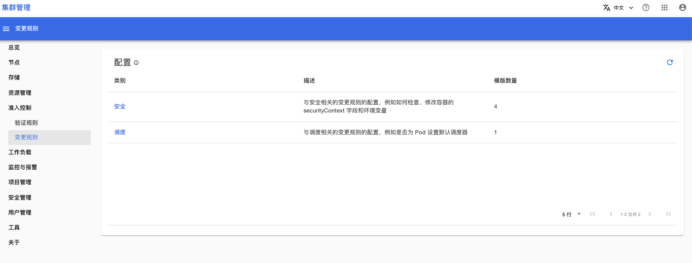
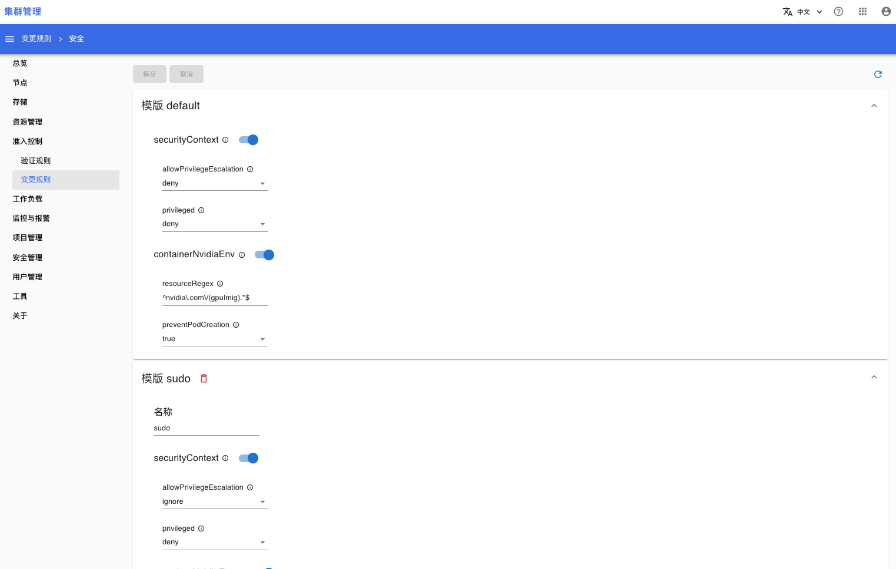
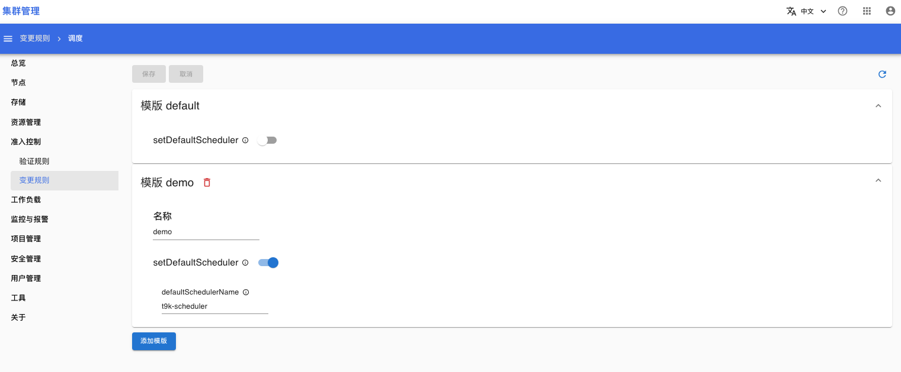

# 变更规则

打开**准入控制 > 变更规则**菜单，你可以查看、管理集群内所有的变更规则。

## 配置列表

下面是配置列表，集群中只有两种类型的配置：安全和调度。

<figure class="screenshot">
  
</figure>

## 安全配置

下面是安全配置页面，你可以增加、删除、修改安全配置模版。

<figure class="screenshot">
  
</figure>

## 调度配置

下面是调度配置页面，你可以增加、删除、修改调度配置模版。

<figure class="screenshot">
  
</figure>

## 配置应用

你可以在项目的详情设置项目的[变更规则](../project-management/index.md#变更规则)，来决定项目采用哪个变更规则策略。

## 参考

[变更规则配置](../../admission-control/mutation.md#规则配置)
