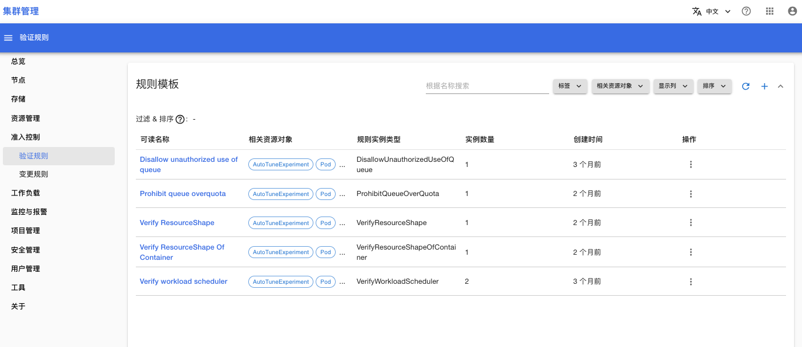
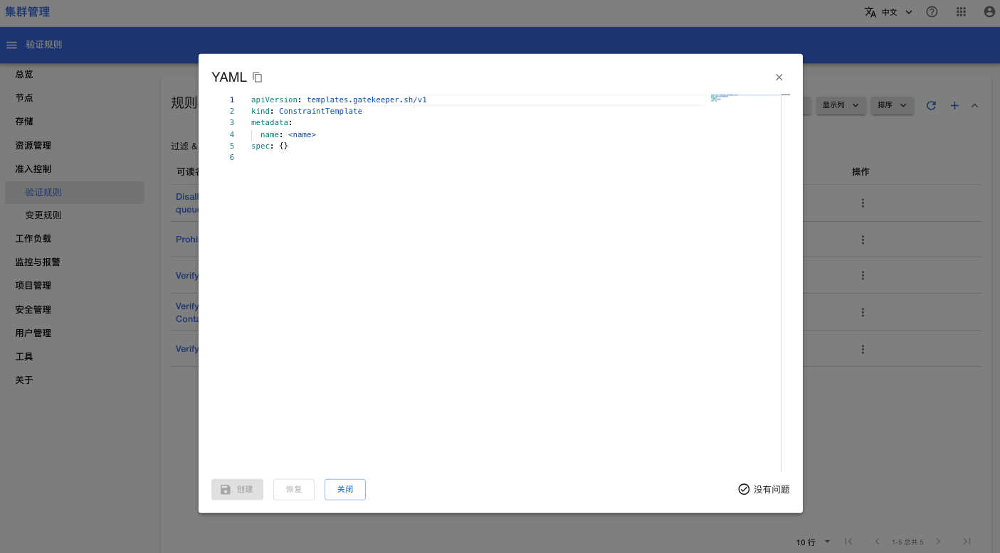
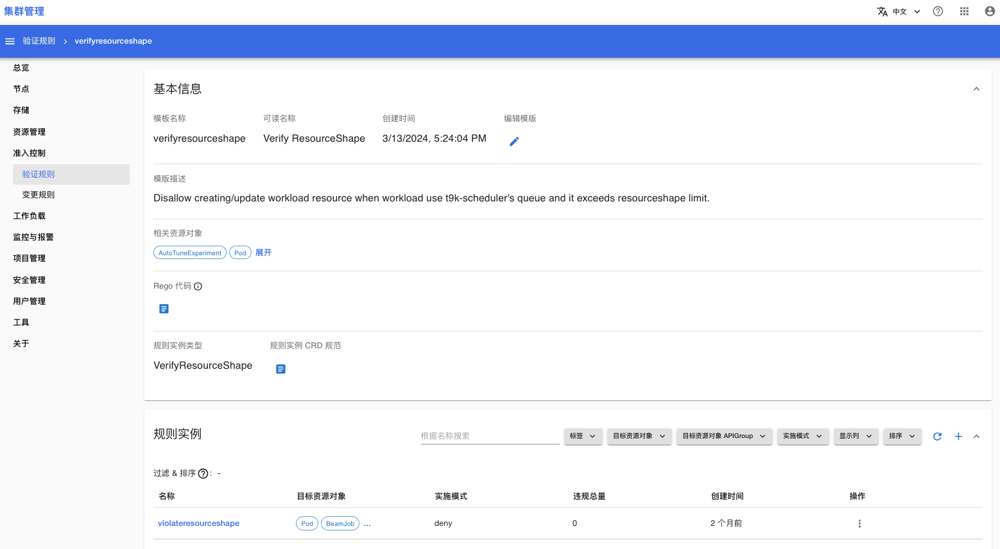
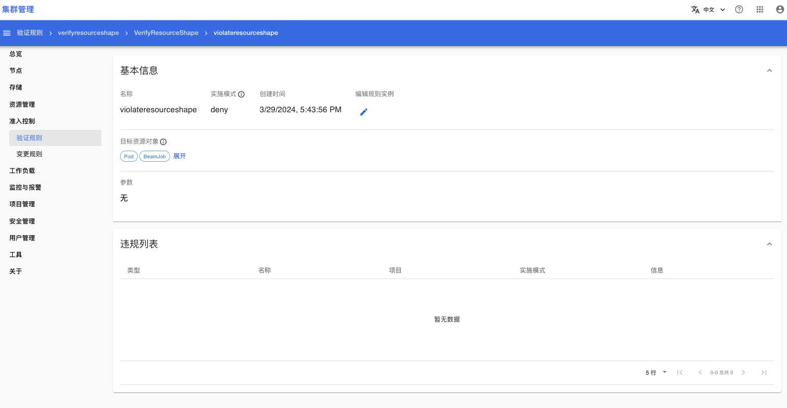

# 验证规则

打开**准入控制 > 验证规则**菜单，你可以查看、管理集群内所有的验证规则。

## 规则模版

下面是规则模版列表页面：

<figure class="screenshot">
  
</figure>

在规则模版列表页面，点击右上角按钮 **+** 可以创建新的规则模版。

<figure class="screenshot">
  
</figure>

在规则模版列表页面，点击规则模版名称可以进入规则模版的详情页面。详情页面包含两部分内容：
* 规则模版的基本信息
* 规则模版对应的规则实例列表

<figure class="screenshot">
  
</figure>

## 规则实例

在规则实例的列表中，点击右上角按钮 **+** 可以创建规则实例。

在规则实例的列表中，点击规则实例的名称可以进入规则实例的详情页面，详情页面包含两部分内容：
* 基本信息：记录实例的基本信息
* 违规列表：已经存在于集群中，并且违反这个规则实例的资源对象列表

<figure class="screenshot">
  
</figure>

## 参考

[验证规则](../../admission-control/validation.md)
