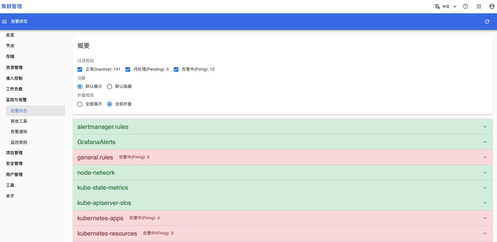
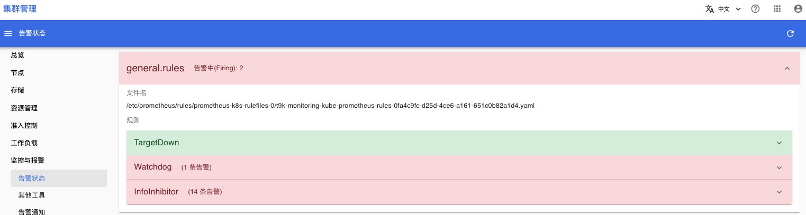
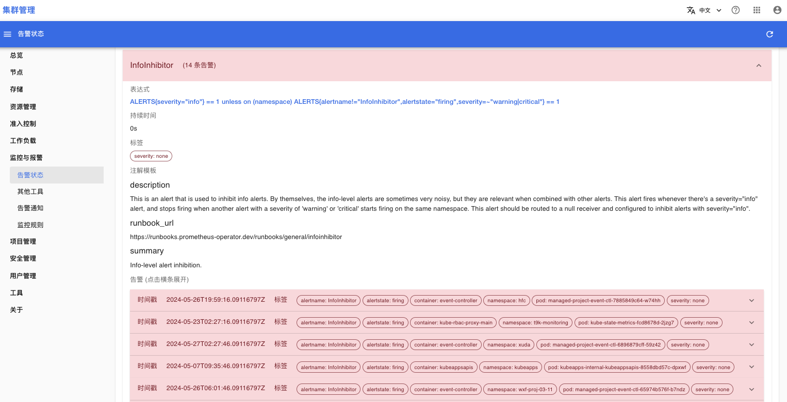

# 告警状态

打开**监控与报警 > 告警状态**菜单，你可以查看集群内所有的告警规则&告警信息，告警规则分为下列三种状态：
* 正常：表明对应的告警信息均为正常状态，显示为绿色。
* 待处理：表明系统产生了对应的告警信息，但持续时间较短，显示为黄色。
* 告警中：表明系统产生了对应的告警信息，并持续了较长时间，显示为红色。

下面是告警状态页面：

<figure class="screenshot">
  
</figure>

在告警状态页面中，一级菜单条目显示的是告警规则组的名称列表：
* alertmanager.rules：条目为绿色，表明这个组内定义的告警规则均为正常状态。
* general.rules：条目为红色，并且显示“告警中（Firing） 2”，表明这个组内有 2 条告警规则处于告警中状态。

展开告警规则组 general.rules，页面如下：

<figure class="screenshot">
  
</figure>

general.rules 中定义了 3 个告警规则：
* TargetDown：条目为绿色，告警规则为正常状态。
* Watchdog：条目为红色，告警规则处于告警中，有 1 条告警信息。
* InfoInhibitor：条目为红色，告警规则处于告警中，有 14 条告警信息。

展开告警规则 InfoInhibitor，页面如下：
<figure class="screenshot">
  
</figure>

通常情况下，你需要关注下列内容：
* 通过“注解模版”中的内容来确定该条告警规则的意义。
* “告警”下的列表显示了所有触发的告警信息，可以通过告警信息的标签确定该告警信息来源于集群中哪一个资源对象，展开告警信息条目可以查看更详细的内容。
