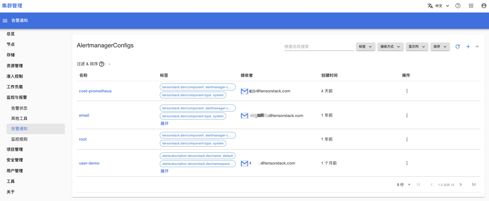
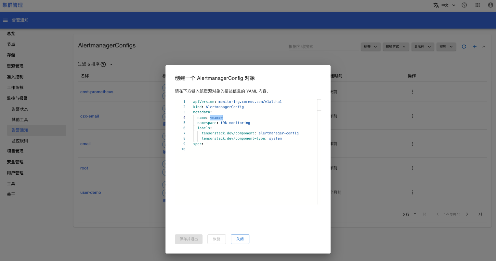
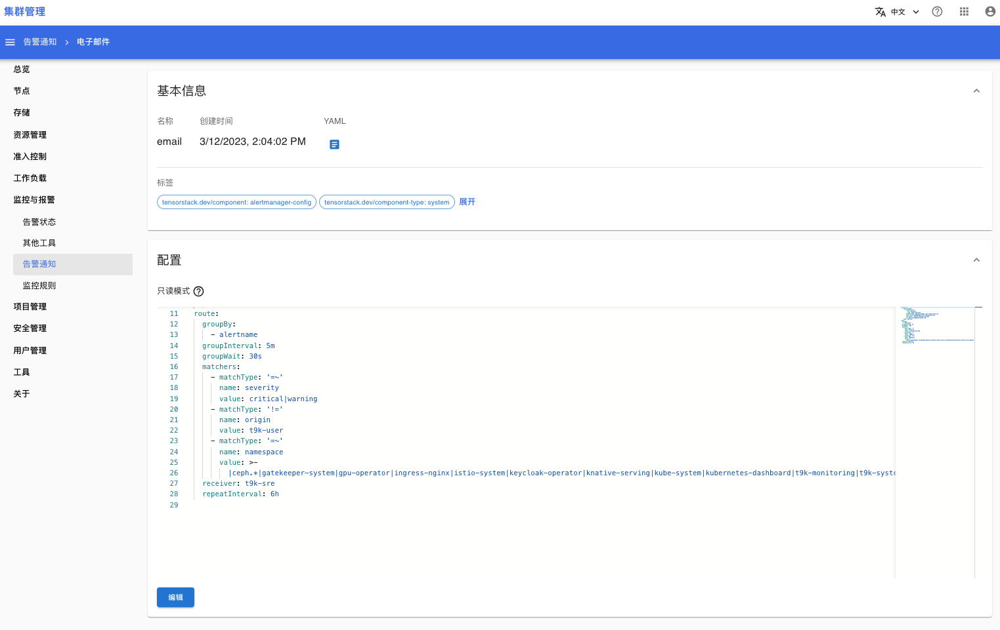

# 告警通知

在菜单**监控与报警 > 告警通知**下，你可以查看并设置 AlertmanagerConfig。AlertmanagerConfig 用于配置监控系统将指定的告警信息发送给指定的用户。

## 列表页面

点击菜单**监控与报警 > 告警通知**，可以打开 AlertmanagerConfigs 的列表页面：

<figure class="screenshot">
  
</figure>

<aside class="note">

注意

* 名称 root：root 是默认配置，用于定义系统发送告警信息的模版样式，不建议修改/删除。
* 名称前缀是 “user-”：这些配置是普通用户对告警信息的订阅，不建议修改/删除。

</aside>

点击右上角按钮 +，可以创建新的 AlertmangerConfig：

<figure class="screenshot">
  
</figure>

## 详情页面

在列表页面，点击 AlertmanagerConfig 的名称，可以进入详情页面:

<figure class="screenshot">
  
</figure>

## 参考

[配置告警通知](../../monitoring-and-log-system/sys-config.md#告警通知)
