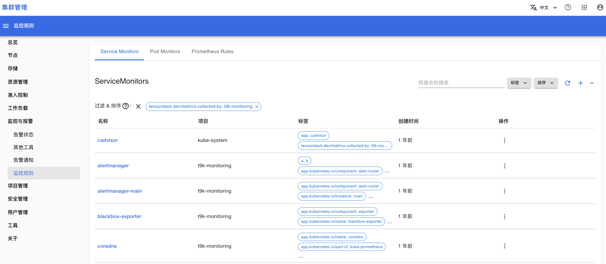
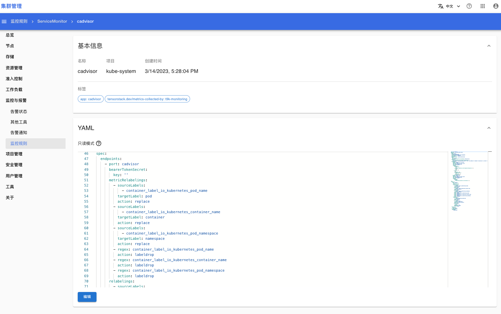
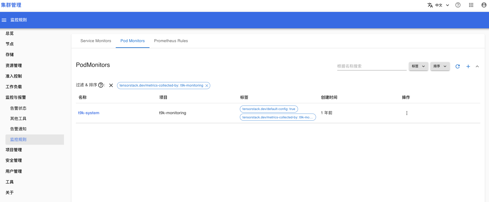
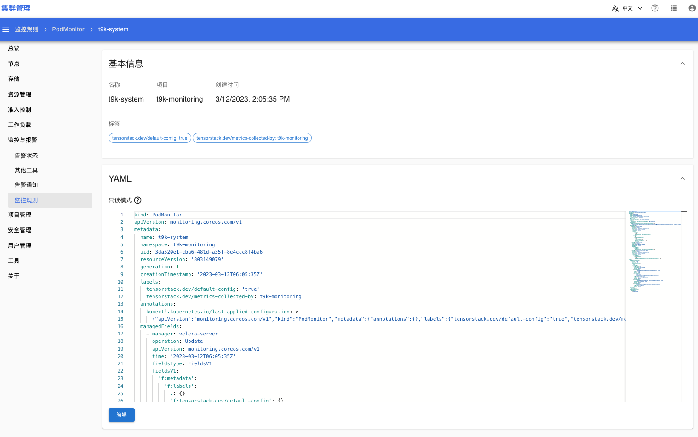
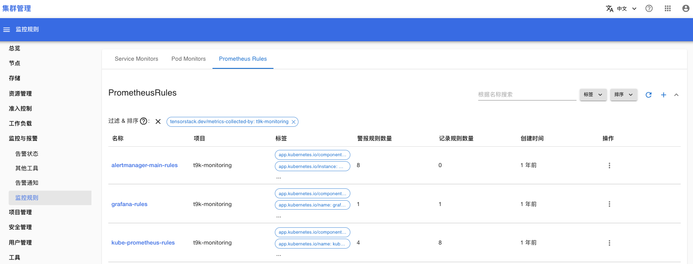
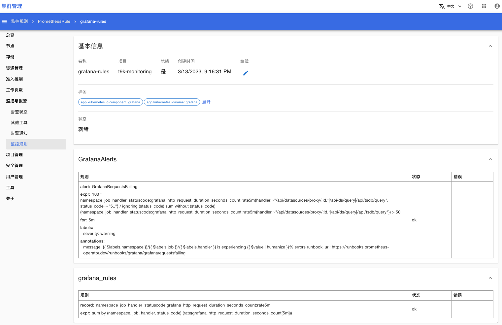

# 监控规则

在菜单**监控与报警 > 监控规则**，你可以设置下列内容：
1. ServiceMonitor：表明 Prometheus 可以从哪些 Service 收集监控数据。
2. PodMonitor：表明 Prometheus 可以从哪些 Pod 收集监控数据。
3. PrometheusRules：定义集群的告警规则和记录规则。
    1. 告警规则：当集群内状态满足告警规则时，Prometheus 会产生对应的告警信息。
    2. 记录规则：将 Prometheus 复杂的查询语句定义为一个简单的名称，例如：你可以将 `count(up==1)` 重新定义为 `count:up`，然后在 Prometheus 中查询 `count:up` 得到的结果与查询 `count (up == 1)` 得到的结果一样。

## ServiceMonitor

下面是 ServiceMonitor 的列表页面：

<figure class="screenshot">
  
</figure>

<aside class="note">

注意

ServiceMonitor 列表会显示集群内所有的 ServiceMonitor，如果你只想查看影响监控系统的 ServiceMonitor，你需要点击筛选按钮“标签”，选择 `"tensorstack.dev/metrics-collected-by": "t9k-monitoring"`，这样列表只会显示影响监控系统的 ServiceMonitor。

下文的 PodMonitor 列表和 PrometheusRules 列表同理。

</aside>

点击右上角的按钮 + 可以创建新的 ServiceMonitor。

点击 ServiceMonitor 名称可以进入详情页面，在详情页面可以查看/修改 ServiceMonitor 的定义：

<figure class="screenshot">
  
</figure>

## PodMonitor

下面是 PodMonitor 的列表页面：

<figure class="screenshot">
  
</figure>

点击右上角的按钮 + 可以创建新的 PodMonitor。

点击 PodMonitor 名称可以进入详情页面，在详情页面可以查看/修改 PodMonitor 的定义：

<figure class="screenshot">
  
</figure>

## PrometheusRules

下面是 PrometheusRules 的列表页面：

<figure class="screenshot">
  
</figure>

点击右上角的按钮 + 可以创建新的 PrometheusRule。

点击 PrometheusRule 名称可以进入详情页面，在详情页面可以查看/修改 PrometheusRule 的定义：

<figure class="screenshot">
  
</figure>

一个 PrometheusRules 中可以定义多个规则组，一个规则组中可以定义多个告警规则、记录规则。在上图中，PrometheusRule grafana-rules 定义了两个规则组：
1. 规则组名称 GrafanaAlerts: 规则组内定义了一条告警规则，告警信息名称是 GrafanaRequestsFailing。
2. 规则组名称 grafana_rules：规则组内定义了一条记录规则。

## 参考

* [配置监控目标](../../monitoring-and-log-system/sys-config.md#监控目标)
* [配置告警/记录规则](../../monitoring-and-log-system/sys-config.md#告警记录规则)
