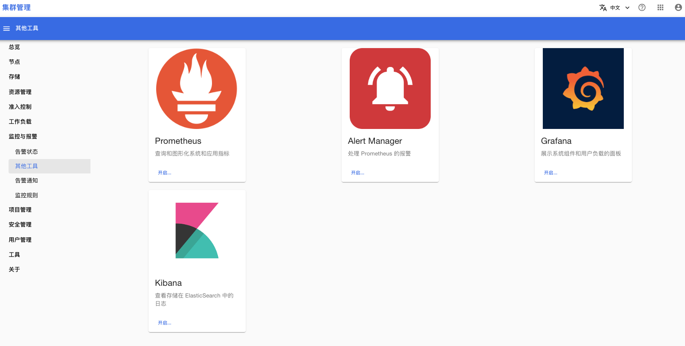

# 其他工具

系统提供了下列监控工具供给管理员直接使用：
* Prometheus：
    * 描述：Prometheus 是监控系统的核心，他负责收集及保存集群服务的各种指标数据，并根据告警规则产生告警信息。
    * 作用：管理员可以通过 Prometheus UI 查询监控数据、查看 Prometheus 配置等等。
* Alertmanager：
    * 描述：Alertmanager 负责将告警信息发送给运维人员。
    * 作用：管理员可以通过 Alertmanager UI 查询已产生的告警信息、查看 Alertmanager 配置、禁止告警信息的通知等等。
* Grafana：
    * 描述：Grafana 用于将 Prometheus 收集到的监控数据进行可视化展示。
    * 作用：管理员可以在 Grafana UI 查看 Dashboards、自定义 Dashboards 来展示关注的监控数据。
* Kibana：
    * 描述：Kibana 用于查询 Elasticsearch 中存储的数据。 
    * 作用：管理员可以在 Kibana UI 检索 Elasticsearch 存储的日志数据。

<figure class="screenshot">
  
</figure>

## 下一步

查看下列工具的用户文档：
* [Prometheus](https://prometheus.io/docs/introduction/overview/)
* [Alertmanager](https://prometheus.io/docs/alerting/latest/alertmanager/)
* [Grafana](https://grafana.com/docs/grafana/latest/)
* [Kibana](https://www.elastic.co/guide/en/kibana/7.17/get-started.html)
