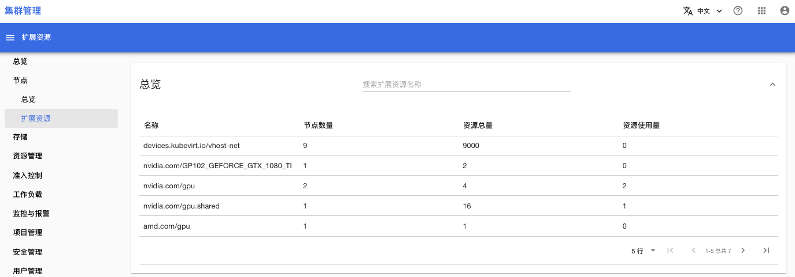
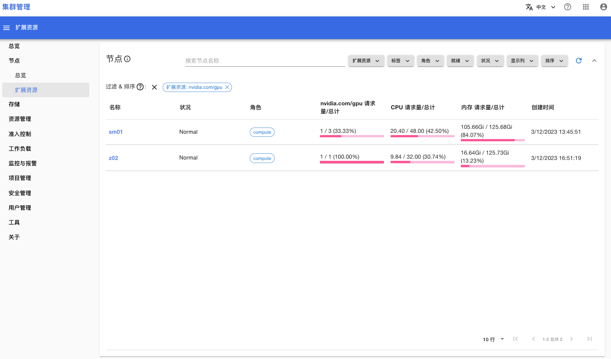
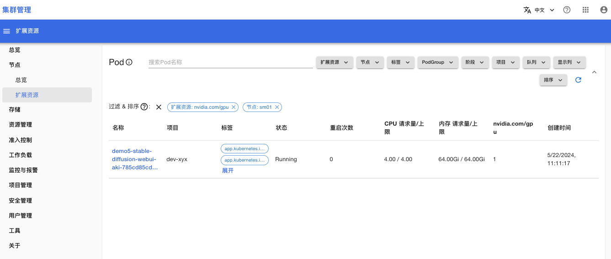

# 扩展资源

在**节点 > 扩展资源**菜单，你可以查看集群中所有扩展资源的使用情况。

## 总览

总览部分列举了集群内所有的扩展资源，并展示下列内容：
* 含有扩展资源的节点数量
* 扩展资源的资源总量
* 已分配的资源量

<figure class="screenshot">
  
</figure>

## 节点

在节点列表部分：
1. 先选择一个扩展资源名称
2. 然后节点列表会显示所有含有该扩展资源的节点

<figure class="screenshot">
  
</figure>

## Pod

在 Pod 列表部分：
1. 你需要先选择一个扩展资源名称和一个节点名称
2. 然后 Pod 列表会显示所有使用上述扩展资源的 Pods，这些 Pods 运行在上述节点上

<figure class="screenshot">
  
</figure>
