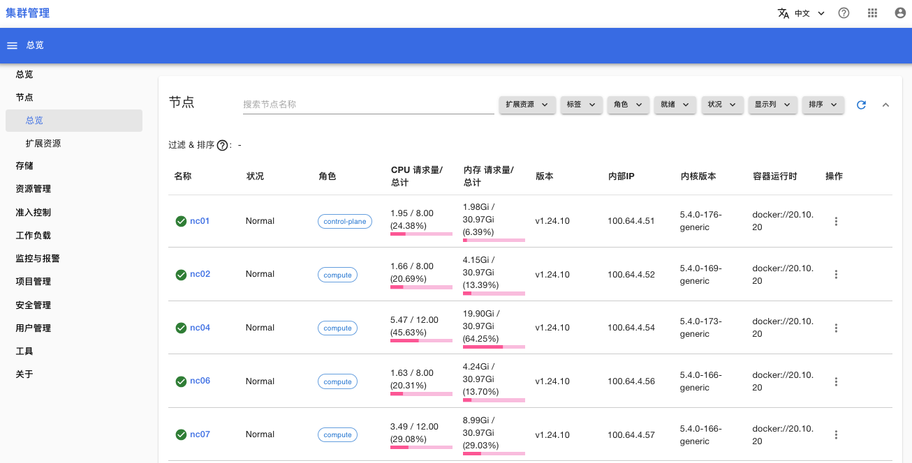
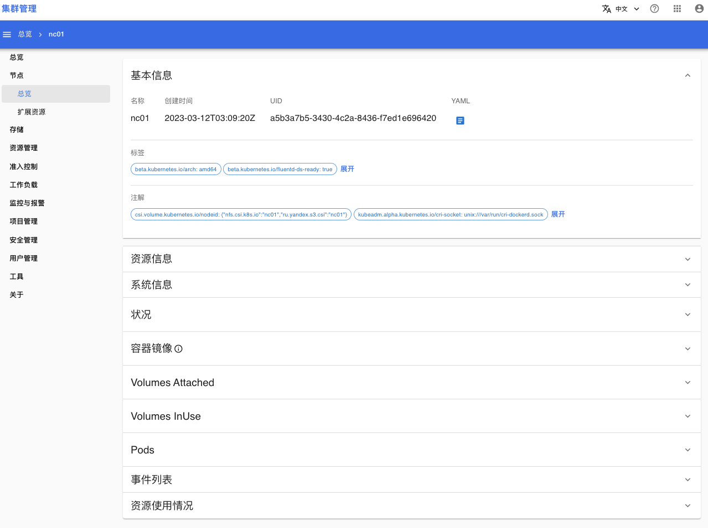

# 总览

在**节点 > 总览**菜单，你可以查看集群内所有的节点列表，以及节点的详细信息。

## 节点列表

打开菜单**节点 > 总览**，进入节点列表页面。

<figure class="screenshot">
  
</figure>

在节点列表页面，你可以进行下列操作：
1. 查看所有节点的基本信息：名称、状况、角色等
2. 通过列表的筛选器来筛选节点
3. 通过“显示列”来控制列表显示哪些列
4. 通过“排序”来控制列表中显示的节点顺序

## 节点详情

在节点列表页面，点击节点名称可以进入节点详情页面。

<figure class="screenshot">
  
</figure>

在节点详情页面，你可以查看节点的下列信息：
1. 基本信息：节点的基本信息，包括节点 YAML
2. 资源信息：网络资源信息、节点污点
3. 系统信息：节点系统架构、操作系统版本、K8s 版本等
4. 状况：节点 YAML 的 status.conditions
5. 容器镜像：节点上已下载的容器镜像
6. Volumes Attached：挂载到节点的 volume
7. Volumes InUse：节点上正在被使用的 volume
8. Pods：运行在节点上的 Pods 列表
9. 事件列表：与节点相关的集群事件
10. 资源使用情况：折线图展示节点资源使用情况
