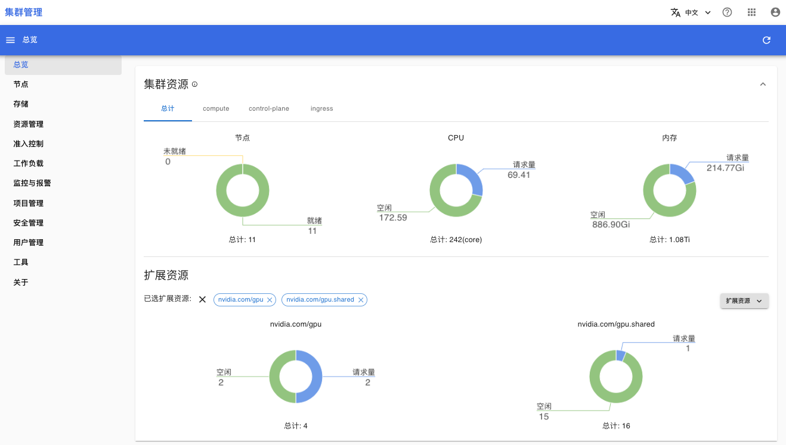
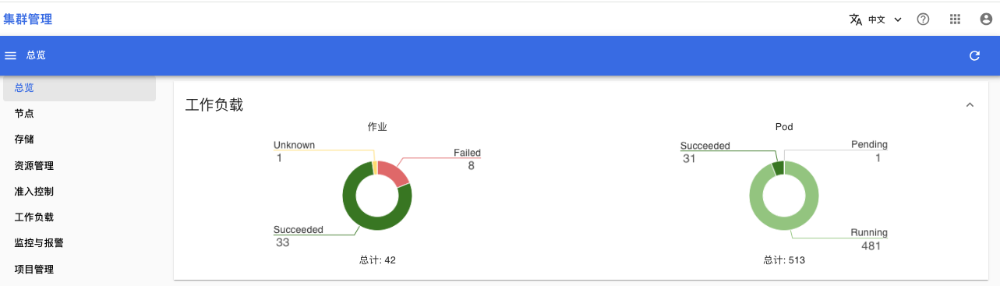
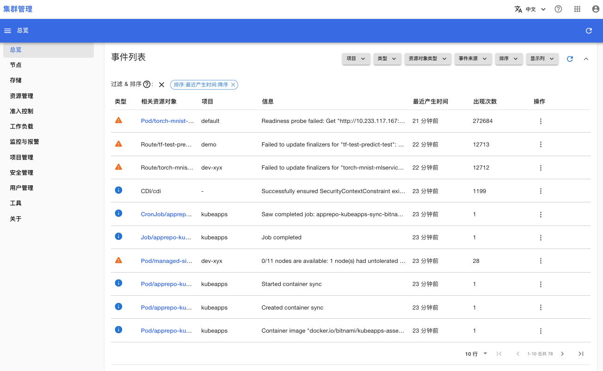

# 总览

点击菜单**总览**，进入总览页面。

## 集群资源

查看下列集群资源的情况：
1. 节点基本情况
2. CPU 资源量
3. 内存资源量
4. 扩展资源量：你需要先选择想要查看的扩展资源名称。上述示例显示了扩展资源 `nvidia.com/gpu` 和 `nvidia.com/gpu.shared` 的资源量。

<figure class="screenshot">
  
</figure>

## 工作负载

查看集群中存在的 T9k Jobs 和 Pod 的数量。

<figure class="screenshot">
  
</figure>

## 事件

查看集群内所有的事件。通过事件列表的筛选器，可以筛选出感兴趣的事件，例如：筛选项目 demo 中产生的类型是 Warning 的事件。

<figure class="screenshot">
  
</figure>
