# 项目管理

集群管理员可以在菜单**项目管理**中，增加/删除项目、设置项目的属性、设置项目的管理员和成员。

## 项目

### 项目列表
点击菜单**项目管理 > 项目**，可以进入项目列表页面。

<figure class="screenshot">
  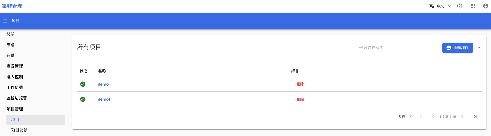
</figure>

### 创建项目
点击右上角“创建项目”按钮，可以创建一个新的项目。创建项目必须填写项目名称和项目管理员。

<figure class="screenshot">
  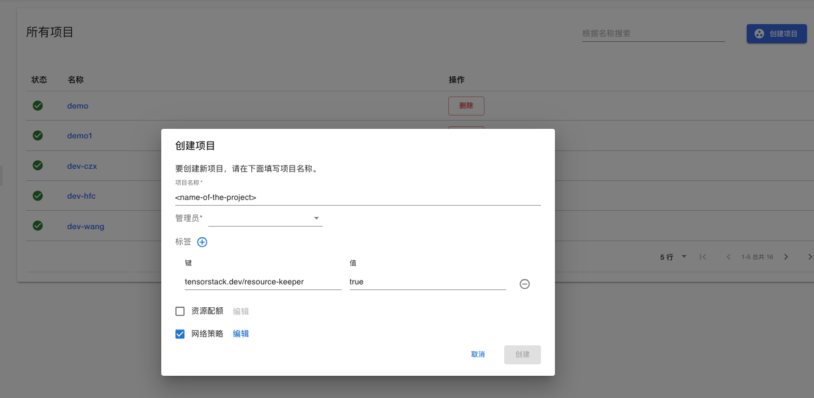
</figure>

### 项目详情
在项目列表页面，点击某个项目名称，可以进入项目详情页面：

<figure class="screenshot">
  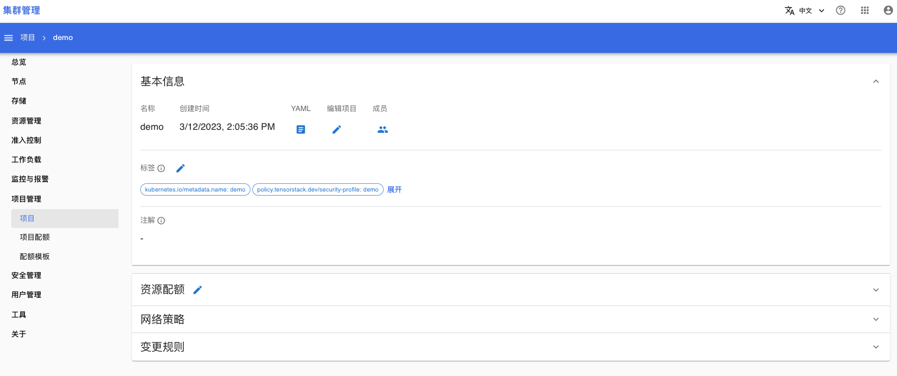
</figure>

在项目的详情页面，你可以设置项目的下列属性：

#### 管理员和成员
点击“基本信息 > 成员”下的按钮，可以查看项目的管理员和成员：

<figure class="screenshot">
  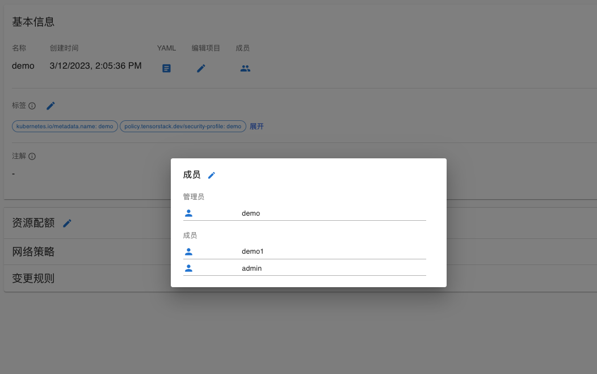
</figure>

点击成员右边的编辑按钮，可以编辑管理员和成员：

<figure class="screenshot">
  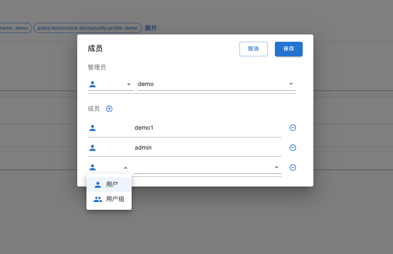
</figure>

#### 资源配额
资源配额用于限制项目中可使用的计算资源（CPU, Memory, GPU, 存储等）上限。

<figure class="screenshot">
  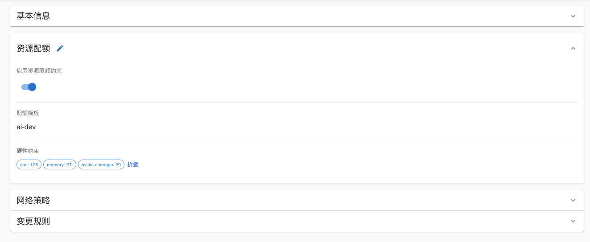
</figure>

点击“启用资源限额约束”下的开关，可以控制是否启用该项目的资源配额。

点击“资源配额”右侧编辑按钮，可以修改资源配额。有两种修改修改资源配额的方式：
1. 选择一个配额模版，项目用采用配额模版中定义的资源配额
    <figure class="screenshot">
       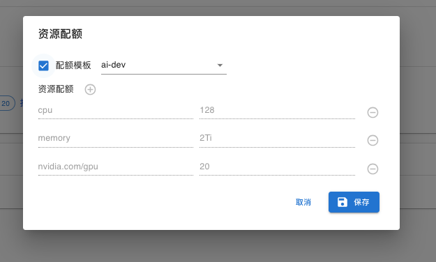
    </figure>
2. 自定义资源配额
    <figure class="screenshot">
       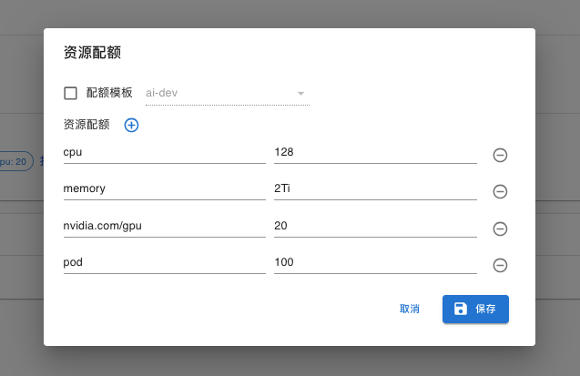
    </figure>

#### 网络策略

通过网络策略，你可以基于命名空间、标签、IP 地址、端口等信息来设置如何允许 Pod 与网络上的各类网络实体通信，包括：
* 出口方向（egress）：Pod 可以访问哪些出站连接。
* 入口方向（ingress）：哪些入站连接可以访问 Pod。

<figure class="screenshot">
  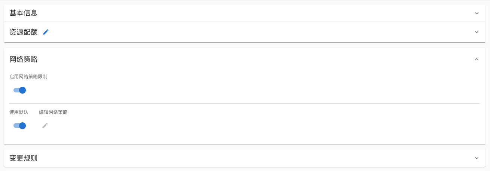
</figure>

点击“启用网络策略限额”下的开关，可以控制是否启用该项目的网络策略限制。启用网络策略后，系统会在项目中创建一个与项目名称同名的 [NetworkPolicy](https://kubernetes.io/zh-cn/docs/concepts/services-networking/network-policies/#networkpolicy-resource)，来定义项目的网络策略。例如：项目 demo 启用网络策略后，系统会在项目 demo 中创建一个名为 demo 的 NetworkPolicy。

点击“使用默认”下的开关按钮，可以控制是否使用默认的网络策略限制。当使用默认的网络策略时，你无法编辑网络策略。下面的 YAML展示了命名空间 demo 的默认网络策略：
* 出口（egress）方向：不做限制；
* 入口（ingress）方向：仅允许来自系统命名空间（t9k-system、kube-system、istio-system、t9k-monitoring、knative-serving）以及该项目 demo 自身的网络请求。

```yaml
spec:
 podSelector: {}
 ingress:
   - from:
       - namespaceSelector:
           matchLabels:
             kubernetes.io/metadata.name: t9k-system
       - namespaceSelector:
           matchLabels:
             kubernetes.io/metadata.name: kube-system
       - namespaceSelector:
           matchLabels:
             kubernetes.io/metadata.name: istio-system
       - namespaceSelector:
           matchLabels:
             kubernetes.io/metadata.name: t9k-monitoring
       - namespaceSelector:
           matchLabels:
             kubernetes.io/metadata.name: knative-serving
       - namespaceSelector:
           matchLabels:
             kubernetes.io/metadata.name: demo
 policyTypes:
   - Ingress
```

关闭“使用默认”的开关后，你可以点击“编辑网络策略”下的编辑按钮，从而自定义网络策略：

<figure class="screenshot">
  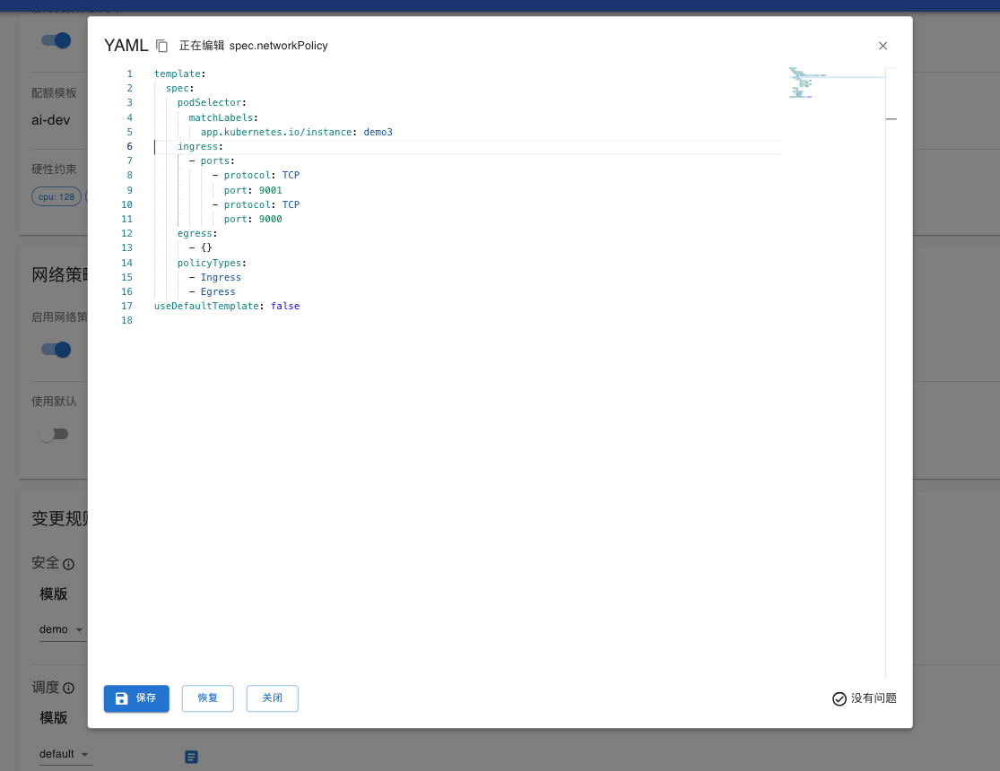
</figure>

#### 变更规则
[变更规则](../admission-control/mutation.md)用于管理变更控制器的行为，你可以在项目的详情页面设置、查看安全配置和调度配置的模版。

<figure class="screenshot">
  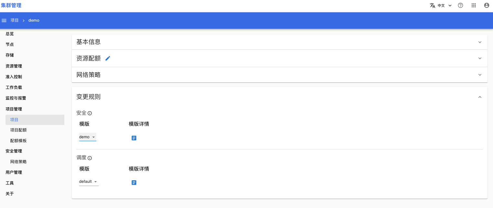
</figure>

## 项目配额
打开菜单**项目管理 > 项目配额**，你可以查看所有项目设置的资源配额列表：

<figure class="screenshot">
  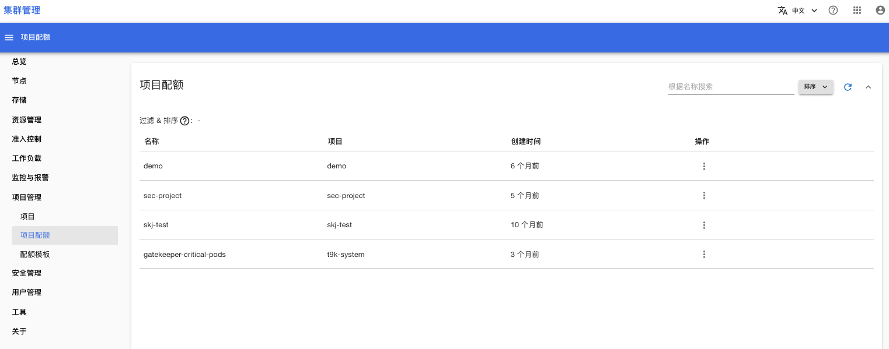
</figure>

点击操作下的按钮，可以查看资源配额的 YAML：

<figure class="screenshot">
  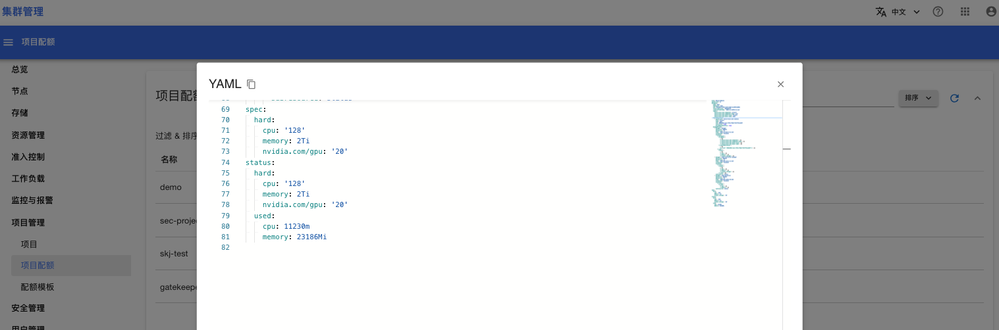
</figure>

## 配额模版

配额模版用于简化项目的资源配额设置。管理员先定义配额模版，然后在设置项目的资源配额时，选择一个配额模版，即可完成项目的资源配额设置。

打开菜单**项目管理 > 配额模版**，可以查看配额模版的列表页面：

<figure class="screenshot">
  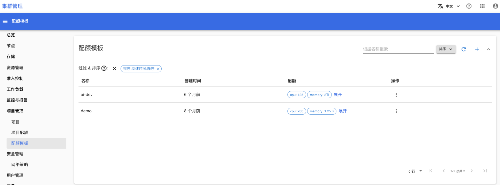
</figure>

点击右上角的按钮 +，可以创建新的配额模版。

选择一个配额模版，点击他对应的操作按钮，可以删除或编辑该模版：

<figure class="screenshot">
  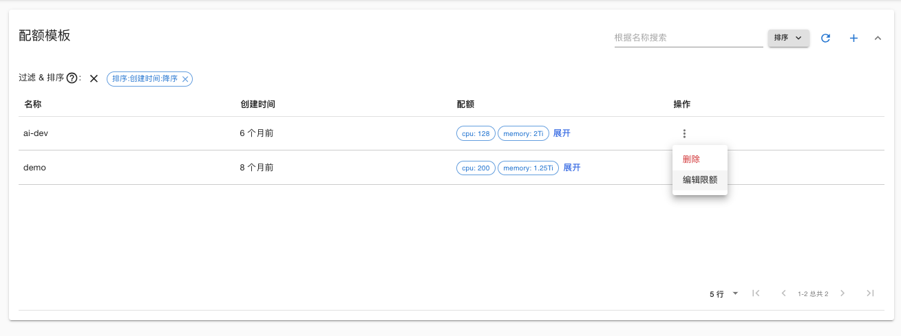
</figure>

点击编辑限额，可以查看/编辑配额模版的限额：

<figure class="screenshot">
  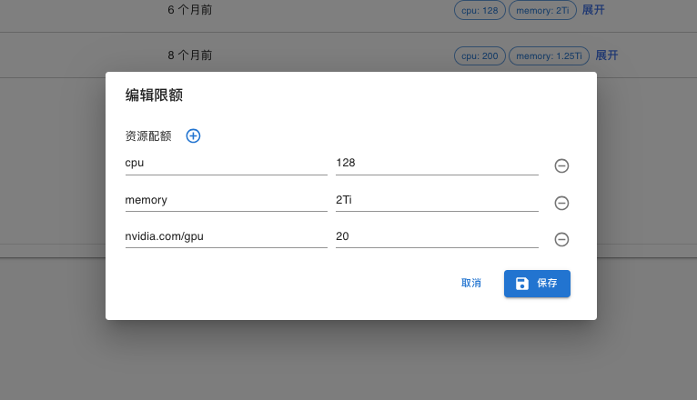
</figure>

## 下一步

详细了解：
* [资源配额](https://kubernetes.io/zh-cn/docs/concepts/policy/resource-quotas/)
* [网络策略](https://kubernetes.io/zh-cn/docs/concepts/services-networking/network-policies/) 
