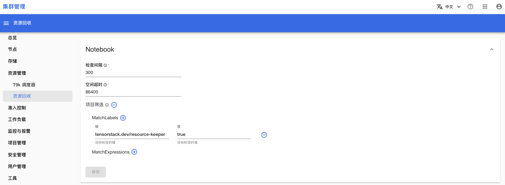
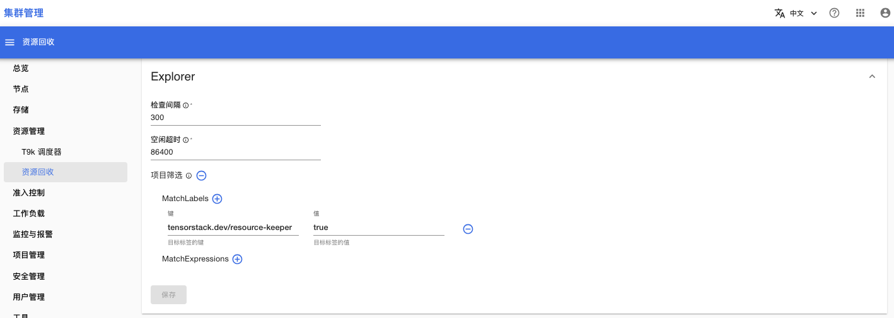
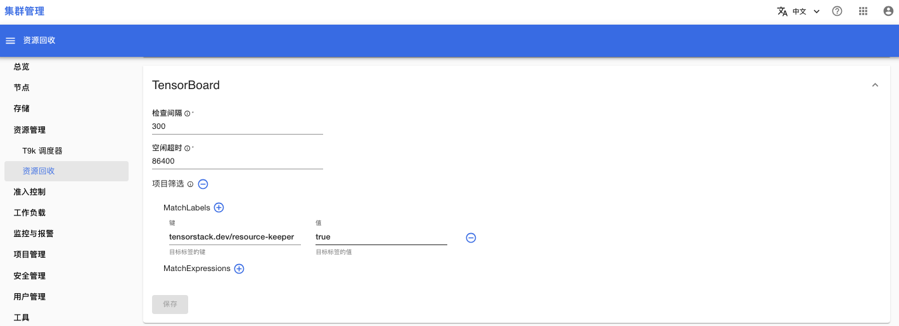

# 资源回收

点击菜单**资源管理 > 资源回收**，你可以查看、修改针对 Notebook、Explorer、Tensorboard 的资源回收配置。

<figure class="screenshot">
  
</figure>

<figure class="screenshot">
  
</figure>

<figure class="screenshot">
  
</figure>

## 参考

[资源回收文档](../../resource-management/resource-keeper.md)
