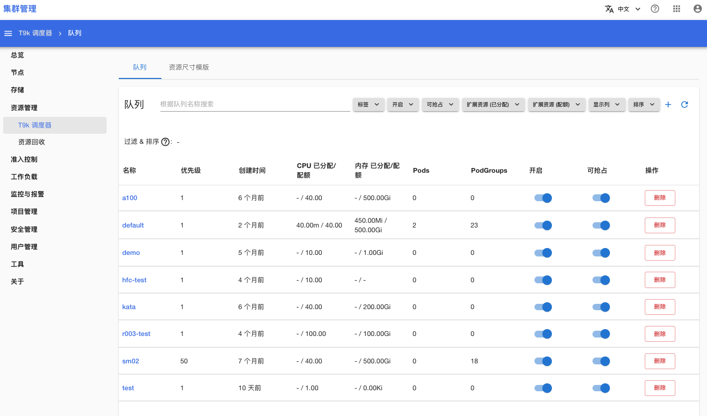
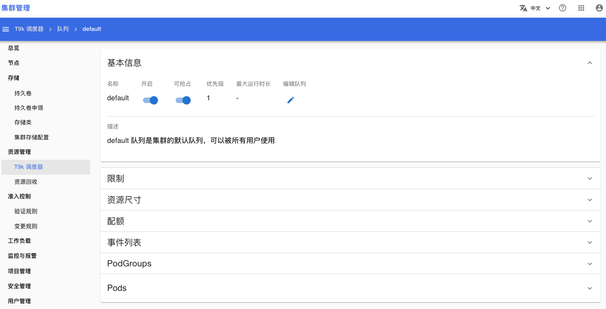
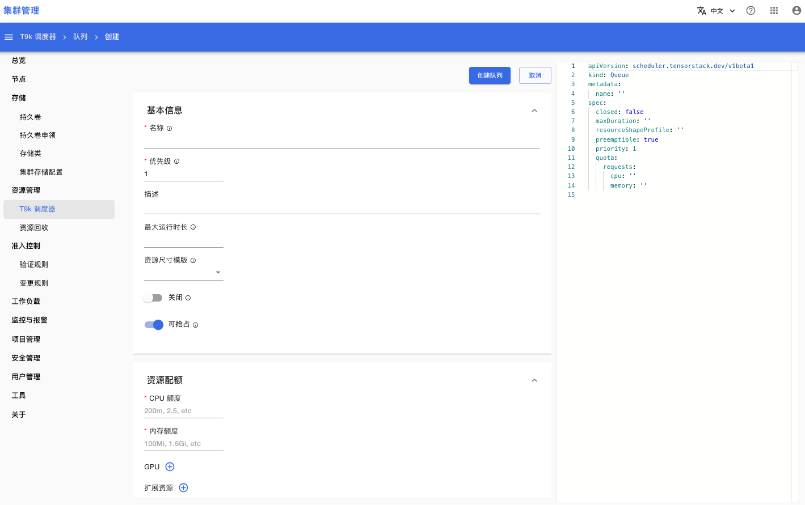
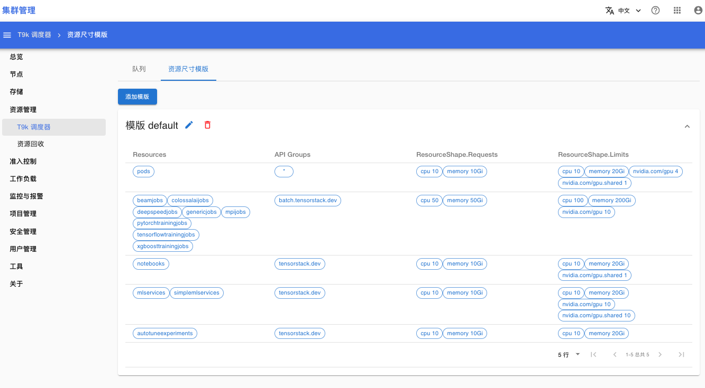

# T9k 调度器

打开菜单**资源管理 > T9k 调度器**，你可以查看、管理 T9k 调度器的[队列](../../resource-management/queue.md)。

## 队列

下面是队列的列表页面

<figure class="screenshot">
  
</figure>

在队列列表页面，点击一个队列的名称，可以进入该队列的详情页面（如下图所示），你可以查看、修改[队列的属性](../../resource-management/queue.md#设置-queue-的属性)：
* 基本信息：显示队列的基本信息，点击队列编辑按钮可以修改队列的 YAML
* 限制：代表队列的使用权限，可以设置哪些用户/用户组/项目有权限使用该队列。
* 资源尺寸：可以查看/修改队列采用的[资源尺寸模版](#资源尺寸模版)
* 配额：显示队列的资源配额，以及资源使用量
* 事件列表：显示与当前队列相关的事件
* PodGroups：显示属于当前队列的 PodGroups 列表
* Pods：显示使用了当前队列的 Pods 列表

<figure class="screenshot">
  
</figure>

在队列列表页面，点击右上角的按钮 + 可以进入创建队列的页面

<figure class="screenshot">
  
</figure>

## 资源尺寸模版

在资源尺寸模版页面，你可以添加新的模版、修改模版、删除模版。

<aside class="note info">

注意

删除模版会导致使用当前模版的队列的资源尺寸限制失效。

</aside>

<figure class="screenshot">
  
</figure>

## 参考

[T9k 调度器](../../resource-management/t9k-scheduler.md)
