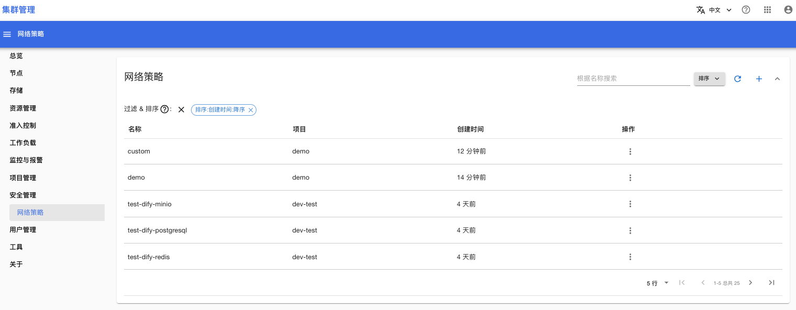
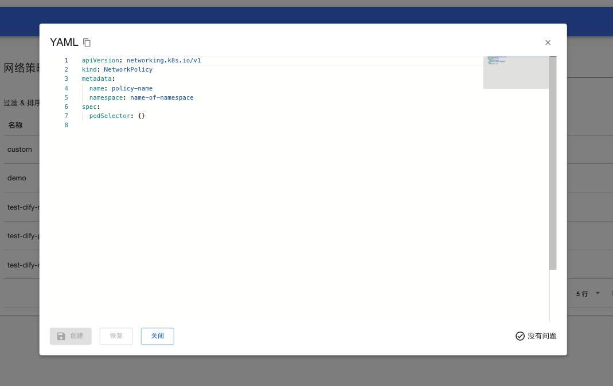
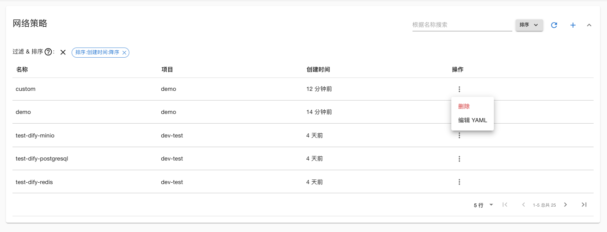
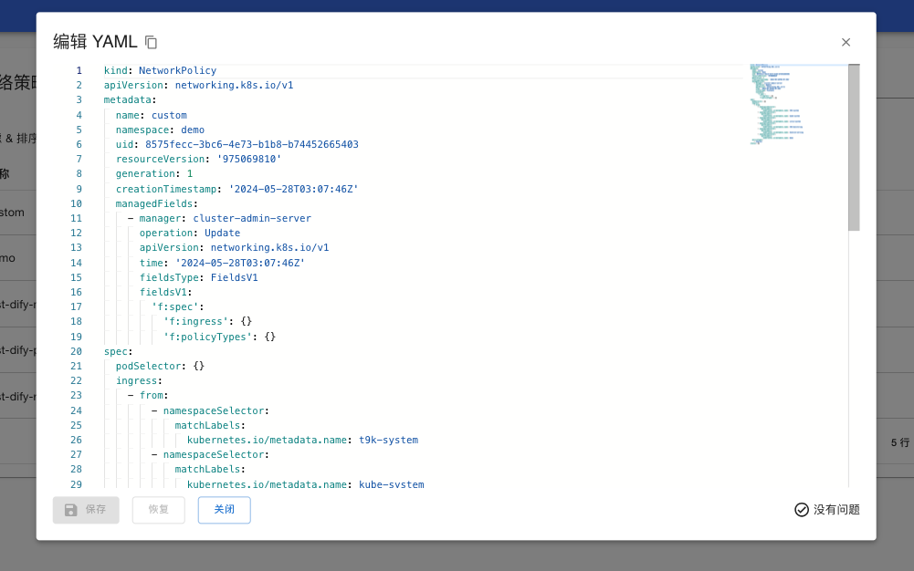

# 网络策略

网络策略可以限制 Pod 能够通信的实体，包括出口方向（egress）和入口方向（ingress）的网络通信。此功能通过创建 [Kubernetes Network Policy](https://kubernetes.io/zh-cn/docs/concepts/services-networking/network-policies/#networkpolicy-resource) 资源实现。

打开菜单**安全管理 > 网络策略**，可以查看到所有项目中所有的 NetworkPolicy 列表。以项目 demo 为例，项目中有两个 NetworkPolicy：
* 名称为 demo 的 NetworkPolicy 是在[项目管理](../project-management/index.md#网络策略)中设置的
* 名称为 custom 的 NetworkPolicy 是管理员自己创建的

<figure class="screenshot">
  
</figure>

点击列表右上角的按钮 + 可以创建新的 NetworkPolicy：

<figure class="screenshot">
  
</figure>

点击列表中的操作按钮，可以删除或编辑 NetworkPolicy：

<figure class="screenshot">
  
</figure>

点击“操作 > 编辑 YAML”，可以查看/编辑 NetworkPolicy 内容：

<figure class="screenshot">
  
</figure>

## 参考

[网络策略](https://kubernetes.io/zh-cn/docs/concepts/services-networking/network-policies/)
