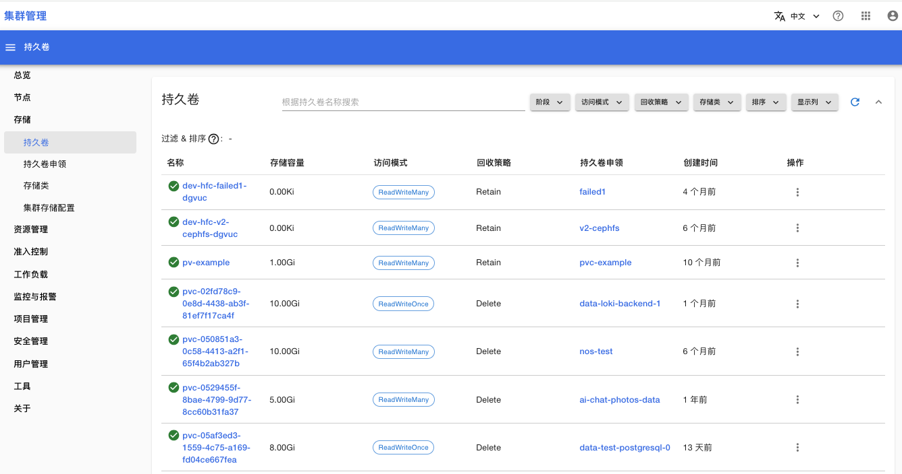
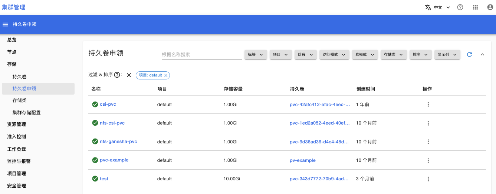
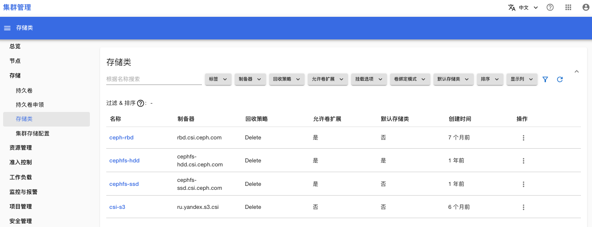
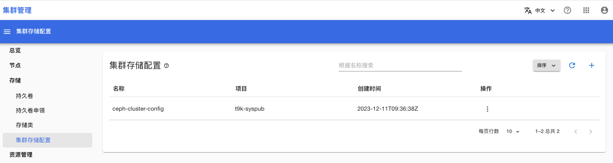

# 存储

在**存储**菜单下，你可以查看与存储相关的内容。

## 持久卷

查询集群内存在所有持久卷

<figure class="screenshot">
  
</figure>

## 持久卷申领

查询集群内存在所有持久卷申领

<figure class="screenshot">
  
</figure>

## 存储类

查询所有的存储类

<figure class="screenshot">
  
</figure>

## 集群存储配置

查询所有的存储配置：
* 集群存储配置存有 ceph 的一些基本信息，用于提供给 [StorageShim CephFS 类型](https://t9k.github.io/user-manuals/latest/modules/storage/storageshim.html#cephfs-%E7%B1%BB%E5%9E%8B)使用
* 项目 t9k-syspub 下的集群存储配置可以供给所有用户使用。

<figure class="screenshot">
  
</figure>

## 参考

[K8s 文档 — 持久卷](https://kubernetes.io/zh-cn/docs/concepts/storage/persistent-volumes/)

