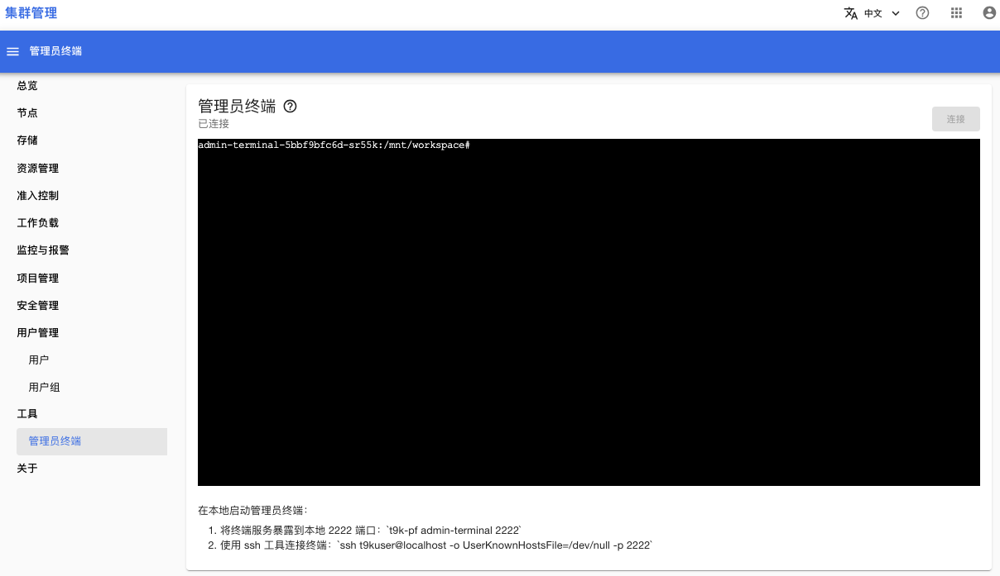
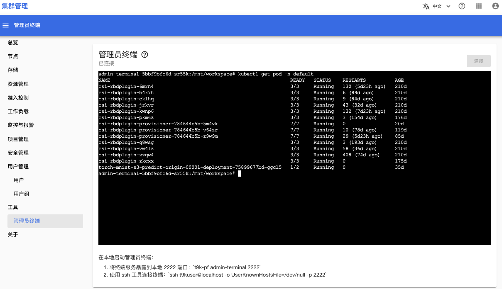

# 管理员终端

Tensorstack 系统在集群内部署了一个管理员终端 Pod，打开菜单**工具 > 管理员终端**就可以连接到这个管理员终端中：

<figure class="screenshot">
  
</figure>

管理员终端中安装了 kubectl，你可以通过 kubectl 与 K8s 集群交互，例如：查看命名空间 default 下所有的 Pod

<figure class="screenshot">
  
</figure>
