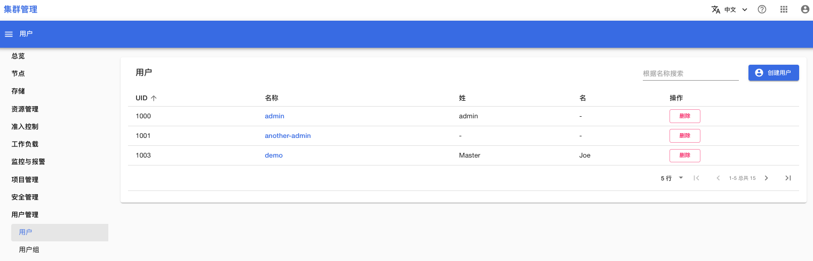
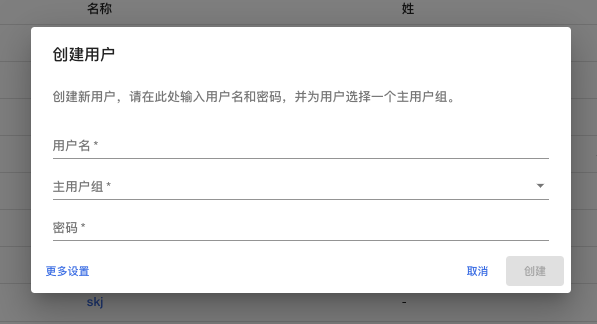
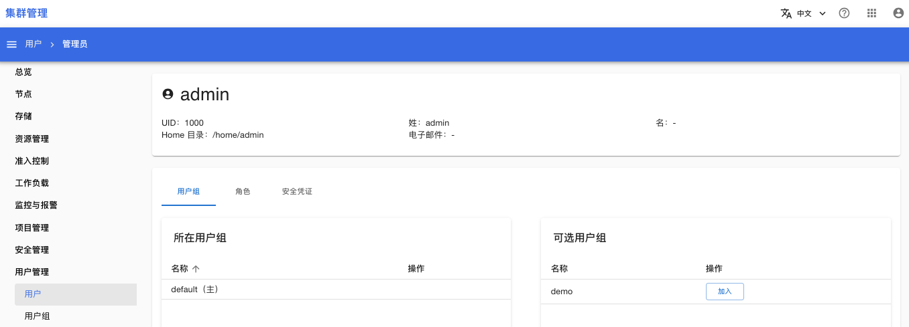
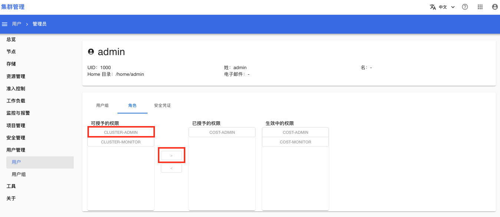
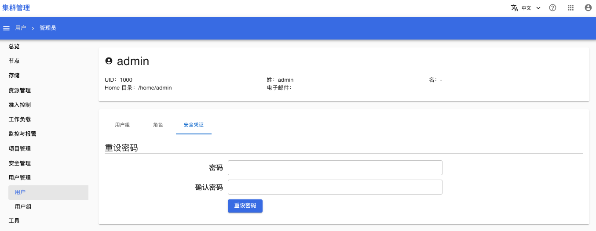
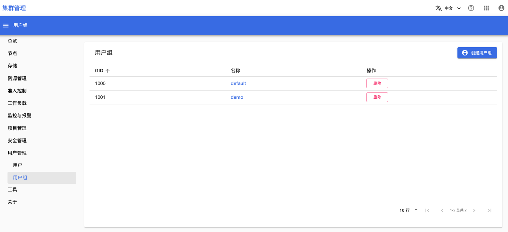
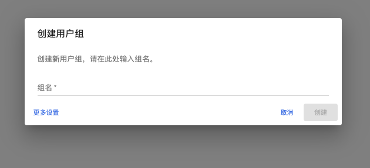
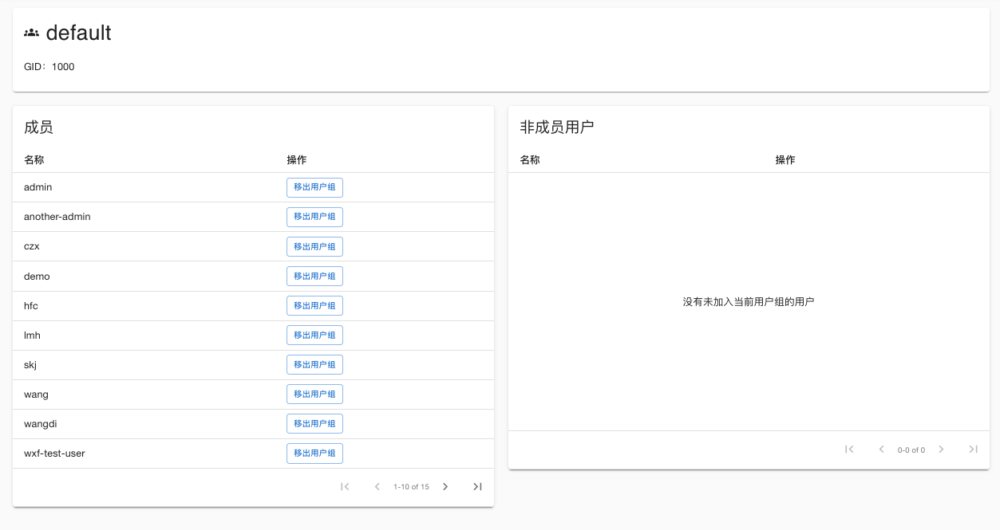

# 用户管理

在菜单**用户管理**中，可以管理 Tensorstack AI 计算平台的用户和用户组。

## 用户

### 用户列表

打开菜单**用户管理 > 用户**，可以看见用户列表：

<figure class="screenshot">
  
</figure>

### 创建用户

点击列表右上角的“创建用户”按钮，可以创建新的用户。创建用户时必须填写用户名、主用户组、密码。在平台中，一个用户必须属于一个主用户组，并且可以属于多个其他用户组。

<figure class="screenshot">
  
</figure>

### 用户详情

在用户列表，点击一个用户名称，可以进入该用户的详情页面。你可以查看/设置用户的：
* 用户组
* 角色：可以为用户设置一些角色，从而授予用户这些角色的权限。
* 安全凭证：可以重置用户的密码。

下面是设置用户组的页面：

<figure class="screenshot">
  
</figure>

下面是设置角色的页面：选择角色名称，然后点击 >，即可授予权限。

<figure class="screenshot">
  
</figure>

可供选择的角色有：
* cluster-admin：平台的管理员，拥有最高权限。cluster-admin 权限包含 cluster-monitor。
* cluster-monitor：平台的监控管理员，拥有查看平台整体运行情况的权限。
* cost-admin：计费系统的管理员，拥有查看各个项目费用、编辑资源价格的权限。cost-admin 权限包含 cost-monitor。
* cost-monitor：计费系统的监控管理员，拥有查看各个项目费用的权限。

下面是设置安全凭证的页面，可以重新设置用户的密码（注：无需原密码）：

<figure class="screenshot">
  
</figure>

## 用户组

### 用户组列表

打开菜单**用户管理 > 用户组**，可以看见用户组列表：

<figure class="screenshot">
  
</figure>

### 创建用户组

在用户组列表，点击右上角的“创建用户组”按钮，可以创建新的用户组：

<figure class="screenshot">
  
</figure>

### 用户组详情

在用户组列表，点击用户组名称，可以进入用户组详情页面：

<figure class="screenshot">
  
</figure>

<aside class="note info">

注意

当用户组是成员的主用户组时，无法将成员移出用户组。

</aside>