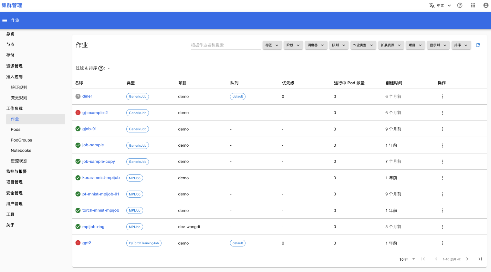
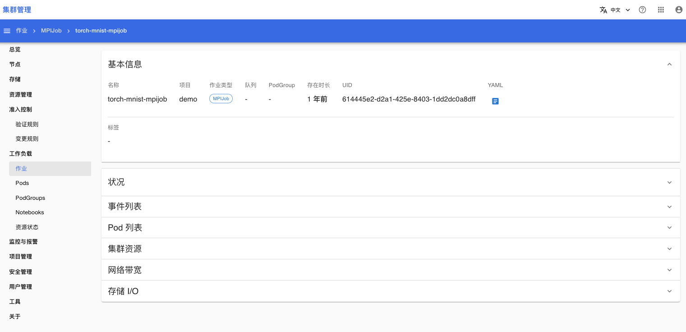
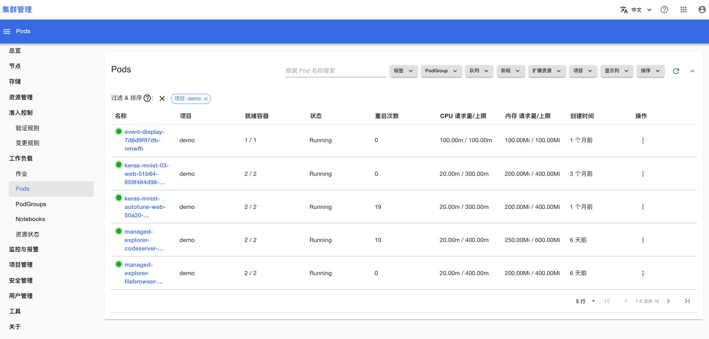
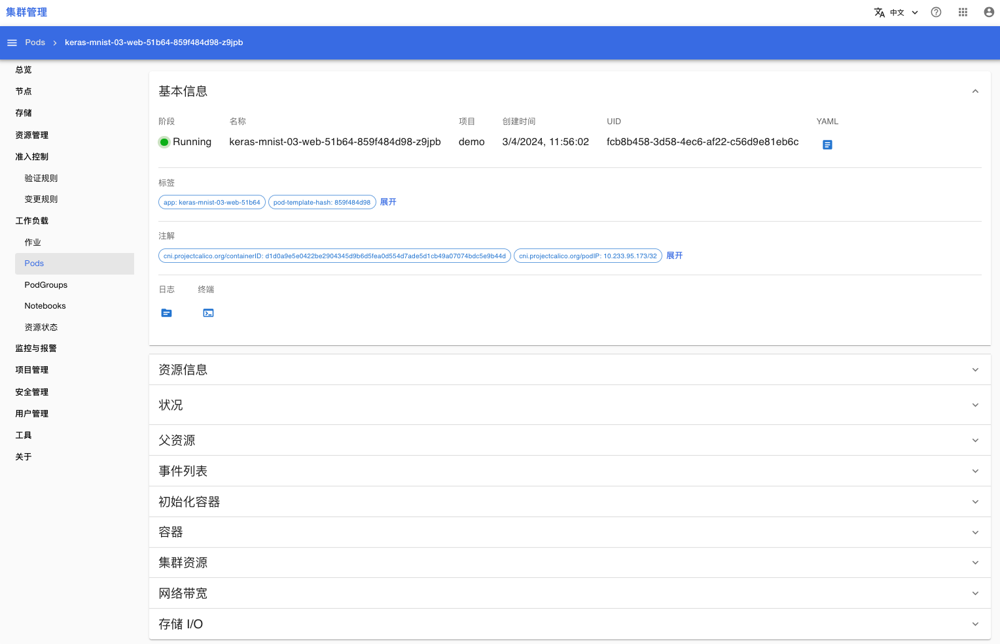
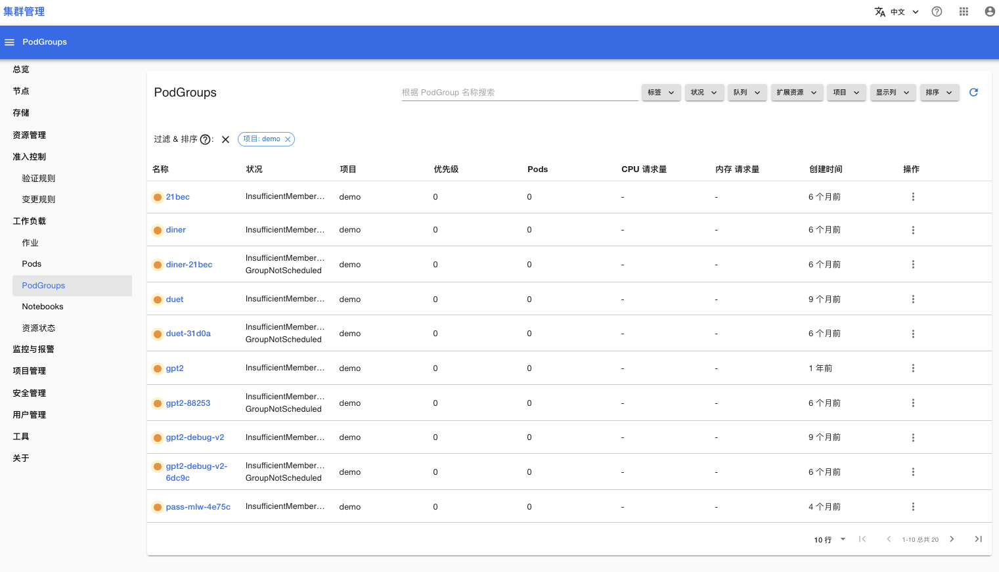
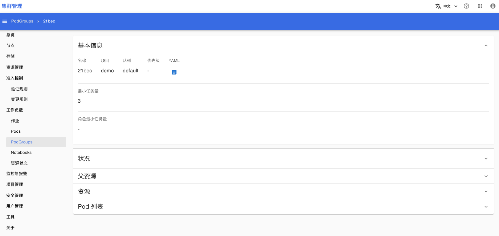
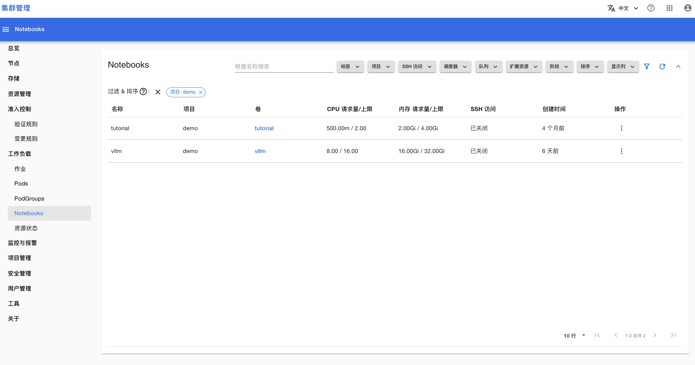

# 工作负载列表

在**工作负载**菜单下，你可以查看下列类型工作负载的基本状态。

## 作业

打开菜单**工作负载 > 作业**，进入作业列表页面：

<figure class="screenshot">
  
</figure>

点击作业名称，可以查看作业的详情页面：

<figure class="screenshot">
  
</figure>

## Pods

打开菜单**工作负载 > Pods**，可以查看 Pods 列表：

<figure class="screenshot">
  
</figure>

点击 Pod 名称，可以查看 Pod 的详情页面：

<figure class="screenshot">
  
</figure>

## PodGroups

打开菜单**工作负载 > PodGroups**，可以查看 PodGroups 列表：

<figure class="screenshot">
  
</figure>

点击 PodGroup 名称，可以查看 PodGroup 的详情页面：

<figure class="screenshot">
  
</figure>

## Notebooks

打开菜单**工作负载 > Notebooks**，可以查看 Notebooks 列表：

<figure class="screenshot">
  
</figure>
