# 计费系统

## 整体架构

TensorStack AI 平台的计费系统由以下部分组成：

* Account Console：普通用户可以在此查看自己管理的项目产生的费用。
* Cost Web：管理员可以在此查看集群中所有项目产生的费用。
* Cost Server：根据资源价格和资源使用量计算费用，并从资源种类、日期、项目、用户等不同粒度进行细分统计。
* PostgreSQL：用于存储费用统计信息的数据库。
* Prometheus：一个开源的监控系统和时间序列数据库，用于存储集群中每个容器随时间变化而变化的资源使用量。

<figure class="architecture">
  
  <figcaption>图 1：TensorStack AI 平台的计费系统架构示意图。1）普通用户在 Account Console 查看自己管理的项目产生的费用，管理员在 Cost Web 查看集群中所有项目产生的费用；2）Cost Server 获取资源使用量、资源价格以及集群中所有容器的相关信息，据此计算费用，并存储到 PostgreSQL 数据库中；3）Prometheus 负责从一些底层组件中收集资源使用情况；4）资源价格存储在一个 ConfigMap 中，管理员可以修改资源价格，普通用户可以查看资源价格</figcaption>
</figure>

## 费用计算

以如下 Pod 为例：

<details><summary><code class="hljs">workload.yaml</code></summary>

```yaml
apiVersion: v1
kind: PersistentVolumeClaim
metadata:
  name: data
spec:
  accessModes:
  - ReadWriteMany
  resources:
    requests:
      storage: 10Gi
---
apiVersion: v1
kind: Pod
metadata:
  name: serving
spec:
  containers:
    - name: serving
      image: <some-sesrving-image>
      resources:
        limits:
          cpu: 4
          memory: 4Gi
          nvidia.com/gpu: 4
        requests:
          cpu: 1
          memory: 1Gi
          nvidia.com/gpu: 4
      volumeMounts:
        - mountPath: /data
          name: datadir
  volumes:
    - name: datadir
      persistentVolumeClaim:
        claimName: data
```

</details>


该 Pod 使用了下列资源：

* CPU：申请量为 1，最大限制量为 4
* 内存：申请量为 1GiB，最大限制量为 4GiB
* GPU：申请量为 4，最大限制量为 4
* PVC：容量为 10GiB
* 网络：包括下行流量（ingress，其他服务访问该 Pod）和上行流量（egress，该 Pod 访问其他服务）

该 Pod 在某个时间窗口内产生的费用计算方式如下：

* CPU：**费用 = 单价 * 平均使用量 * 时长**，其中：
    * **单价**：由管理员设置，单位是元/核心/小时
    * **平均使用量**：**平均使用量**通过取**申请量**和**实际使用量**的较大值，并在时间窗口内平均得到。例如，该 Pod 的**申请量**为 1 CPU，但是有一半时间由于访问该 Pod 的客户端较少，**实际使用量**只有 0.1 CPU，另一半时间由于访问该 Pod 的客户端较多，**实际使用量**达到 2 CPU，那么，**平均使用量**为 (max(1, 0.1) + max(1, 2)) / 2 = 1.5。这样做的原因是，调度器是根据 Pod 的**申请量**来分配一个拥有足够计算资源的节点，因此 Pod 至少会占用节点上**申请量**大小的资源，并且可以使用超过**申请量**（但不超过**最大限制量**）的资源，因此计费系统取**申请量**和**实际使用量**的较大值来进行费用计算。
    * **时长**：即时间窗口的大小，单位是小时
* 内存：**费用 = 单价 * 平均使用量 * 时长**，其中：
    * **单价**：由管理员设置，单位是元/GiB/小时
    * **平均使用量**：**平均使用量**通过取**申请量**和**实际使用量**的较大值，并在时间窗口内平均得到。例如，该 Pod 的**申请量**为 1 GiB，但是有一半时间由于访问该 Pod 的客户端较少，**实际使用量**只有 0.1 GiB，另一半时间由于访问该 Pod 的客户端较多，**实际使用量**达到 2 GiB，那么，**平均使用量**为 (max(1, 0.1) + max(1, 2)) / 2 = 1.5 GiB
    * **时长**：即时间窗口的大小，单位是小时
* GPU：**费用 = 单价 * 申请量 * 时长**，其中：
    * **单价**：由管理员设置，单位是元/个/小时
    * **申请量**：与 CPU、内存不同，GPU 的**申请量**、**最大限制量**必须相等。因此 Pod 总是占用节点上**申请量**大小的 GPU 资源，计费系统直接根据**申请量**来进行费用计算即可。
    * 时长：即时间窗口的大小，单位是小时
* PVC：**费用 = 单价 * 申请量 * 时长**，其中：
    * **单价**：由管理员设置，单位是元/GiB/小时
    * **申请量**：即 PVC 的大小，单位是 GiB。例如，该 Pod 的 PVC **申请量**为 10GiB
    * **时长**：即时间窗口的大小，单位是小时
* 网络：**费用 = 单价 * 使用量**，其中：
    * **单价**：由管理员设置，单位是元/GiB，下行流量和上行流量可以有不同的单价
    * **使用量**：即该时间窗口内的累计流量，下行流量和上行流量分别单独计算
