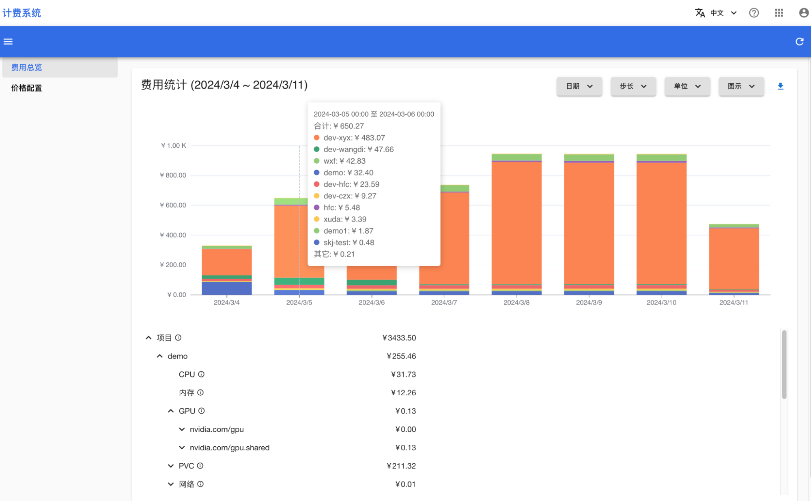
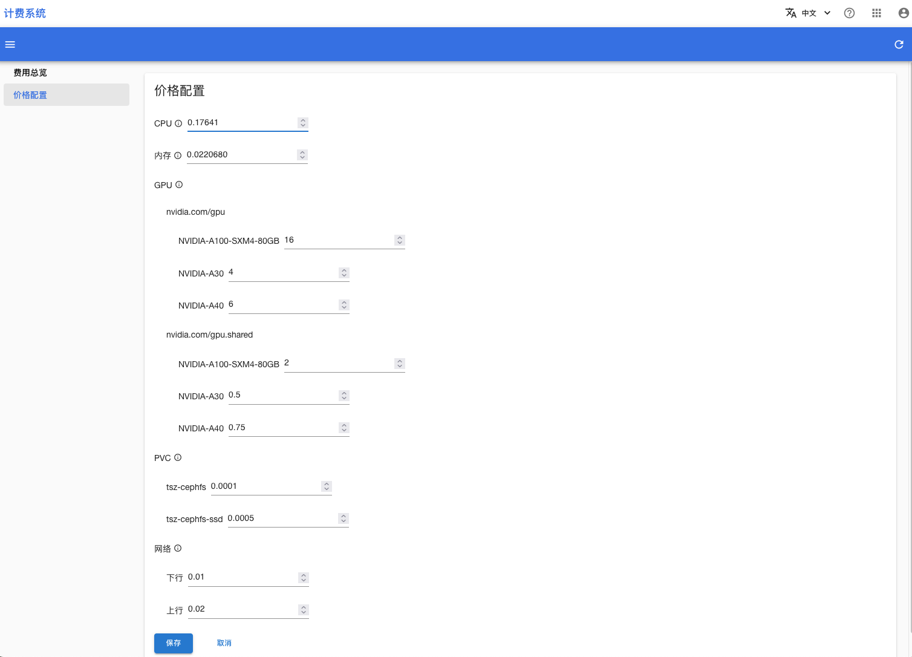
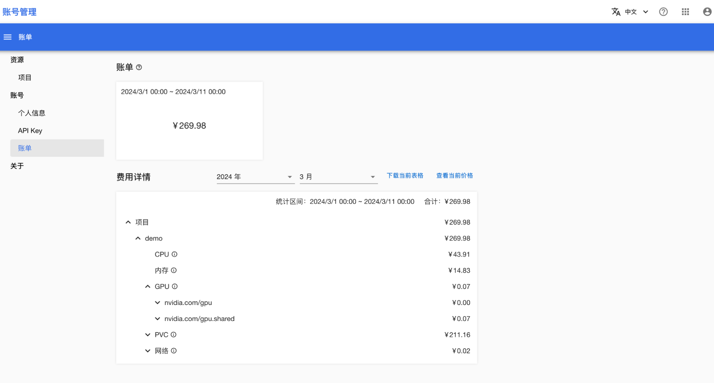

# 查看费用和价格

## 管理员

进入计费系统控制台，在左侧导航菜单中点击**费用总览**进入费用详情页面：

<figure class="screenshot">
  
</figure>

默认会展示最近 7 天内的费用使用情况，其中：

* 上方的图示展示了每一天每个项目的总费用
* 下方的表格展示了 7 天内每个项目使用每种资源（包括 CPU、内存、GPU、PVC、网络）的费用

另外，您还可以通过图示右上方的选择框选择多种不同的展示方式：

* **日期选择框**：可选择最近 24 小时、最近 7 天、本月至今或任意有效时间范围。30 天以内的数据可精确到小时，30 天以前的数据可精确到天。
* **步长选择框**：可选择一小时、一天、一周、一月、一年或全部时间，表示在**日期选择框**选择的时间窗口基础上，每隔一段时间小结一次费用。
* **单位选择框**：可选择按项目统计或按用户统计。按项目统计表示展示每个项目的费用；按用户统计表示将每个项目的费用归结于项目管理员，然后展示每个用户所管理的所有项目的费用。
* **图示选择框**：可选择柱状图、饼状图、矩形树状图。

在左侧导航菜单中点**价格配置**进入价格详情页面：

<figure class="screenshot">
  
</figure>

管理员可以在此查看、修改每种资源的价格。

<aside class="note">

注意

修改价格只会影响后续的计费，之前使用的资源仍然按照原价格计算。

</aside>

## 个人用户

进入账号管理控制台，在左侧导航菜单中点击**账号 > 账单**进入账单详情页面：

<figure class="screenshot">
  
</figure>

每个用户都可以在此查看其管理的每个项目每个月使用每种资源产生的费用，并且可以下载费用表格、查看资源价格。
