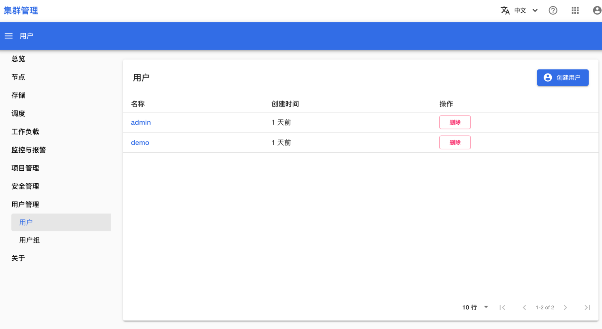

# 安装产品

T9k 产品安装分为以下三个阶段：

1. Pre-Install
1. Install
1. Post-Install

## 前提条件

执行安装命令的环境要求：

| 条件 | 说明                                                                                                     |
| ---- | -------------------------------------------------------------------------------------------------------- |
| 软件 | 安装了以下软件，建议的版本如下：<ul><li>kubectl，v1.25.9</li><li>helm，v3.9.0</li></ul>                  |
| 网络 | <ul><li>可以使用 kubectl 访问 K8s 集群</li><li>能够访问存放安装包的网络服务，以下载 Helm chart</li></ul> |

网络联通要求：

* “执行安装命令” 的环境应当能够通过网络访问 “K8s 集群”。
* “K8s 集群” 应当能够访问安装过程中使用的容器镜像服务（一般在公网上，可支持本地 mirror）。
* “执行安装命令” 的环境应当能够访问存放安装包的网络服务（一般在公网上，可支持本地 mirror）。
* T9k 产品使用者应当能够访问 “K8s 集群” 上部署的服务。

## Pre-Install

### 域名相关设置

准备可用域名、设置域名解析、获得域名证书。

### 域名

域名：用户应当以合适的途径获得域名，并正确配置其解析。下文假设用户选择使用 DNS sample.t9kcloud.cn 部署产品，各个具体的模块的子 DNS 如下表。

| 域名                         | 说明                                |
| ---------------------------- | ----------------------------------- |
| `home.sample.t9kcloud.cn`    | 平台主入口                          |
| `auth.sample.t9kcloud.cn`    | 安全系统                            |
| `lakefs.sample.t9kcloud.cn`  | AI 资产和实验管理服务的 S3 接口地址 |
| `\*.ksvc.sample.t9kcloud.cn` | 模型推理服务                        |

注意事项：

1. 具体安装时，应当替换 sample.t9kcloud.cn 为实际的名称。
1. 为了简化安装流程，可配置 `*.sample.t9kcloud.cn` 的域名证书和域名解析，而不是分开配置上面多个域名。
1. 也可以选择不同模块使用不同的 DNS 后缀，具体细节见“其他场景”部分。
1. knative 服务使用的域名应该在**前提条件**-安装 **K8s 及必要组件**的步骤中配置，具体细节见“其他场景”部分。
1. 如果要在中国公有云服务中部署 TensorStack AI 平台，域名一般需要备案才能使用。备案细节请咨询云服务提供商。

### 解析

在域名服务商处设置域名解析。为 `*.sample.t9kcloud.cn` 域名添加一条 A （或者 CNAME）记录，使其最终正确指向 K8s 集群的 [ingress](https://kubernetes.io/docs/concepts/services-networking/ingress/#what-is-ingress) 服务的 IP 地址。

验证为期望值：

```bash
dig home.sample.t9kcloud.cn +short
```

### 证书

用于支持 HTTPS 的证书可以在服务商处购买，也可以使用免费证书服务（如 <https://freessl.cn/>， <https://letsencrypt.org/>，<https://zerossl.com/>）。

证书以 2 个文件（具体名字可变）的形式提供，公钥证书（public key certificate）和私钥（private key）：

```
server.crt
server.key
```

可以使用如下命令对证书进行验证：

```bash
# 验证公钥证书有效期：
cat server.crt  | openssl x509 -noout -enddate

# 确认公钥证书对应的域名：
cat server.crt  | openssl x509 -noout -text \
  |grep -A 1 -i "Subject Alternative Name"

# 输出公钥证书所有内容：
cat server.crt  | openssl x509 -noout -text

# 确认私钥的 RSA 格式正确：
cat server.key |  openssl rsa -check
```

### 创建前置 K8s 资源

#### namespace

您需要创建以下 namespace：

| Resource name  | Resource Namespace | 说明                        |
| -------------- | ------------------ | --------------------------- |
| t9k-system     | \-                 | TensorStack AI 平台控制平面 |
| t9k-syspub     | \-                 | 用于存储公共配置            |
| t9k-monitoring | \-                 | 用于监控及告警系统          |

确认以下 namespace 存在，如果不存在则创建：

```bash
$ kubectl get ns t9k-system
$ kubectl get ns t9k-syspub
$ kubectl get ns t9k-monitoring

$ for ns in "t9k-system" "t9k-syspub" "t9k-monitoring"; do
  kubectl create ns "$ns"
done
```

#### Set namespace label

为运行 TensorStack AI 平台系统功能的 Namespace 设置 label: `control-plane="true"`。

没有 `control-plane` label（Key 值相同就行，Value 可以是任意值）的 Namespace 会受到 Admission Control 产品的检查。运行 TensorStack AI 平台服务的 Namespace 中的 Pod 并不需要这些检查。添加这个 label 可以防止 Admission Control 的影响：

```bash
namespaces=(
  "ingress-nginx"
  "istio-system"
  "knative-serving"
  "kube-system"
  "t9k-system"
  "t9k-syspub"
  "t9k-monitoring"
)

for ns in "${namespaces[@]}"; do
  kubectl label ns "$ns" control-plane="true"
done
```

#### 证书 Secret

您需要创建以下 Secret：

| Resource name     | Resource Namespace | 说明                                                                              |
| ----------------- | ------------------ | --------------------------------------------------------------------------------- |
| cert.landing-page | istio-system       | 平台主入口的 ingress 使用（`home.sample.t9kcloud.cn`）                            |
| cert.keycloak     | t9k-system         | 安全系统的 ingress 使用（`auth.sample.t9kcloud.cn`）                              |
| cert.lakefs       | t9k-system         | AI 资产和实验管理服务的 S3 接口地址的 ingress 使用（`lakefs.sample.t9kcloud.cn`） |

如果我们使用多域名证书，可以使用同一份 cert 文件创建这些 secret：

```bash
kubectl create secret tls cert.landing-page \
    --cert='server.crt' \
    --key='server.key' \
    -n istio-system
kubectl create secret tls cert.keycloak \
    --cert='server.crt' \
    --key='server.key' \
    -n t9k-system
kubectl create secret tls cert.lakefs \
    --cert='server.crt' \
    --key='server.key' \
    -n t9k-system
```

说明：

1. 如果使用单独的证书，需要在上面的命令中使用不同的文件分别创建 secret。
1. 目前模型推理服务的 ingress (*.ksvc.sample.t9kcloud.cn) 使用 HTTP 协议，不需要配置 cert/secret

#### Ingress

安装过程中需要创建以下 ingress：

| Resource name    | Resource Namespace | 说明                            |
| ---------------- | ------------------ | ------------------------------- |
| t9k.landing-page | istio-system       | 平台主入口                      |
| t9k.keycloak     | t9k-system         | 安全系统                        |
| t9k.lakefs       | t9k-system         | AI 资产和实验管理服务的 S3 接口 |
| t9k.serving      | istio-system       | 模型推理服务                    |

运行以下命令创建 ingress `t9k.landing-page`：

```bash
kubectl create -f - << EOF
apiVersion: networking.k8s.io/v1
kind: Ingress
metadata:
  name: t9k.landing-page
  namespace: istio-system
  annotations:
    kubernetes.io/ingress.class: nginx
spec:
  rules:
  - host: "home.sample.t9kcloud.cn"
    http:
      paths:
      - backend:
          service:
            name: istio-ingressgateway
            port:
              number: 80
        pathType: ImplementationSpecific
  tls:
  - hosts:
    - "home.sample.t9kcloud.cn"
    secretName: "cert.landing-page"
EOF
```

说明：

1. 其他 ingress 将在后续安装过程中自动创建

### 设置 

#### 配置 values.yaml

从 <https://github.com/t9k/ks-clusters/tree/master/values> 获取 values.yaml，并参考 values.yaml 中的注释进行修改。

<aside class="note">
<div class="title">注意</div>

带有注释 MUST 的设置必须检查。

</aside>

#### Pre-Pull Image

[可选] 预先下载 T9k 产品需要的所有镜像。

从 github 上获取与产品对应的<a target="_blank" rel="noopener noreferrer" href="https://github.com/t9k/ks-clusters/tree/master/tools/offline-t9k/imagelist">镜像列表</a>，拉取列表中的镜像：

```bash
for image in $(cat t9k-2024-02-01.list); do
    docker pull $image
done
```

如果您计划安装的产品尚未生成镜像列表，则需要根据文档[生成 T9k 产品镜像列表](../appendix/generate-t9k-product-image-list.md)。

## Install

### 安装产品

产品列表及其最新版本见：[T9k Releases](https://docs.google.com/document/d/13aBfNmEYTysJJS_S7bMPPZkTqms6ZrUkVL6bv-IaRPc/edit)

登录到 Registry：

```bash
# 要求 helm version >= v3.8.0
helm registry login tsz.io

# 在完成安装后，可以通过以下命令登出
helm registry logout tsz.io
```

从 <a target="_blank" rel="noopener noreferrer" href="https://github.com/t9k/ks-clusters/tree/master/values">ks-clusters</a> 中获取 values-sample.yaml，并根据文件中的注释进行修改，其中标注了 MUST 的项目必须修改。

安装单个产品：

```bash
# --version 指定的参数为 Helm Chart 的版本，如果省略则安装最新版本
helm install t9k-core \
   oci://tsz.io/t9kcharts/t9k-core \
   -f values.yaml \
   -n t9k-system \
   --version <version>
```

### 基本检查

等待并确认 K8s 集群中所有的 Pod 都正常工作：

* 如果执行了 Pre-Pull Image 的操作，根据集群性能不同，通常需要等待 3-5 分钟
* 如果没有执行 Pre-Pull Image 的操作，根据集群网络环境，通常需要等待 30-60 分钟

```bash
# 持续查看 K8s 集群中的所有 Pod 状态
kubectl get pod -A -w

# 查看 K8s 集群中是否有异常状态的 Pod
kubectl get pod -A -o wide | grep -Eiv "running|complete"
```

查看所有的 helm chart releases：

```bash
$ helm list -A -d
NAME                            NAMESPACE       REVISION        UPDATED                                 STATUS          CHART                                   APP VERSION
elasticsearch-single            t9k-monitoring  1               2023-11-19 04:42:24.939067616 +0000 UTC deployed        elasticsearch-7.13.4                    7.13.4
t9k-gatekeeper                  t9k-system      2               2023-11-19 04:47:12.871874737 +0000 UTC deployed        gatekeeper-3.11.0                       v3.11.0
t9k-core                        t9k-system      1               2023-11-19 04:52:52.591086929 +0000 UTC deployed        t9k-core-1.78.3                         1.78.3
t9k-scheduler                   t9k-system      1               2023-11-19 04:53:22.047545558 +0000 UTC deployed        t9k-scheduler-1.78.4                    1.78.4
t9k-csi-s3                      t9k-system      1               2023-11-19 04:53:46.694820382 +0000 UTC deployed        t9k-csi-s3-1.78.3                       1.78.3
t9k-jobs                        t9k-system      1               2023-11-19 04:54:12.858122721 +0000 UTC deployed        t9k-jobs-1.78.4                         1.78.4
t9k-services                    t9k-system      1               2023-11-19 04:54:36.863984918 +0000 UTC deployed        t9k-services-1.78.4                     1.78.4
t9k-landing-page                t9k-system      1               2023-11-19 04:55:00.60533111 +0000 UTC  deployed        t9k-landing-page-1.78.4                 1.78.4
t9k-security-console            t9k-system      1               2023-11-19 04:55:19.309728043 +0000 UTC deployed        t9k-security-console-1.78.5             1.78.5
t9k-notebook                    t9k-system      1               2023-11-19 04:55:54.230482157 +0000 UTC deployed        t9k-notebook-1.78.4                     1.78.4
t9k-monitoring                  t9k-monitoring  1               2023-11-19 04:56:12.617506927 +0000 UTC deployed        t9k-monitoring-1.78.5                   1.78.5
t9k-build-console               t9k-system      1               2023-11-19 04:57:19.251309469 +0000 UTC deployed        t9k-build-console-1.78.5                1.78.5
t9k-deploy-console              t9k-system      1               2023-11-19 04:57:36.088260359 +0000 UTC deployed        t9k-deploy-console-1.78.4               1.78.4
t9k-workflow-manager            t9k-system      1               2023-11-19 04:57:56.56433641 +0000 UTC  deployed        t9k-workflow-manager-1.78.4             1.78.4
t9k-asset-hub                   t9k-system      1               2023-11-19 04:58:28.991306879 +0000 UTC deployed        t9k-asset-hub-1.78.4                    1.78.4
t9k-experiment-management       t9k-system      1               2023-11-19 04:58:49.350846324 +0000 UTC deployed        t9k-experiment-management-1.78.4        1.78.4
t9k-cluster-admin               t9k-system      1               2023-11-19 06:02:45.082613774 +0000 UTC deployed        t9k-cluster-admin-1.78.8                1.78.8
t9k-aistore                     t9k-system      3               2023-11-19 06:37:17.947109956 +0000 UTC deployed        t9k-aistore-1.78.5                      1.78.5
```

## Post-Install

### 登录管理员账号

在浏览器中访问 <https://home.sample.t9kcloud.cn/t9k/landing-page/>，点击**集群管理（Cluster Admin）**，并通过[安装产品](#安装产品)一节使用的配置文件中设置的 T9k 平台管理员账号密码登录。

点击**用户管理 > 用户**，进入用户列表页面。

<figure class="screenshot">
  
</figure>

点击右上角的**创建用户**来创建一个新用户。

<figure class="screenshot">
  
</figure>

点击**项目管理 > 项目**，进入项目列表页面。

<figure class="screenshot">
  
</figure>

点击右上角的**创建项目**来创建一个新项目。

<figure class="screenshot">
  
</figure>

### 资源/任务管理配置

#### ResourceKeeper 配置

ResourceKeeper 负责进行资源回收，目前只支持 Notebook CRD 的资源回收。 ResourceKeeper 的配置存储在 ConfigMap 中，ConfigMap 的 namespace、name 以及 data.key 是在部署 ResourceKeeper 时确认的。

ConfigMap 的默认 namespace 是 t9k-system, 默认 name 是 resource-keeper-policy-config，默认 data.key 是 policy.yaml。

##### Notebook 资源回收配置

notebook 的资源回收配置记录在 policy.yaml 的 policy.notebook 字段中，包含以下内容：

* scanInterval：类型是 int，单位是秒，默认是 300。表示每隔 scanInterval 秒检查一次 Notebook 的 status。
* idleTimeout：类型是 int，单位是秒，默认是 86400（即 24 小时）。Notebook 处于空闲状态的时间超过 idleTimeout 秒之后，回收资源。
* namespaceSelector：类型是 <a target="_blank" rel="noopener noreferrer" href="https://kubernetes.io/docs/reference/generated/kubernetes-api/v1.24/#labelselector-v1-meta">kubernetes meta/v1.LabelSelector</a>，默认是空。筛选 namespace，Resourcekeeper 只对符合筛选条件的 namespace 中的 Notebook 执行资源回收策略。namespaceSelector 是控制表明匹配所有的 namespace。

##### 配置示例

下面是设置了 Notebook 资源回收策略的 ResourceKeeper 配置示例：

```yaml
apiVersion: v1
kind: ConfigMap
metadata:
  name: resource-keeper-policy-config
  namespace: t9k-system
data: 
  policy.yaml:
    policy:
      notebook:
        scanInterval: 300
        idleTimeout: 86400
        namespaceSelector:
          matchLabels:
            tensorstack.dev/resource-keeper: true
          matchExpressions: []
```

##### 操作示例

查看集群内部署的 ResourceKeeper 配置的命令：

```bash
kubectl -n t9k-system get cm resource-keeper-policy-config -o yaml


# label a namespace to enable resource reclamation
kubectl label namespace demo tensorstack.dev/resource-keeper=true
```

### 监控系统

集群部署了 <a target="_blank" rel="noopener noreferrer" href="https://prometheus-operator.dev/">prometheus operator</a>，并通过 Prometheus Operator 部署了 Prometheus 来收集集群的监控数据。管理员可以通过创建 Prometheus Operator 来修改监控配置：

* ServiceMonitor/PodMonitor：指定监控数据来源于哪些 Service/Pod。
* PrometheusRule：设置警报规则、记录规则。
* AlertmanagerConfig：设置警报规则的接收者。

#### 安装 cAdvisor 服务

在 K8s 1.24 及之后的版本，kubelet cadvisor 无法提供有效的 metrics 信息。管理员需要单独部署 cadvisor 服务来提供集群的 metrics 信息。已测试过存在该问题的 K8s 版本有 1.24.10，1.25.9，其他未测试版本根据 <a target="_blank" rel="noopener noreferrer" href="https://github.com/google/cadvisor/issues/2785#issuecomment-1205538108">issue</a> 中的讨论也存在相同的问题。

参考：[T9k Monitoring & Alert 问题记录](https://docs.google.com/document/d/141Vyd2joYRgdL0gttc6iLZnOFvWsHXFWFPXiafOkV0w/edit#heading=h.8zt69amb1stn)

<aside class="note">
<div class="title">注意</div>

需要确认 t9k-monitoring 已经正确安装。

</aside>

a）删除 servicemonitor kubelet 的 cadvisor 部分：

```bash
$ kubectl -n t9k-monitoring edit servicemonitor kubelet

# 需要删除的部分
$ kubectl -n t9k-monitoring get servicemonitor kubelet \
    -o jsonpath="{.spec.endpoints[?(@.path=='/metrics/cadvisor')]}"
```

b）[离线安装场景]修改镜像仓库的设置：

```bash
$ sed -i "s|docker.io/t9kpublic|192.168.101.159:5000/t9kpublic|g" \
    ../ks-clusters/additionals/monitoring/cadvisor.yaml
```

c）部署 cadvisor 服务：

```bash
$ kubectl apply -n kube-system -f ../ks-clusters/additionals/monitoring/cadvisor.yaml
```

#### 配置 Alert Manager

管理员可以通过创建 <a target="_blank" rel="noopener noreferrer" href="https://prometheus-operator.dev/docs/operator/api/#monitoring.coreos.com/v1alpha1.AlertmanagerConfig">AlertmanagerConfig</a> 来配置警报通知的处理，包括报警接收方 receivers，报警路由 route，报警抑制规则 inhibitRules。Alertmanager 支持多种订阅警报消息的方式，包括邮件、微信等等。

AlertmanagerConfig 是 namespace-scope resource，多个配置聚合在一起完成 Alertmanager 的配置功能。AlertmanagerConfig 需要与 Alertmanager 服务在同一个 namespace 中，并且包含以下 label，才能被系统识别：

```bash
tensorstack.dev/component: alertmanager-config
tensorstack.dev/component-type: system
```

##### 邮件接收警报

想要通过邮件接受警报消息，管理员需要创建：

* Secret：存储 SMTP 用户密码
* AlertmanagerConfig

AlertmanagerConfig 需要设置 spec.receivers.emailConfig 字段，并提供如下信息：

* `<SMTP-server-host>`：SMTP 服务器地址。
* `<username-for-authentication>`：用于 SMTP 服务认证的用户名。
* `<sender-address>`：警报消息的发送方邮件地址。
* `<alert-recipient-address>`：警报消息的接收者的邮件地址。

具体配置，示例如下：

```yaml
apiVersion: monitoring.coreos.com/v1alpha1
kind: AlertmanagerConfig
metadata:
labels:
  tensorstack.dev/component: alertmanager-config
  tensorstack.dev/component-type: system
name: email
namespace: t9k-monitoring
spec:
 receivers:
 - emailConfigs:
   - authPassword:
       key: password
       name: email-password
     authUsername: <username-for-authentication>
     from: <sender-address>
     smarthost: <SMTP-server-host>
     to: <alert-recipient-address>
   name: t9k-sre
 route:
   groupBy:
   - alertname
   matchers:
   - name: severity
     value: critical
   - name: component
     value: t9k-user
     matchType: !=
   - name: namespace
     value: "|ceph.*|gatekeeper-system|gpu-operator|ingress-nginx|istio-system|keycloak-operator|knative-serving|kube-system|kubernetes-dashboard|t9k-monitoring|t9k-system"
     matchType: "=~"
   groupInterval: 5m
   groupWait: 30s
   receiver: t9k-sre
   repeatInterval: 6h
---
apiVersion: v1
kind: Secret
metadata:
 name: email-password
 namespace: t9k-monitoring
type: Opaque
data:
 password: <base64-encoded-password-for-authentication>
```


##### 微信接收警报

想要通过企业微信接受警报消息，管理员需要创建：

* Secret：存储企业微信 API Secret
* AlertmanagerConfig

AlertmanagerConfig 需要设置 spec.receivers.wechatConfig 字段，并提供如下信息：

* `<corpID>`：企业微信的 Company ID
* `<agentID>`：企业微信应用对应的 agentID
* `<toUser>`：optional，想要发送给哪些用户，值是 @all 时表明发送给所有用户。

如果想简化企业微信消息格式，可以将 `spec.receivers[0].wechatConfigs[0].message` 字段设置为 '{{ template "wechat.t9k.message" . }}'。

具体配置的示例如下：

```yaml
apiVersion: monitoring.coreos.com/v1alpha1
kind: AlertmanagerConfig
metadata:
 labels:
   tensorstack.dev/component: alertmanager-config
   tensorstack.dev/component-type: system
 name: wechat-test
 namespace: t9k-monitoring
spec:
 receivers:
 - wechatConfigs:
   - corpID: <corpID>
     agentID: <agentID>
     toUser: <toUser>
     message: '{{ template "wechat.t9k.message" . }}'
     apiSecret:
       name: wechat-apisecret
       key: apiSecret
   name: 'wechat'
 route:
   groupBy:
   - alertname
   matchers:
   - name: severity
     value: critical|warning
     matchType: =~
   - name: component
     value: t9k-user
     matchType: !=
   - name: namespace
     value: "|ceph.*|gatekeeper-system|gpu-operator|ingress-nginx|istio-system|keycloak-operator|knative-serving|kube-system|kubernetes-dashboard|t9k-monitoring|t9k-system"
   groupInterval: 5s
   groupWait: 10s
   receiver: wechat
   repeatInterval: 6h
---

apiVersion: v1
kind: Secret
metadata:
 name: wechat-apisecret
 namespace: t9k-monitoring
type: Opaque
data:
 apiSecret: <base64-encoded-apiSecret-for-authentication>
```

#### 操作示例

查看系统中的 Alert Manager config

```bash
kubectl get AlertmanagerConfig -n t9k-monitoring \
  -l tensorstack.dev/component=alertmanager-config
```

查看 email 账号的安全凭证（密码）配置

```bash
kubectl -n t9k-monitoring get secret email-password
```

### Logging 系统

#### 为 Elasticsearch 配置 Index

新部署好的 Elasticsearch 需要添加以下设置：

1. index 的生命周期：30 天自动删除，防止数据过多
1. timestamp 类型设置为纳秒级别

```yaml
# 将部署好的 ElasticSearch 暴露出来：
kubectl -n t9k-monitoring port-forward service/elasticsearch-client 9200:9200

# 发送如下请求创建 ILM Policy，用于自动清理创建时间超过 30 天的 index：
curl -X PUT "http://localhost:9200/_ilm/policy/t9k-policy?pretty" \
   -H 'Content-Type: application/json' \
   -d '{
    "policy": {                       
      "phases": {
        "hot": {                      
          "actions": {}
        },
        "delete": {
          "min_age": "30d",           
          "actions": { "delete": {} }
        }
      }
    }
  }'

# 创建 Template，使 ElasticSearch 自动将 ILM Policy 绑定到合适的 Index（t9k-deploy-log-、t9k-deploy-log-、t9k-deploy-log-、t9k-event-）上，并设置 timestamp 的类型（在搜索的时候，如果时间精度不够会导致顺序错误）：
curl -X PUT "http://localhost:9200/_template/logging_policy_template?pretty" \
 -H 'Content-Type: application/json' \
 -d '{
  "index_patterns": ["t9k-build-log-*", "t9k-deploy-log-*", "t9k-system-log-*", "t9k-event-*"],
  "mappings": {
    "properties": {
      "@timestamp": {
        "type": "date_nanos"
      }
    }
  },
  "settings": { "index.lifecycle.name": "t9k-policy" }
}'
```

#### 验证集群中的 Elasticsearch 进行了上述配置

```bash
$ curl -X GET "http://localhost:9200/_ilm/policy"  | jq .\"t9k-policy\"
{
  "version": 1,
  "modified_date": "2023-09-21T06:40:38.863Z",
  "policy": {
    "phases": {
      "hot": {
        "min_age": "0ms",
        "actions": {}
      },
      "delete": {
        "min_age": "30d",
        "actions": {
          "delete": {
            "delete_searchable_snapshot": true
          }
        }
      }
    }
  }
}

$ curl -G "http://localhost:9200/_template" | jq .\"logging_policy_template\" 
{
  "order": 0,
  "index_patterns": [
    "t9k-build-log-*",
    "t9k-deploy-log-*",
    "t9k-system-log-*",
    "t9k-event-*"
  ],
  "settings": {
    "index": {
      "lifecycle": {
        "name": "t9k-policy"
      }
    }
  },
  "mappings": {
    "properties": {
      "@timestamp": {
        "type": "date_nanos"
      }
    }
  },
  "aliases": {}
}
```

#### 检查节点 Label

检查节点的以下 label：

```yaml
# 查看所有节点
$ kubectl get node

# 查看具有 fluentd-ds-ready 标签的节点，期望的输出是所有的节点
$ kubectl get node -l beta.kubernetes.io/fluentd-ds-ready="true"

# 查看具有 control-plane 标签的节点，期望的输出是所有控制平面节点
$ kubectl get node -l node-role.kubernetes.io/control-plane

# 查看具有 control-plane 标签的节点，期望的输出是 1-2 个负责控制 ingress 的节点
$ kubectl get node -l node-role.kubernetes.io/ingress
```

#### 配置 fluentd 的路径

kubernetes 的日志系统是通过软连接组织的。日志的实际路径在节点安装的时候由安装人员指定。如果不知道，在本节后面有如何查看软链接的方法。

nc201 集群上 sm01 节点为例（`Nov 21, 2022`）：

```bash
/var/log/pods/t9k-system_pinger-5bsln_49736add-de97-4160-8c84-e346a210494a/tpinger/0.log -> 
/var/lib/docker/containers/f2f62d917f8ced6ff4969d64515e9b3eb2d976bb9035e9b95d594fcbd12f6300/f2f62d917f8ced6ff4969d64515e9b3eb2d976bb9035e9b95d594fcbd12f6300-json.log
```

而 nc201 集群上 pek01 节点（`Nov 21, 2022`）：

```bash
/var/log/pods/t9k-system_pinger-jplh7_5ae0be2f-29e9-4a27-a6a5-6d97c2e6db42/tpinger/0.log ->
/mnt/sdc/docker/containers/6a9948cc88659055176c24969db77e9cb1834e424e611328a5406200922e3072/6a9948cc88659055176c24969db77e9cb1834e424e611328a5406200922e3072-json.log
```

可以看到两个节点上的日志路径是不一样的，其中 sm01 使用的是 docker 默认的地址，pek01 是安装人员自行设置的磁盘路径。软链接上的所有路径都必须绑定在 fluentd container 上，fluentd 程序才可以读取到日志。

**软链接的查找方式**

```bash
# 列举所有节点，不同节点的日志路径可能不一样（取决于节点的安装方式），所以可能每一个节点都需要检查（）
kubectl get nodes -o wide

# 结果如下（隐藏部分无关列）
NAME    STATUS   ROLES                  AGE    VERSION   INTERNAL-IP  
nc01    Ready    control-plane,master   596d   v1.20.2   100.64.4.51 
nc02    Ready    control-plane,master   596d   v1.20.2   100.64.4.52 
nc04    Ready    compute                333d   v1.20.2   100.64.4.54 
nc05    Ready    compute                595d   v1.20.2   100.64.4.55 
nc06    Ready    compute                591d   v1.20.2   100.64.4.56 
nc07    Ready    compute                585d   v1.20.2   100.64.4.57 
nc08    Ready    compute                536d   v1.20.2   100.64.4.58 
nc16    Ready    control-plane,master   23h    v1.20.2   100.64.4.76  
pek01   Ready    compute                592d   v1.20.2   100.64.4.165
s03     Ready    nfs                    593d   v1.20.2   100.64.4.44 
s15     Ready    ingress                594d   v1.20.2   100.64.4.26 
sm01    Ready    abc,compute,test       257d   v1.20.2   100.64.4.164 
sm02    Ready    compute                21d    v1.20.2   100.64.4.62 
z02     Ready    compute                361d   v1.20.2   100.64.4.60 
z820    Ready    compute                490d   v1.20.2   100.64.4.170 

# 进入 pek01 节点
ssh 100.64.4.165

# 从日志的起点开始列举（任选一个 pod/container）
cd /var/log/pods/t9k-system_minio-2_1df1f922-f4ae-4142-8402-287fbc8653cc/minio
ls -al

# 结果为：
lrwxrwxrwx 1 root root  165 Nov 20 16:25 0.log -> /mnt/sdc/docker/containers/87d726631391a07798cfcf981e2e8bc8c1b8d9fb00ea05ae3cf279e315b9c972/87d726631391a07798cfcf981e2e8bc8c1b8d9fb00ea05ae3cf279e315b9c972-json.log

# 继续进入 /mnt/sdc/docker/containers/87d726631391a07798cfcf981e2e8bc8c1b8d9fb00ea05ae3cf279e315b9c972/ 查看日志的链接路径
# 将完整路径记录下来（有一些节点，软链接路径不止两级），全部绑定到 fluentd 上
```

**磁盘绑定方式**

```bash
# 编辑 fluentd 的 daemonset
kubectl edit daemonset -n t9k-monitoring fluentd-ds

# 添加下面标记为黄色的部分
apiVersion: apps/v1
kind: DaemonSet
metadata:
  name: fluentd-ds
  ...
spec:
  ...
  template:
    spec:
      containers:
      - name: xxxx
        volumeMounts:
        - mountPath: /var/log/pods
          name: varlogpods
          readOnly: true
        - mountPath: /mnt/sdc/docker/containers
          name: mntsdcdockercontainers
          readOnly: true
        - ...
      volumes:
      - hostPath:
          path: /var/log/pods
          type: ""
        name: varlogpods
      - hostPath:
          path: /mnt/sdc/docker/containers
          type: ""
        name: mntsdcdockercontainers
      - ...
```

所有节点的所有软链接上的路径都需要写到这里，因为所有节点上的 fluentd 都是这个 daemonset 创建的，只有这样才能让每一个 fluentd 服务正常运行。当然，也可以对每一个节点，单独创建 fluentd daemonset，但是会比较麻烦。

#### 日志格式变化

kubernetes 底层可以使用不同的容器运行时，比如在 [Kubernetes 1.24.7 适配](https://docs.google.com/document/d/11vrEiYmV8uwHDSJcgz1TGpd87bVtnsT15EKy3k7HGU0/edit#)的时候，就使用不同的容器运行时。不同的运行时，存储的日志格式是不同的：

* 之前的版本日志格式：`{"log":" Average Recall     (AR) @[ IoU=0.50:0.95 | area= large | maxDets=100 ] = 0.804\n","stream":"stdout","time":"2022-09-19T06:13:01.856641709Z"}`
* 新版本日志格式：`2022-10-25T05:54:00.897711526Z stderr F 	/root/repos/aimd-server/gen/component/repos/aimd-server/pkg/lakefs/client.go:102 +0x251`

所以日志的解析方式也需要变化，Fluentd 之前使用 json parser 对日志进行解析，现在需要使用 regexp parser 对日志进行解析（需要修改 fluentd-ds ConfigMap）。

<aside class="note">
<div class="title">注意</div>

ConfigMap 中多处使用 parser 组件，只有 source 组件中的 parser 组件才是用来解析日志的，需要进行替换；其他的 parser 组件是用来解析其他字段的，不需要修改。

</aside>

之前版本（Docker）的日志解析方式：

```
<parse>
  @type json
  time_format %Y-%m-%dT%H:%M:%S.%NZ
</parse>
```

将日志当成 json 来解析，提取其中的 time 字段作为当前日志的时间戳，time 字段的格式为 %Y-%m-%dT%H:%M:%S.%NZ。

新版本（containerd）的日志解析方式：

```
<parse>
  @type regexp
  time_key logtime
  expression /^(?<logtime>[^ ]*) (stdout|stderr) F (?<log>.*)$/
  time_format %Y-%m-%dT%H:%M:%S.%NZ
</parse>
```

用正则表达式（`/^(?<logtime>[^ ]*) (stdout|stderr) F (?<log>.*)$/`）分析日志，将其中 `<logtime>` 所匹配到的字符串作为日志的时间戳，其格式为 `%Y-%m-%dT%H:%M:%S.%NZ`。

## 验证

运行快速入门的例子，检验集群的功能。如果没有预先下载用户文档中使用的镜像，第一次创建资源时需要等待较长时间（根据网络情况，约 10 分钟）。
