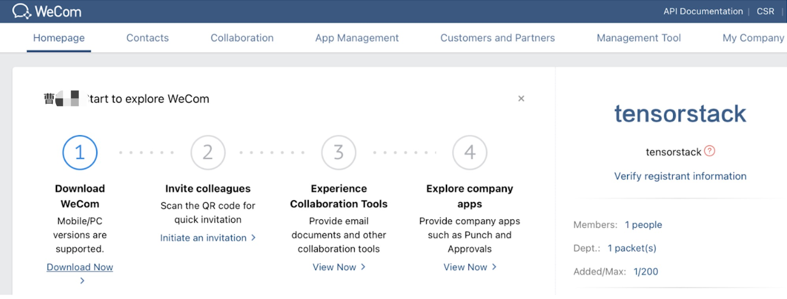
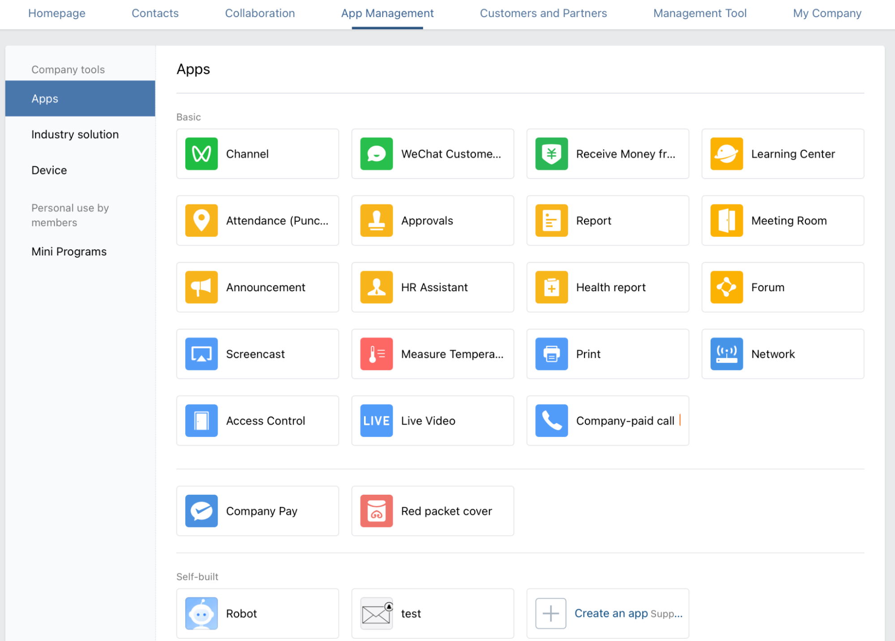
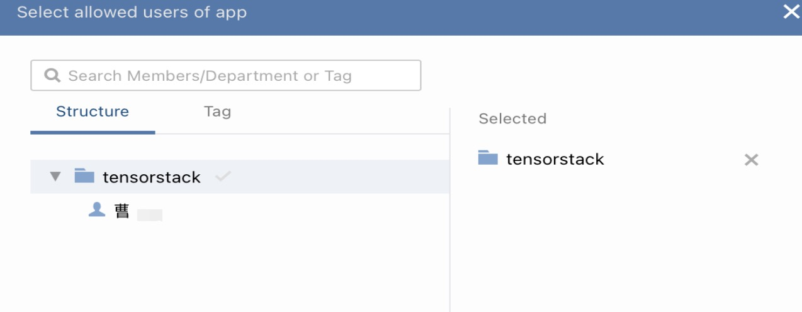
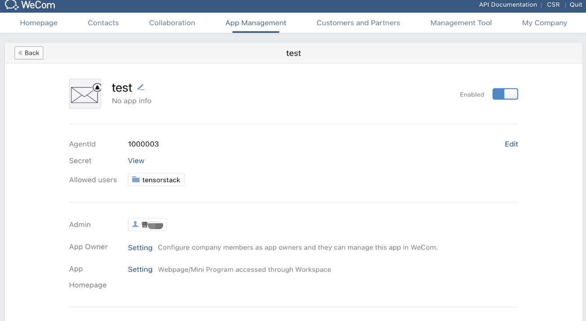
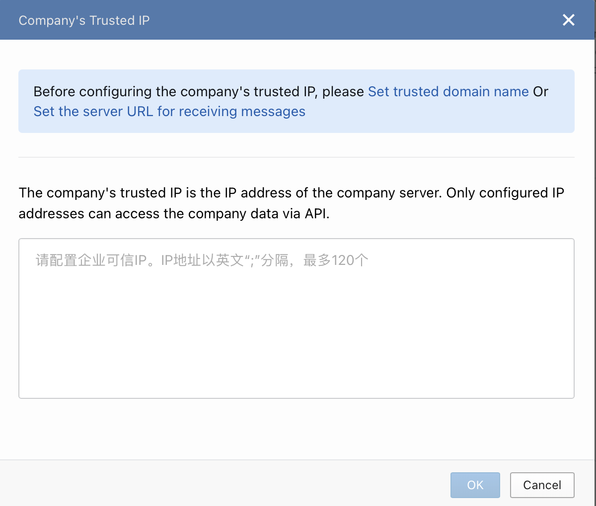
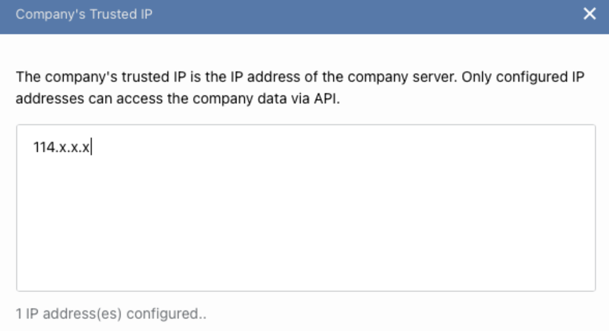
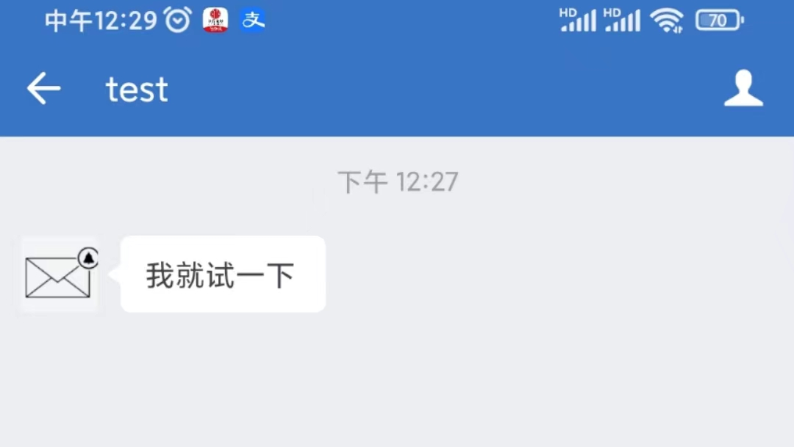

# 配置企业微信

本节介绍如何配置企业微信以接受 “监控系统的告警通知”。

## 创建企业微信

首先，需要在  <a target="_blank" rel="noopener noreferrer" href="https://work.weixin.qq.com">https://work.weixin.qq.com</a> 创建一个企业微信账号。

本示例使用 tensorstack 企业微信 ：

<figure class="screenshot">
  
</figure>

## 创建应用

创建企业微信之后，还需要创建“自建应用（Self-built）”，我们需要通过自建应用来向企业微信中的用户发送消息。在企业微信网页端，创建“自建应用（Self-built）的操作流程是：

1. 顶部菜单栏点击 App Management
1. 左侧菜单栏点击 Apps
1. 在页面找到 self-built 标题，然后点击 Create an app 来创建”自建应用（Self-built）”。创建时，你可以选择这个自建应用关联的用户组、用户。

<figure class="screenshot">
  
</figure>

<figure class="screenshot">
  
</figure>

本示例中创建的自建应用的名称是 test，在 self-built 标题下，点击“应用图标+名称”按钮可以进入应用详情页面：

<figure class="screenshot">
  
</figure>

在应用详情页面，我们可以查看与应用相关的认证信息：

* 应用的 AgentId（对应上图的：1000003）
* API Secret（首先点击 Secret 旁的 View，然后手机企业微信会收到“Accessing Secret……”的消息，确认消息即可获取 API Secret）

## 获取认证信息

通过“自建应用”向企业微信发送消息需要提供以下认证信息：

1. corpID：企业微信的 Company ID（在 My Company -> Company Information -> Company ID 查看）
1. 应用的 AgentId
1. 应用的 API Secret

## 配置应用可信 IP

调用企业微信 API 来发送应用消息的 IP 必须是企业微信应用的可信 IP。如果未配置应用可信 IP，向企业微信发送消息会返回错误（<a target="_blank" rel="noopener noreferrer" href="https://developer.work.weixin.qq.com/document/path/90313#错误码：60020">错误码 60020</a>）。设置应用可信 IP 的入口是：App Manager -> Apps -> Self-built/应用 -> Developer API/Company's Trusted IP。

设置应用可信 IP（company's trusted IP）的页面如下图所示：

<figure class="screenshot">
  
</figure>

<aside class="note">
<div class="title">注意</div>

页面提示在设置应用可信 IP 之前，我们需要先设置 trusted domain name 或者 Set the server URL for receiving messages。

</aside>

### 设置 trusted domain name

选择设置 trusted domain name，企业微信会提供给我们一个认证文件，它让我们提供一个域名，这个域名指向的 http server 的根目录下需要存放这个认证文件。

本示例在 t9k-example 服务器（IP：128.199.x.x）上部署了一个 nginx http server，并在 http server 根目录下放 wechat verification file，并且通过域名服务其配置域名 *.dev.example.cn 指向 IP 128.199.x.x。

```bash
# 进入 t9k-example 服务器
$ ssh t9k-example
# 主机上 verification file 路径
$ ls ~/demo/
WW_verify_2YR9B7ZGcQ3dbN3b.txt

# 运行 nginx container，将 verification file 绑定到 nginx http 根目录
$ docker run -d -p 80:80 --name wechat-verification \
 -v ~/demo:/usr/share/nginx/html \
 nginx

# 本机测试
$ curl localhost:80/WW_verify_2YR9B7ZGcQ3dbN3b.txt
2YR9B7ZGcQ3dbN3b
```

然后，在企业微信设置 trusted domain name 时，填入 wechat-test.dev.example.cn。

### 设置企业可信 IP

部署了 Alertmanager 的集群的公网 IP 是 114.x.x.x，需要将这个 IP 设置为企业可信 IP

<figure class="screenshot">
  
</figure>

## 本地测试

配置企业微信步骤完成后，我们可以在在本地调用企业微信 API 来模拟 Alertmanger 向企业微信发送消息的行为。

首先通过[获取认证信息](#获取认证信息)中得到的 corpID 和 API Secret 获取 token：

```bash
$ curl "https://qyapi.weixin.qq.com/cgi-bin/gettoken?corpid=<corp-ID>&corpsecret=<app-apiSecret>"
{"errcode":0,"errmsg":"ok","access_token":"<token>","expires_in":7200}
```

然后利用 token 向企业微信发送消息（参考 <a target="_blank" rel="noopener noreferrer" href="https://developer.work.weixin.qq.com/document/path/90236">API 文档</a>）：

```bash
$ data='{
  "touser" : "@all",
  "msgtype" : "text",
  "agentid" : 1000003,
  "text" : {
      "content" : "我就试一下"
  },
  "safe":0
}'

$ curl -X POST -H "Content-Type: application/json" -d "$data" "https://qyapi.weixin.qq.com/cgi-bin/message/send?access_token=<token>"
{"errcode":0,"errmsg":"ok","msgid":"mrVtVXE39it1tWVvd57npFULkDToQB0BOBlwUNvEk2eP8w3Hy29QWeiap1sMbhcldkX96CF41kZCHJVVuQHUEg"}* Closing connection 0
```

企业微信上，agentId 为 1000003 的应用对应的所有用户会收到消息：

<figure class="screenshot">
  
</figure>
