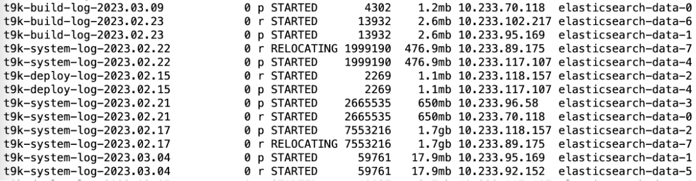
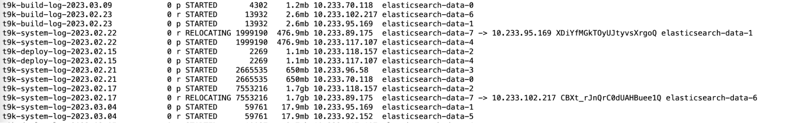

# Elasticsearch

## 部署

Elasticsearch 部署文档：[K8s 组件](../installation/online/k8s-components/index.md)

## 修改配置

以 data 节点为例，其配置文件 data.yaml：

<details><summary><code class="hljs">data.yaml</code></summary>

```yaml
clusterName: "elasticsearch"
nodeGroup: "data"
roles:
  master: "false"
  ingest: "true"
  data: "true"
replicas: 3
volumeClaimTemplate:
  accessModes: ["ReadWriteOnce"]
  resources:
    requests:
      storage: 60Gi
resources:
  requests:
    cpu: "1000m"
    memory: "3Gi"
  limits:
    cpu: "1000m"
    memory: "3Gi"
esConfig:
  elasticsearch.yml: |
    xpack.security.enabled: false
```

</details>

说明：

* `replicas`：节点数量
* `resources`：cpu、内存等资源配置

此外的其他字段，一经创建则不可修改。

使用以下命令更新 Elasticsearch 配置：

```bash
helm upgrade elasticsearch-data \
  oci://tsz.io/t9kcharts/elasticsearch \
  -n t9k-monitoring \
  --version 7.13.4 \
  --values data.yaml
```

运行一段时间之后，如需增加 PVC 的容量，可手动对 PVC 进行修改：

```bash
kubectl edit pvc -n t9k-monitoring elasticsearch-data-elasticsearch-data-0
```

### 日志生命周期

新部署好的 ElasticSearch 需要添加以下设置：

1. index 的生命周期：30 天自动删除，防止数据过多
1. timestamp 类型设置为纳秒级别


```bash
# 将部署好的 ElasticSearch 暴露出来：
kubectl -n t9k-monitoring port-forward service/elasticsearch-client 9200:9200

# 发送如下请求创建 ILM Policy，用于自动清理创建时间超过 30 天的 index：
curl -X PUT "http://localhost:9200/_ilm/policy/t9k-policy?pretty" \
   -H 'Content-Type: application/json' \
   -d '{
    "policy": {                       
      "phases": {
        "hot": {                      
          "actions": {}
        },
        "delete": {
          "min_age": "30d",           
          "actions": { "delete": {} }
        }
      }
    }
  }'

# 创建 Template，使 ElasticSearch 自动将 ILM Policy 绑定到合适的 Index（t9k-deploy-log-、t9k-deploy-log-、t9k-deploy-log-、t9k-event-）上，并设置 timestamp 的类型（在搜索的时候，如果时间精度不够会导致顺序错误）：
curl -X PUT "http://localhost:9200/_template/logging_policy_template?pretty" \
 -H 'Content-Type: application/json' \
 -d '{
  "index_patterns": ["t9k-build-log-*", "t9k-deploy-log-*", "t9k-system-log-*", "t9k-event-*"],
  "mappings": {
    "properties": {
      "@timestamp": {
        "type": "date_nanos"
      }
    }
  },
  "settings": { "index.lifecycle.name": "t9k-policy" }
}'

```

#### 验证


```bash
curl -X GET "http://localhost:9200/_ilm/policy"  | jq .\"t9k-policy\"
```

<details><summary><code class="hljs">output</code></summary>

```json
{
  "version": 1,
  "modified_date": "2023-09-21T06:40:38.863Z",
  "policy": {
    "phases": {
      "hot": {
        "min_age": "0ms",
        "actions": {}
      },
      "delete": {
        "min_age": "30d",
        "actions": {
          "delete": {
            "delete_searchable_snapshot": true
          }
        }
      }
    }
  }
}
```
</details>

```bash
curl -G "http://localhost:9200/_template" | jq .\"logging_policy_template\" 
```
<details><summary><code class="hljs">output</code></summary>

```json
{
  "order": 0,
  "index_patterns": [
    "t9k-build-log-*",
    "t9k-deploy-log-*",
    "t9k-system-log-*",
    "t9k-event-*"
  ],
  "settings": {
    "index": {
      "lifecycle": {
        "name": "t9k-policy"
      }
    }
  },
  "mappings": {
    "properties": {
      "@timestamp": {
        "type": "date_nanos"
      }
    }
  },
  "aliases": {}
}
```

</details>


### 添加、删除节点

添加节点，可以参考 [修改配置](#修改配置) 通过修改配置文件，执行 helm upgrade 命令完成。

删除节点，需要将待删除节点的数据移动到其他节点，然后再删除该节点。以下为删除节点的步骤。

首先将 elasticsearch 服务暴露出来：

```bash
kubectl port-forward service/elasticsearch-client -n t9k-monitoring 9200:9200
```

通过浏览器查看集群中的分片情况（url：`http://localhost:9200/_cat/shards`）：

<figure class="screenshot">
  
</figure>

如果我们想将 data 节点数量从 8 缩小到 3，则需要删除 elasticsearch-data-3 到 elasticsearch-data-7 这 5 个节点。

执行以下命令，将 elasticsearch-data-7 节点排出 elastic 集群（IP 可以从上图中获得）：

```bash
curl -XPUT http://localhost:9200/_cluster/settings \
  -H "Content-Type: application/json" \
  -d '{
  "transient" :{
      "cluster.routing.allocation.exclude._ip" : "10.233.89.175"
   }
}'
```

再次通过浏览器查看集群中的分片情况（url：`http://localhost:9200/_cat/shards`）：

<figure class="screenshot">
  
</figure>

可以看到这一节点上的数据正在被复制到其他节点上。

刷新上述浏览器页面，直到发现 elasticsearch-data-7 节点上没有任何分片后，可以关闭该节点：

```bash
kubectl scale --replicas=7 sts elasticsearch-data -n t9k-monitoring
```

将 statefulset 的 replicas 数量缩小 1。

重复上面步骤，删除剩下的 elasticsearch-data-3 到 elasticsearch-data-6 四个节点。全部删除后，执行如下操作：

```bash
curl -XPUT http://localhost:9200/_cluster/settings -H "Content-Type: application/json" -d '{
  "transient" :{
      "cluster.routing.allocation.exclude._ip" : ""
   }
}'
```

恢复集群设置。

<aside class="note">
<div class="title">注意</div>

1. elasticsearch 的数据节点同时只能删除一个；
1. 节点删除应从序号大的节点开始删除，不支持跳过大序号的节点去删除小序号节点；这是 k8s statefulset 的性质决定的；
1. 删除节点后，需要手动删除 pvc，释放空间。

</aside>

## 参考

<https://github.com/elastic/elasticsearch>
