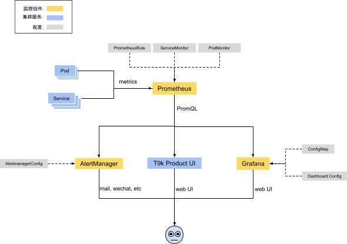

# 监控告警系统

监控告警系统（简称 t9k-monitoring）收集并存储集群的监控数据，当集群触发告警规则时，告警系统会产生警告信息通知管理员。

本系统主要包含下列组件：

* <a target="_blank" rel="noopener noreferrer" href="https://prometheus.io/">Prometheus</a>：监控系统的核心组件。负责收集集群服务的监控数据，并以时间化序列存储监控数据，提供查询接口 & 查询语句以供给其他服务使用。
* <a target="_blank" rel="noopener noreferrer" href="https://grafana.com/">Grafana</a>：图形化展示监控数据的组件，监控数据来自于 Prometheus。
* <a target="_blank" rel="noopener noreferrer" href="https://prometheus.io/docs/alerting/latest/alertmanager/">Alertmanager</a>：处理告警信息的组件。当集群状态触发了告警规则之后，Prometheus 会产生告警信息，然后 Alertmanager 会收集告警信息并将其发送给运维人员。
* 产生监控数据的服务：
    * <a target="_blank" rel="noopener noreferrer" href="https://github.com/kubernetes/kube-state-metrics">kube-state-metrics</a>：收集集群中资源对象的信息作为监控数据，例如 Deployment、Pod。
    * <a target="_blank" rel="noopener noreferrer" href="https://github.com/prometheus/node_exporter">node-exporter</a>：收集集群节点的信息作为监控数据。
    * t9k-state-metrics：收集集群中与 t9k 相关的信息作为监控数据。

本系统通过 <a target="_blank" rel="noopener noreferrer" href="https://prometheus-operator.dev/">Prometheus Operator</a> 来部署、配置 Prometheus 和 Alertmanager。Prometheus Operator 提供了多种 CRD 来简化安装、配置方法：

* `Prometheus`：用于部署 Prometheus。
* `Alertmanager`：用于部署 Alertmanager。
* `ServiceMonitor`：用于配置 Prometheus 监听哪些 Service 资源对象。
* `PodMonitor`：用于配置 Prometheus 监听哪些 Pod 资源对象。
* `PrometheusRule`：用于配置 Prometheus 的告警规则。
* `AlertmanagerConfig`：用于配置 Alertmanager 发送警告信息的规则。

管理员可以进行下列配置操作：

* 设置监控目标：配置 Prometheus 收集哪些集群服务产生的监控数据。
* 设置告警规则：Prometheus 会根据告警规则来判断如何产生告警信息。
* 设置告警通知：配置 AlertManager 如何将告警信息发送出去。
* 自定义 Grafana Dashboard：创建新的 Grafana Dashboard 来展示监控信息。


<figure class="architecture">
  
  <figcaption>图 1：TensorStack AI 平台的监控告警系统概览。1）集群服务需要通过 http endpoint 提供 <a target="_blank" rel="noopener noreferrer" href="https://prometheus.io/docs/instrumenting/writing_exporters/#metrics">metrics</a> 以供 Prometheus 收集监控数据。 2）T9k Product UI 会从 Prometheus 查询到监控数据并展示给用户</figcaption>
</figure>

## 运行状态

查看 Prometheus Operator 运行状态的命令：

```bash
$ kubectl -n t9k-monitoring get deploy prometheus-operator  
NAME                  READY   UP-TO-DATE   AVAILABLE   AGE
prometheus-operator   1/1     1            1           233d
$ kubectl -n t9k-monitoring get pod -l "app.kubernetes.io/name"="prometheus-operator"
NAME                                   READY   STATUS    RESTARTS   AGE
prometheus-operator-5b8987464c-m9kzb   2/2     Running   0          231d
```

查看 Prometheus 运行状态的命令：

```bash
$ kubectl -n t9k-monitoring get prometheus k8s
NAME   VERSION   DESIRED   READY   RECONCILED   AVAILABLE   AGE
k8s    2.41.0    2         2       True         True        222d

$ kubectl -n t9k-monitoring get pod -l prometheus=k8s
NAME               READY   STATUS    RESTARTS   AGE
prometheus-k8s-0   3/3     Running   0          96d
prometheus-k8s-1   3/3     Running   0          126d
```

查看 Grafana 运行状态的命令：

```bash
$ kubectl -n t9k-monitoring get deploy grafana
NAME      READY   UP-TO-DATE   AVAILABLE   AGE
grafana   1/1     1            1           232d

$ kubectl -n t9k-monitoring get pod -l app.kubernetes.io/component=grafana
NAME                       READY   STATUS    RESTARTS      AGE
grafana-646cf546cd-62hd6   2/2     Running   3 (96d ago)   172d
```

查看 Alertmanager 运行状态的命令：

```bash
$ kubectl -n t9k-monitoring get alertmanager main
NAME   VERSION   REPLICAS   AGE
main   0.25.0    1          232d

$ kubectl -n t9k-monitoring get pod -l alertmanager=main
NAME                  READY   STATUS    RESTARTS   AGE
alertmanager-main-0   3/3     Running   0          222d
```

查看 kube-state-metrics 运行状态的命令：

```bash
$ kubectl -n t9k-monitoring get deploy kube-state-metrics
NAME                 READY   UP-TO-DATE   AVAILABLE   AGE
kube-state-metrics   1/1     1            1           232d


$ kubectl -n t9k-monitoring get pod -l "app.kubernetes.io/name"="kube-state-metrics"
NAME                                 READY   STATUS    RESTARTS   AGE
kube-state-metrics-95658b8d7-x7f6t   3/3     Running   0          187d
```

查看 node-exporter 运行状态的命令：

```bash
$ kubectl -n t9k-monitoring get ds node-exporter 
NAME           DESIRED   CURRENT   READY   UP-TO-DATE   AVAILABLE   NODE SELECTOR            AGE
node-exporter  10        10        10      10           10          kubernetes.io/os=linux   233d

$ kubectl -n t9k-monitoring get pod -l "app.kubernetes.io/name"="node-exporter" -o wide
NAME                   READY  STATUS    RESTARTS      AGE    IP             NODE 
node-exporter-8x59x   2/2     Running   0             231d   100.64.4.57    nc07    
node-exporter-dw4c7   2/2     Running   0             231d   100.64.4.51    nc01    
node-exporter-gxjzg   2/2     Running   0             231d   100.64.4.26    s15     
```

查看 t9k-state-metrics 运行状态的命令：

```bash
$ kubectl -n t9k-monitoring get deploy t9k-state-metrics
NAME                READY   UP-TO-DATE   AVAILABLE   AGE
t9k-state-metrics   1/1     1            1           214d
$ kubectl -n t9k-monitoring get pod -l app=t9k-state-metrics
NAME                                 READY   STATUS    RESTARTS   AGE
t9k-state-metrics-57d7cd8b58-29g65   1/1     Running   0          2d2h
```

## Prometheus 

Prometheus 负责收集集群服务的监控数据，并以时间化序列存储监控数据，提供查询接口和查询语句以供给其他服务使用，本系统只需要在集群内部署一个 Prometheus 来收集监控数据。

### 部署设置

运行下列命令可以查看部署的 Prometheus 详情（<a target="_blank" rel="noopener noreferrer" href="https://prometheus-operator.dev/docs/operator/api/#monitoring.coreos.com/v1.Prometheus">API Reference</a>）：

```bash
# inspect CRD
$ kubectl -n t9k-monitoring get prometheus k8s -o yaml

# inspect pods
$ kubectl -n t9k-monitoring get pod -l prometheus=k8s
```

通过设置 Prometheus spec 字段可以修改 Prometheus 部分配置。spec 字段中常用的子字段有：

* `retention`：值类型 <a target="_blank" rel="noopener noreferrer" href="https://prometheus-operator.dev/docs/operator/api/#monitoring.coreos.com/v1.Duration">duration</a>，当 retention 和 retentionSize 据未设置时，retention 默认被设为 “24h”。监控数据的保存时长。
* `retentionSize`：值类型 <a target="_blank" rel="noopener noreferrer" href="https://prometheus-operator.dev/docs/operator/api/#monitoring.coreos.com/v1.ByteSize">ByteSize</a>，保存监控数据的最大存储空间。例如 100GB。
* `storage`：值类型 <a target="_blank" rel="noopener noreferrer" href="https://prometheus-operator.dev/docs/operator/api/#monitoring.coreos.com/v1.StorageSpec">StorageSpec</a>，定义了提供给 Prometheus 使用的 K8s Volume。例如，下列设置表明提供 1000Gi 大小的 PVC 给 Prometheus 使用，为 PVC 提供存储支持的 storageClass 是 cephfs-hdd：

```yaml
    storage:
      volumeClaimTemplate:
        spec:
          resources:
            requests:
              storage: 1000Gi
          storageClassName: cephfs-hdd
```

### 查看 Web UI

Prometheus 成功运行之后，你可以通过浏览器查看 Prometheus 的 Web UI。

Web 首页 - 打开 Prometheus 的 Web 首页，你可以在搜索框输入 <a target="_blank" rel="noopener noreferrer" href="https://prometheus.io/docs/prometheus/latest/querying/basics/">PromQL</a>（Prometheus Query Lanaguage） 来查询监控数据：`https://<host>/t9k-monitoring/prometheus/graph`

Prometheus 的 Config - 创建的[监控目标](#监控目标)会被添加到这个 Config 中，所以你可以通过这个页面来确定创建的监控目标是否生效：`https://<host>/t9k-monitoring/prometheus/config`

监控目标的健康状态：`https://<host>/t9k-monitoring/prometheus/targets`

Prometheus 设置的[告警规则](#告警规则记录规则)：`https://<host>/t9k-monitoring/prometheus/rules`

## Alertmanager

Alertmanager 负责将告警信息发送给运维人员，一般在集群内部署一个 Alertmanager 即可。

### 部署设置

运行下列命令可以查看部署的 Alertmanager 详情（<a target="_blank" rel="noopener noreferrer" href="https://prometheus-operator.dev/docs/operator/api/#monitoring.coreos.com/v1.Alertmanager">API Reference</a>）：

```bash
$ kubectl -n t9k-monitoring get alertmanager main -o yaml
```

一般不建议对 Alertmanager 的 Spec 字段进行修改。

### 查看 Web UI

Alertmanager 成功运行之后，你可以通过浏览器查看 Alertmanager 的 Web UI。

Alertmanager Web 首页，在这个页面你可以看见集群内产生的告警信息：`https://<host>/t9k-monitoring/alertmanager`

Alertmanager 的 Config，创建的[告警通知](#告警通知)会被添加到这个 Config 中：`https://<host>/t9k-monitoring/alertmanager/#/status`

## Grafana

Grafana 对监控数据进行可视化展示，方便用户了解集群状态。

### 部署设置

运行下列命令可以部署的 Grafana 详情：

```bash
$ kubectl -n t9k-monitoring get deploy grafana -o yaml
```

### Dashboard

#### 查看 Dashboard

Dashboard 列表：`https://<host>/t9k-monitoring/grafana/dashboards`

选择一个 Dashboard 点击，就可以查看这个 Dashboard 的详情。

#### 增加 Dashboard

在 Grafana 中增加 Dashboard 有两种方法。

**方法一**

通过 UI 创建新的 Dashboard。在 Grafana 的 Web UI 可以找到创建 Dashboard 的按钮，点击就可以创建新的 Dashboard，详细内容请参考 <a target="_blank" rel="noopener noreferrer" href="https://grafana.com/docs/grafana/latest/dashboards/">Grafana 文档</a>。

需要注意，按照上述方式创建的 Dashboard 无法被持久性存储，Grafana Pod 重启后，这些 Dashboard 会消失。

**方法二**

使用 ConfigMap 存储 dashboard，然后修改 Deployment grafana 的配置，可以在 Grafana 中增加持久性存储的 dashboard。

下面是操作示例：

首先运行下列命令创建 ConfigMap grafana-dashboard-demo，data[custom.json] 字段下存储着 dashboard json 文件：

```bash
$ kubectl create -f - << EOF
apiVersion: v1
data:
  demo.json: |-
    {
        ...
        <Dashboard-Json>
        ... 
    }
kind: ConfigMap
metadata:
  name: grafana-dashboard-demo
  namespace: t9k-monitoring
EOF
```

修改 Grafana dashboards 目录配置，增加下列绿底内容，表明在 dashboards 目录中新增自定义文件夹 custom：

<pre><div class="buttons"><button class="fa fa-copy clip-button" title="Copy to clipboard" aria-label="Copy to clipboard"><i class="tooltiptext"></i></button></div><code class="language-bash hljs">&#36; kubectl -n t9k-monitoring edit cm grafana-dashboards
apiVersion: v1
data:
  dashboards.yaml: |-
    {
        <span class="hljs-string">"apiVersion"</span>: 1,
        <span class="hljs-string">"providers"</span>: [
<span style="background-color: #D6E8D3">            {
                <span class="hljs-string">"folder"</span>: <span class="hljs-string">"Default"</span>,
                <span class="hljs-string">"folderUid"</span>: <span class="hljs-string">""</span>,
                <span class="hljs-string">"name"</span>: <span class="hljs-string">"0"</span>,
                <span class="hljs-string">"options"</span>: {
                    <span class="hljs-string">"path"</span>: <span class="hljs-string">"/grafana-dashboard-definitions/0"</span>
                },
                <span class="hljs-string">"orgId"</span>: 1,
                <span class="hljs-string">"type"</span>: <span class="hljs-string">"file"</span>
            },</span>
            {
                <span class="hljs-string">"folder"</span>: <span class="hljs-string">"T9k"</span>,
                <span class="hljs-string">"folderUid"</span>: <span class="hljs-string">""</span>,
                <span class="hljs-string">"name"</span>: <span class="hljs-string">"T9k"</span>,
                <span class="hljs-string">"options"</span>: {
                    <span class="hljs-string">"path"</span>: <span class="hljs-string">"/grafana-dashboard-definitions/T9k"</span>
                },
                <span class="hljs-string">"orgId"</span>: 1,
                <span class="hljs-string">"type"</span>: <span class="hljs-string">"file"</span>
            },
            {
                <span class="hljs-string">"folder"</span>: <span class="hljs-string">"Custom"</span>,
                <span class="hljs-string">"folderUid"</span>: <span class="hljs-string">""</span>,
                <span class="hljs-string">"name"</span>: <span class="hljs-string">"custom"</span>,
                <span class="hljs-string">"options"</span>: {
                    <span class="hljs-string">"path"</span>: <span class="hljs-string">"/grafana-dashboard-definitions/custom"</span>
                },
                <span class="hljs-string">"orgId"</span>: 1,
                <span class="hljs-string">"type"</span>: <span class="hljs-string">"file"</span>
            }
        ]
    }
kind: ConfigMap
metadata:
  name: grafana-dashboards
  namespace: t9k-monitoring
</code></pre>

修改 deployment grafana：

```bash
$ kubectl -n t9k-monitoring edit deploy grafana
```

在 volumes 中增加下列字段：

```yaml
      - configMap:
          defaultMode: 420
          name: grafana-dashboard-demo
        name: grafana-dashboard-demo
```

在 container grafana 的 volumeMounts 中增加下列字段：

```yaml
        - mountPath: /grafana-dashboard-definitions/custom/demo
          name: grafana-dashboard-demo
```

完成后，Grafana Pod 会被重新运行，然后可以在 Grafana Dashboard 列表看见一个新增的文件夹 Custom。这个文件夹下有 ConfigMap grafana-dashboard-demo 中定义的 Dashboards。

## 设置

### 监控目标

你可以通过 CRD ServiceMonitor 和 PodMonitor 来设置 Prometheus 从哪些集群服务收集监控数据：

* ServiceMonitor（推荐）：表明从哪些 Service 资源对象收集监控数据。
* PodMonitor：表明从哪些 Pod 收集监控数据。

#### 查看配置

运行下列命令可以查看与本系统相关的监控目标配置列表：

```bash
$ kubectl get serviceMonitor -A -l tensorstack.dev/metrics-collected-by=t9k-monitoring
$ kubectl get podMonitor -A -l tensorstack.dev/metrics-collected-by=t9k-monitoring
```

运行下列命令可以查看一个 ServiceMonitor 的详情：

```bash
$ kubectl -n <namespace> get servicemonitor <name> -o yaml
```

#### 修改配置

运行下列命令可以修改 servicemonitor：

```bash
$ kubectl -n <namespace> edit servicemonitor  <name>
```

#### 创建配置

运行下列命令可以创建一个基本的 ServiceMonitor：

```bash
$ kubectl apply -f - << EOF
apiVersion: monitoring.coreos.com/v1
kind: ServiceMonitor
metadata:
  name: example-app
  namespace: demo
  labels:
    team: frontend
    tensorstack.dev/metrics-collected-by: t9k-monitoring
spec:
  selector:
    matchLabels:
      app: example-app
  endpoints:
  - port: web
EOF
```

创建 ServiceMonitor 或 PodMonitor 时，必须添加 label `tensorstack.dev/metrics-collected-by: t9k-monitoring` 以表明监控目标规则作用于 t9k-monitoring。

上面创建的 ServiceMonitor 定义的规则是：

1. 监听 namespace demo 下所有含有标签 `app:example-app` 的 service
1. 监听 service 的名称是 web 的端口

更多细节请参考 API Reference：<a target="_blank" rel="noopener noreferrer" href="https://prometheus-operator.dev/docs/operator/api/#monitoring.coreos.com/v1.ServiceMonitor">ServiceMonitor</a> 和 <a target="_blank" rel="noopener noreferrer" href="https://prometheus-operator.dev/docs/operator/api/#monitoring.coreos.com/v1.PodMonitor">PodMonitor</a>

### 告警规则/记录规则

你可以通过 CRD PrometheusRule 来设置 Prometheus 的告警规则（Alerting Rules）和记录规则（Recording rules）：

* <a target="_blank" rel="noopener noreferrer" href="https://prometheus.io/docs/prometheus/latest/configuration/alerting_rules/">告警规则</a>：你可以基于 PromQL（Prometheus 查询语言） 设置一些告警规则，警报触发时，Prometheus 会产生对应的告警信息。
* <a target="_blank" rel="noopener noreferrer" href="https://prometheus.io/docs/prometheus/latest/configuration/recording_rules/#recording-rules">记录规则</a>：Recording rules 允许你将经常用到的或计算量大的 PromQL 提前计算出来，并将结果保存为一组新的时间序列数据。例如：你可以将 `count (up == 1)` 记录为 `count:up`，查询 `count:up` 得到的结果与查询 `count (up == 1)` 得到的结果一样。

#### 查看配置

运行下列命令可以查看与本系统的告警规则：

```bash
$ kubectl get prometheusrule -A -l tensorstack.dev/metrics-collected-by=t9k-monitoring
```

#### 修改配置

运行下列命令可以修改 PrometheusRule：

```bash
$ kubectl -n <namespace> edit prometheusrule  <name>
```

#### 创建配置

运行下面这个命令可以创建一个 PrometheueRule

```bash
$ kubectl apply -f - << EOF
apiVersion: monitoring.coreos.com/v1
kind: PrometheusRule
metadata:
  labels:
    tensorstack.dev/metrics-collected-by: t9k-monitoring
  name: t9k
  namespace: t9k-monitoring
spec:
  groups:
  - name: t9k-workflow-alerts
    rules:
    - alert: T9kWorkflowTooManyFailures
      annotations:
        description: '{{ $value }} WorkflowRuns failed in last 1m.'
      expr: sum(t9k_workflow_failed_workflowruns - (t9k_workflow_failed_workflowruns
        offset 1m)) > 10
      for: 1m
      labels:
        origin: t9k-user
        severity: warning
  - name: t9k-common-rules
    rules:
    - expr: (kube_pod_status_phase{phase=~"Pending|Running|Unknown"} == 1) * on(namespace,pod)
        group_left kube_pod_info{node!=""}
      record: t9k_pod_resources_allocated
    - expr: DCGM_FI_DEV_XID_ERRORS * on(pod,namespace) group_left(node) kube_pod_info
      record: t9k_dcgm_xid_errors_with_node
EOF
```

创建 PrometheusRule 时，必须添加 label `tensorstack.dev/metrics-collected-by: t9k-monitoring` 以表明告警规则作用于 t9k-monitoring。

这个 PrometheusRule 定义了：

1. 一个告警规则：当 expr 定义的表达式成立，并且持续时间超过一分钟时，Prometheus 会产生名为 `T9kWorkflowTooManyFailures` 的警告信息，这个警告信息会被添加相应的 annotations 和 labels。
1. 两个记录规则：记录规则名称是 `t9k_pod_resources_allocated` 和 `t9k_dcgm_xid_errors_with_node`。这两个记录规则中的 expr 查询表达式会被提前计算并保存，当用户输入记录规则名称进行查询时，Prometheus 会返回对应的数据。

更多细节请参考 API Reference：<a target="_blank" rel="noopener noreferrer" href="https://prometheus-operator.dev/docs/operator/api/#monitoring.coreos.com/v1.PrometheusRule">PrometheusRule</a>

### 告警通知

你可以通过 CRD AlertmanagerConfig 来配置 Alertmanager 将哪些警告信息通过邮件等方式发送给运维人员。Alertmanager  支持多种订阅警报消息的方式，包括邮件、企业微信等等。

AlertmanagerConfig 需要与 Alertmanger 服务在同一个 namespace 中， 并且包含以下 label，才能被系统识别：

```
tensorstack.dev/component: alertmanager-config
tensorstack.dev/component-type: system
```

API Reference：<a target="_blank" rel="noopener noreferrer" href="https://prometheus-operator.dev/docs/operator/api/#monitoring.coreos.com/v1alpha1.AlertmanagerConfig">AlertmanagerConfig</a>

#### 查看配置

运行下列命令可以查看与本系统的告警通知规则：

```bash
$ kubectl get alertmanagerconfig -n t9k-monitoring \
  -l tensorstack.dev/component=alertmanager-config,tensorstack.dev/component-type=system
```

#### 邮件接收配置

想要通过邮件接受警报消息，管理员需要创建两个资源对象：

* Secret：存储 SMTP 用户密码
* AlertmanagerConfig

下面是一个配置示例：

```yaml
apiVersion: monitoring.coreos.com/v1alpha1
kind: AlertmanagerConfig
metadata:
labels:
  tensorstack.dev/component: alertmanager-config
  tensorstack.dev/component-type: system
name: email
namespace: t9k-monitoring
spec:
 receivers:
 - emailConfigs:
   - authPassword:
       key: password
       name: email-password
     authUsername: <username-for-authentication>
     from: <sender-address>
     smarthost: <SMTP-server-host>
     to: <alert-recipient-address>
   name: t9k-sre
 route:
   groupBy:
   - alertname
   matchers:
   - name: severity
     value: critical
   - name: origin
     value: t9k-user
     matchType: !=
   - name: namespace
     value: "|ceph.*|gatekeeper-system|gpu-operator|ingress-nginx|istio-system|keycloak-operator|knative-serving|kube-system|kubernetes-dashboard|t9k-monitoring|t9k-system"
     matchType: "=~"
   groupInterval: 5m
   groupWait: 30s
   receiver: t9k-sre
   repeatInterval: 6h
---
apiVersion: v1
kind: Secret
metadata:
 name: email-password
 namespace: t9k-monitoring
type: Opaque 
data:
 password: <base64-encoded-password-for-authentication>
```

与邮件认证相关的配置：

1. 你需要设置 AlertmanagerConfig 的 `spec.receivers.emailConfig` 字段的下列信息：
    * `<SMTP-server-host>`：SMTP 服务器地址。
    * `<username-for-authentication>`：用于 SMTP 服务认证的用户名。
    * `<sender-address>`：警报消息的发送方邮件地址。
    * `<alert-recipient-address>`：警报消息的接收者的邮件地址。
1. 设置 Secret 时，你需要将 SMTP 服务器的密码经过 base64 编码后填写在 `data.password` 字段。

上面 AlertmanagerConfig 表明将 labels 满足 route.matchers 的警告信息通过邮件发送给用户。

#### 企业微信接收配置

想要通过企业微信接受警报消息，管理员需要创建两个资源对象：

* Secret：存储企业微信 API Secret
* AlertmanagerConfig

下面是一个配置示例：

```yaml
apiVersion: monitoring.coreos.com/v1alpha1
kind: AlertmanagerConfig
metadata:
 labels:
   tensorstack.dev/component: alertmanager-config
   tensorstack.dev/component-type: system
 name: wechat-test
 namespace: t9k-monitoring
spec:
 receivers:
 - wechatConfigs:
   - corpID: <corpID>
     agentID: <agentID>
     toUser: <toUser>
     message: '{{ template "wechat.t9k.message" . }}'
     apiSecret:
       name: wechat-apisecret
       key: apiSecret
   name: 'wechat'
 route:
   groupBy:
   - alertname
   matchers:
   - name: severity
     value: critical|warning
     matchType: =~
   - name: origin
     value: t9k-user
     matchType: !=
   - name: namespace
     value: "|ceph.*|gatekeeper-system|gpu-operator|ingress-nginx|istio-system|keycloak-operator|knative-serving|kube-system|kubernetes-dashboard|t9k-monitoring|t9k-system"
   groupInterval: 5m
   groupWait: 10s
   receiver: wechat
   repeatInterval: 6h
---

apiVersion: v1
kind: Secret
metadata:
 name: wechat-apisecret
 namespace: t9k-monitoring
type: Opaque
data:
 apiSecret: <base64-encoded-apiSecret-for-authentication>
```

与企业微信相关的配置：

1. 你需要设置 AlertmanagerConfig 的 `spec.receivers.wechatConfig` 字段的下列信息：
    * `<corpID>`：企业微信的 Company ID
    * `<agentID>`：企业微信应用对应的 agentID
    * `<toUser>`：optional，想要发送给哪些用户，值是 @all 时表明发送给所有用户。
1. 设置 Secret 的 `data.apiSecret` 字段，将企业微信的 API Secret 经 base64 编码后填写在这个字段上。具体如何获取 API Secret 请见[参考：配置企业微信](./reference/configure-wecom.md)。

上述示例将 `spec.receivers[0].wechatConfigs[0].message` 字段设置为 '{{ template "wechat.t9k.message" . }}'，直接使用 wechat.t9k.message 消息模版，简化消息格式。

运行下列命令可以查看 T9k monitoring 默认部署的消息模版：

```bash
$ kubectl -n t9k-monitoring get cm alertmanager-template  -o yaml
```
