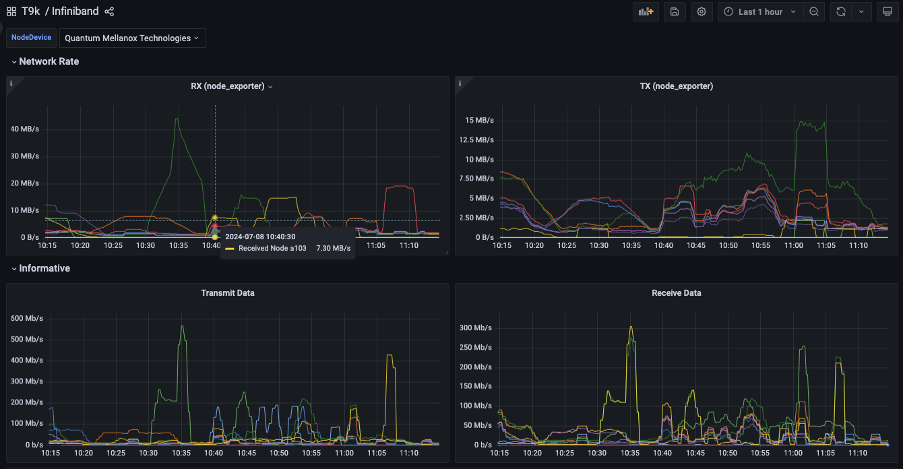

# Infiniband Network

TensorStack AI 的监控系统提供对 Infiniband 网络的监控，你可以参考下列内容来启用对 Infiniband 网络的监控。

## 前提

* 集群节点上安装有 Infiniband 网卡硬件
* 正确安装了 [Network Operator](../../installation/hardware/nvidia/network-operator.md)

## 安装

在[安装 t9k-monitoring 产品](../../installation/online/products/install.md)时，通过 values.yaml 中的 `global.t9k.monitoring.infinibandExporter` 字段配置 Infiniband 监控：

```yaml
global:
  t9k:
    monitoring:
      infinibandExporter:
        enabled: true
        image: t9kpublic/infiniband-exporter:v0.0.7
        nodeSelector:
          kubernetes.io/os: linux
          feature.node.kubernetes.io/pci-15b3.present: "true"
```

字段说明：
* enabled：类型 boolean。设为 true 时 t9k-monitoring 会启用 Infiniband 监控。
* image：类型 string。infiniband-exporter 组件的 image，infiniband-exporter 负责收集 Infiniband 网卡的监控数据。
* nodeSelector：类型 map。节点标签，用于筛选安装有 Infiniband 网卡的节点。

## 监控查询

使用浏览器打开 Grafana 页面，进入 Dashboards 列表选择 Dashboard `T9k/Infiniband` 就可以查看 Infiniband 的监控图标。


<figure class="screenshot">
  
</figure>

## 参考
[https://github.com/treydock/infiniband_exporter](https://github.com/treydock/infiniband_exporter)