# 在线安装

## 概述

如果可以访问 Internet，并可以方便地从 Docker Hub 拉取镜像，下载 Linux 的 packages 等，可采用在线安装的方式。

反之，如果网络访问受限，则可采用[离线安装](../offline/index.md)模式。

安装过程中，我们将主要使用 ansible 安装 Kubernetes 集群和 OS 系统组件，使用 helm 安装 T9k 产品，步骤如下：

1. [设置 ansible inventory](./inventory/index.md)；
1. [准备节点](./prepare-nodes.md)；
1. [安装基础 K8s](./k8s-index.md)；
1. [安装 K8s 的一些扩展组件](./k8s-components/index.md)，例如 Istio、Knative 等；
1. [安装特定的硬件支持](../hardware/hardware.md)，例如 NVIDIA GPU 等；
1. [安装 TensorStack AI 计算平台](./products/index.md)；
1. [检查安装的正确性](./correctness-checking.md)。

另外可选的步骤包括：

* [安装 Harbor Registry](./registry/harbor.md)。
* [安装存储服务](./storage-service/index.md)，例如 MinIO、Ceph 等。

<figure class="architecture">
  
  <figcaption>图 1：在线安装流程。图左侧从上到下分别为准备步骤、核心步骤和检查步骤；图右侧为可选步骤，应根据需求选择性地执行。</figcaption>
</figure>

## 下一步

我们首先准备工具和环境：[设置 ansible inventory](./inventory/index.md)。

## 参考

- <https://www.ansible.com/>
- <https://helm.sh/>
