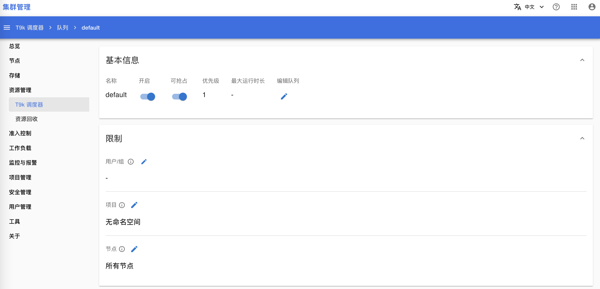
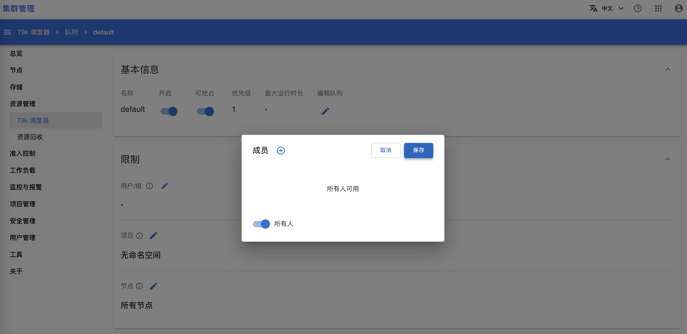

# 安装后可选配置

## 目的

安装 T9k 产品时，如果你启用了一些可选的功能，请参考下列教程对启用的功能进行初始化配置。

## 前提条件

完成 [安装后配置](./post-install.md)。

## T9k 调度器配置

如果你安装了 T9k 调度器，请完成下列配置。

### 创建默认队列

如果集群部署了 T9k 调度器，您需要在集群管理页面：
1. 为 T9k 调度器创建名为 `default` 的队列；
2. 修改 default 队列的配置，允许所有用户使用该队列。

打开 **集群管理（Cluster Admin）** 页面（参考 [登录管理员账号](#登录管理员账号)），点击 **资源管理 > T9k 调度器 > 队列**，进入队列列表页面。

<figure class="screenshot">
  
</figure>

点击右上角的 **+** 来创建一个新队列，队列名称填写为 `default`，其他字段按需填写（参考 [管理员手册 > 设置 Queue 的属性](../../../resource-management/queue.md#设置-queue-的属性)）。

<figure class="screenshot">
  
</figure>

回到队列列表页面，点击 `default` 队列的名称，进入队列详情页面。

<figure class="screenshot">
  
</figure>

点击**限制 > 用户/组**的编辑按钮，将用户权限设置为所有人。

<figure class="screenshot">
  
</figure>

## 下一步

运行 <a target="_blank" rel="noopener noreferrer" href="https://t9k.github.io/user-manuals/latest/get-started/index.html"> 用户手册 > 快速入门的例子 </a>，检验产品的功能。
