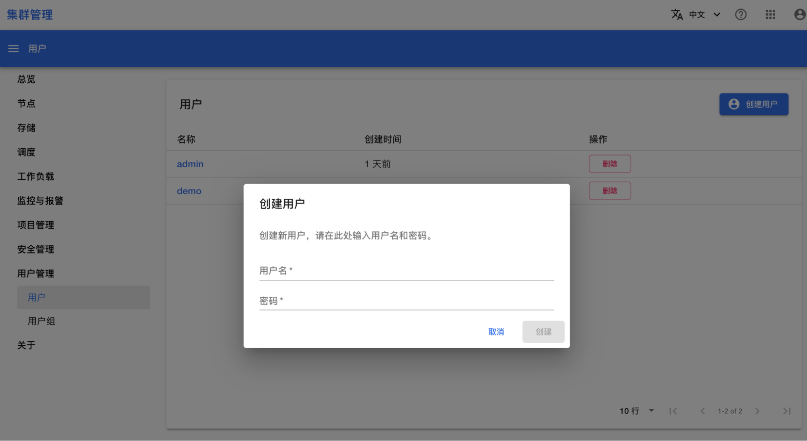

# 安装后配置

## 目的

进行初次安装后的配置工作，包括报警发送方式、日志系统等。

## 前提条件

完成 [产品安装](./install-uc-mode.md)。

## 管理员登录

<aside class="note warning">
<div class="title">注意</div>

下文使用的 `home.sample.t9kcloud.cn` 仅为示例，请使用安装时实际配置的域名。

</aside>

在浏览器中访问集群管理控制台 <https://home.sample.t9kcloud.cn/t9k/cluster-admin/web/>，通过 [安装产品](./install-uc-mode.md) 一节使用的配置文件中设置的 T9k 平台管理员账号密码登录。

点击**用户管理 > 用户**，进入用户列表页面。

<figure class="screenshot">
  
</figure>

点击右上角的**创建用户**来创建一个新用户。

<figure class="screenshot">
  
</figure>

点击**项目管理 > 项目**，进入项目列表页面。

<figure class="screenshot">
  
</figure>

点击右上角的**创建项目**来创建一个新项目。

<figure class="screenshot">
  
</figure>

## 监控系统

### 安装 cAdvisor 服务

<aside class="note warning">
<div class="title">注意</div>

需要确认 t9k-monitoring 已经正确安装。

</aside>

在 K8s 1.24 及之后的一些版本，kubelet cadvisor 无法提供有效的 metrics 信息。管理员需要单独部署 cadvisor 服务来提供集群的 metrics 信息。已知 K8s 版本 1.24.10，1.25.9 存在此问题，根据 <a target="_blank" rel="noopener noreferrer" href="https://github.com/google/cadvisor/issues/2785#issuecomment-1205538108">issue</a> 中的讨论，其它版本也可能存在相同的问题。

cAdvisor 服务的安装步骤：

1. 删除 servicemonitor kubelet 的 cadvisor 部分：

    ```bash
    kubectl -n t9k-monitoring edit servicemonitor kubelet

    # 需要删除的部分
    kubectl -n t9k-monitoring get servicemonitor kubelet \
        -o jsonpath="{.spec.endpoints[?(@.path=='/metrics/cadvisor')]}"
    ```

2. 部署 cadvisor 服务：
 
    <aside class="note warning">
    <div class="title">离线安装</div>

    如果采用本地容器镜像服务器，需要修改镜像仓库的设置：

    ```bash
    sed -i "s|docker.io/t9kpublic|192.168.101.159:5000/t9kpublic|g" \
      ../ks-clusters/additionals/monitoring/cadvisor.yaml
    ```

    </aside>


    ```bash
    kubectl apply -n kube-system -f ../ks-clusters/additionals/monitoring/cadvisor.yaml
    ```

### 告警通知

参考 [管理员手册 > 告警通知](../../../monitoring-and-log-system/monitoring-system.md#告警通知) 来配置系统，告警信息可以通过邮件、企业微信的形式发送给运维人员。

## Logging 系统

### 节点 Label

检查节点的以下 label：

```yaml
# 查看所有节点
kubectl get node

# 查看具有 fluentd-ds-ready 标签的节点，期望的输出是所有的节点
kubectl get node -l beta.kubernetes.io/fluentd-ds-ready="true"

# 查看具有 control-plane 标签的节点，期望的输出是所有控制平面节点
kubectl get node -l node-role.kubernetes.io/control-plane

# 查看具有 ingress 标签的节点，期望的输出是 1-2 个负责控制 ingress 的节点
kubectl get node -l node-role.kubernetes.io/ingress
```

### 配置 ElasticSearch

新部署好的 ElasticSearch 需要添加以下设置：

1. index 的生命周期：30 天自动删除，防止数据过多
1. timestamp 类型设置为纳秒级别

详情请参考：[管理员手册 > 配置 ElasticSearch](../../../monitoring-and-log-system/es.md#修改配置)

### 配置 fluentd

Kubernetes 底层可以使用不同的容器运行时。不同的运行时，存储的日志格式是不同的，因此需要根据使用的容器运行时进行配置。

详情：[管理员手册 > 配置 Fluentd](../../../monitoring-and-log-system/fluentd.md#修改-fluentd-配置)


## 下一步

运行<a target="_blank" rel="noopener noreferrer" href="https://t9k.github.io/user-manuals/latest/get-started/index.html">用户手册 > 快速入门的例子</a>，检验产品的功能。

执行 [安装后可选配置](./post-install-optional.md)。

## 参考

<https://prometheus-operator.dev/docs/operator/api/#monitoring.coreos.com/v1alpha1.AlertmanagerConfig>
