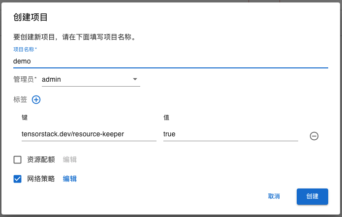
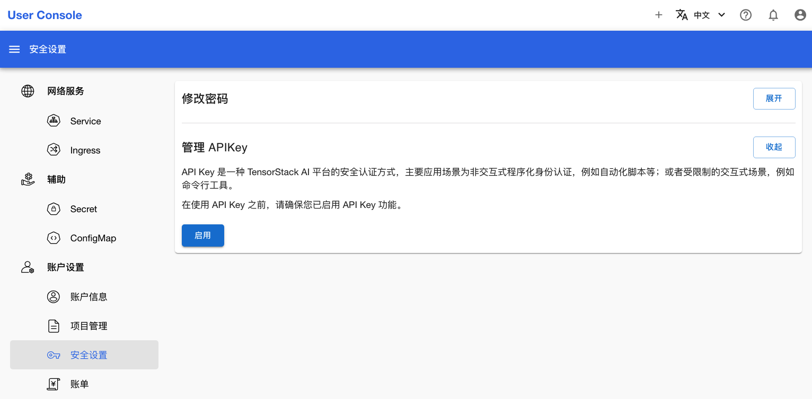
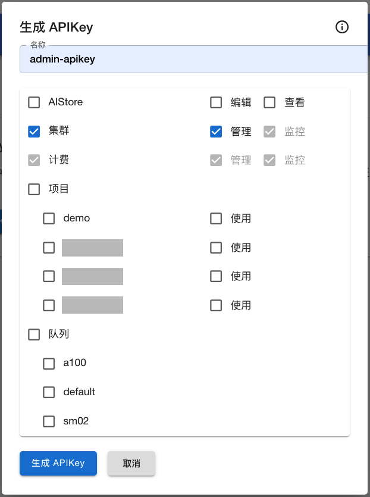
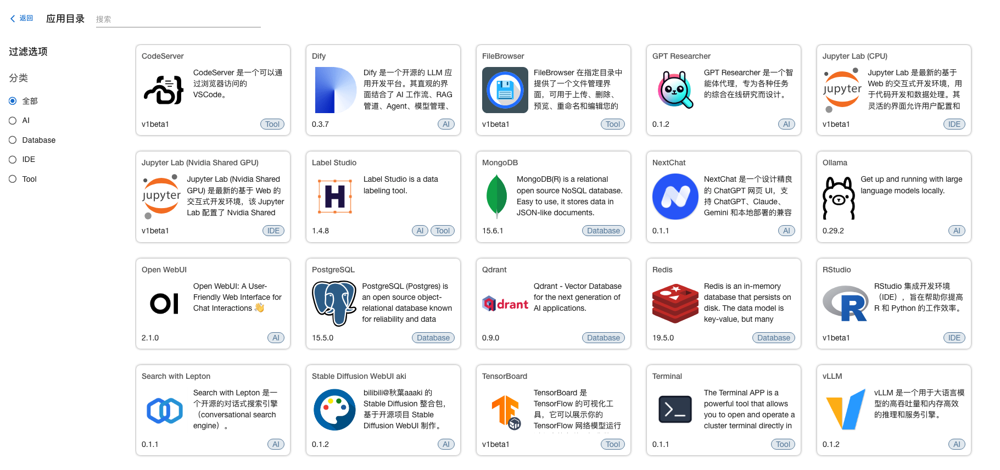

# 注册 APP

## 创建项目

在浏览器中访问 <https://home.sample.t9kcloud.cn/t9k/cluster-admin/web/>，使用管理员账号登录。你可以从 values.yaml 的 `global.t9k.securityService.t9kAdminAccount` 字段中获得管理员账号，例如使用 yq 命令获取：

```bash
# yq 4.x.x 的获取方式如下：
yq e ".global.t9k.securityService.t9kAdminAccount" values.yaml
```

点击左侧导航菜单 “项目管理 -> 项目”，点击右上角 “创建项目”；在弹出的菜单中填写 “项目名称” 和 “管理员”；点击右下角的 “创建” 创建项目：

<figure class="screenshot">
  
</figure>

## 创建 API Key

在浏览器中访问 <https://home.sample.t9kcloud.cn/t9k/user-console/web/>。

点击左侧导航菜单的 “账户设置 > 安装设置”，展开“管理 APIKey”：

<figure class="screenshot">
  
</figure>

点击启用并输入密码，然后 “生成 API Key”；在弹出的菜单中勾选“集群”；点击左下角的“生成 API Key” 创建 API Key：

<figure class="screenshot">
  
</figure>

从页面中复制 API Key 备用。

## 注册 APP

首先，获取 <a target="_blank" rel="noopener noreferrer" href="https://github.com/t9k/apps">apps</a> 中的 APP Template：

```bash
git clone https://github.com/t9k/apps.git && cd apps
```

`user-console` 目录中包含了多个 APP，你可以在 <a target="_blank" rel="noopener noreferrer" href="https://github.com/t9k/apps/blob/master/user-console/README.md">README.md</a> 中看到注册和注销应用的方法。

从 <a target="_blank" rel="noopener noreferrer" href="https://github.com/t9k/user-manuals/releases">releases</a> 中获取最新的 t9k-app 命令行工具。以 Linux 操作系统为例：

```bash
wget https://github.com/t9k/user-manuals/releases/download/2024-08-07/t9k-app-linux-amd64
mv t9k-app-linux-amd64 t9k-app
sudo chmod +x t9k-app
```

注册 APP，这里提供 terminal 和 notebook (jupyter-lab-cpu) 两个例子：

```bash
# 将 API Key 保存在环境变量中
export API_KEY="<admin-api-key>"

# 注册 terminal
./t9k-app register -k $API_KEY \
    -s https://home.sample.t9kcloud.cn/t9k/app/server \
    -f ./user-console/terminal/template.yaml \
    -u -v=2

# 注册 Notebook 中的 jupyter-lab-cpu APP
./t9k-app register -k $API_KEY \
    -s https://home.sample.t9kcloud.cn/t9k/app/server \
    -f ./user-console/notebook/jupyter-lab-cpu/template.yaml \
    -u -v=2
```


每个 APP 注册完成后，都会有一条注册成功的信息：

```console
I1 06/13 14:23:45 logr.go:280 app-server [register app successfully] 
```

## 验证

在 User Console (<https://home.sample.t9kcloud.cn/t9k/user-console/web/>) 中点击左侧导航菜单的 “应用”，点击右上角 “部署应用”，查看可选的应用项：

<figure class="screenshot">
  
</figure>

你也可以通过命令行工具进行确认：

```bash
./t9k-app -k $API_KEY -s https://home.sample.t9kcloud.cn/t9k/app/server list
```

```bash
NAME                DISPLAY NAME                DEFAULT VERSION     CATEGORIES
codeserver          Code Server                 0.1.2               Tool
comfyui             ComfyUI                     0.1.1               AI
dify                Dify                        0.3.7               AI
filebrowser         FileBrowser                 0.1.2               Tool
fish-speech         Fish Speech                 0.1.0               AI
gpt-researcher      GPT Researcher              0.1.5               AI
job-manager         Job Manager                 0.1.3               Tool, AI
jupyterlab-cpu      JupyterLab (CPU)            0.1.2               IDE
jupyterlab-gpu      JupyterLab (Nvidia GPU)     0.1.2               IDE
jupyterlab-test     JupyterLab (TEST)           0.1.2               IDE
```