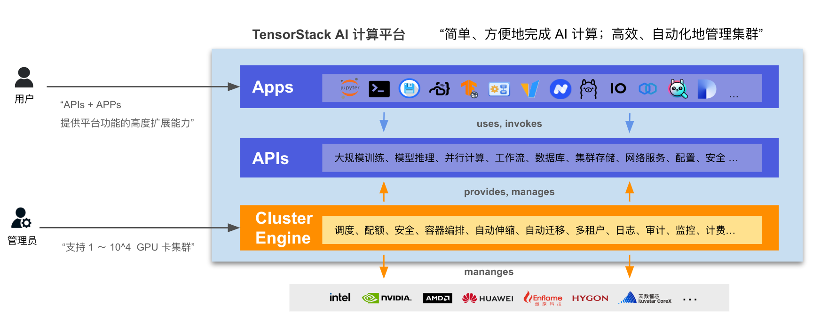

# 概述

“TensorStack AI 计算平台” 是面向 AI 集群的系统软件，针对 AI 集群的硬件架构和 AI 领域的计算任务的特性和需求，提供稳定、可扩展的 AI 技术平台能力，服务 AI 技术研发和规模化落地。

AI 集群的拥有者可以使用这套软件，构建自己的 “AI 私有云” 或 “AI 混合云” 基础设施服务。

<aside class="note info">

“TensorStack AI 计算平台” 的功能

作为基础设施软件，平台提供两方面的能力：

1. **计算服务**：针对 AI 集群使用者，向上支持各种 AI 计算场景，例如：云端开发环境、模型训练、部署推理服务、应用开发等；
1. **集群管理**：针对 AI 集群的管理、运维人员，提供方便的机制，实施各种资源、安全、数据等管理策略。

</aside>

通过先进的架构和丰富的 API + 系统服务，“TensorStack AI 计算平台” 合理地隐藏了分布式并行、异构计算、加速计算等技术的复杂细节，提高了抽象层次，并为 AI 领域的各种计算提供了针对性的支持，极大地提升了 AI 技术研究、开发、应用的工作效率。

<figure class="architecture">
  
  <figcaption>图 1：TensorStack AI 计算平台为 AI 集群提供先进的 AI 基础设施能力。APIs 层提供了可扩展、可编程、云原生的系统服务；Apps 层为多样化的应用场景提供全面、完善的支持：用户可根据需求，安装各种 Apps（IDE、LLM 开发框架、并行训练管理、推理服务管理、资源管理工具、完整的 AI 应用等），满足 AI 研究、开发和应用等业务需求。</figcaption>
</figure>
