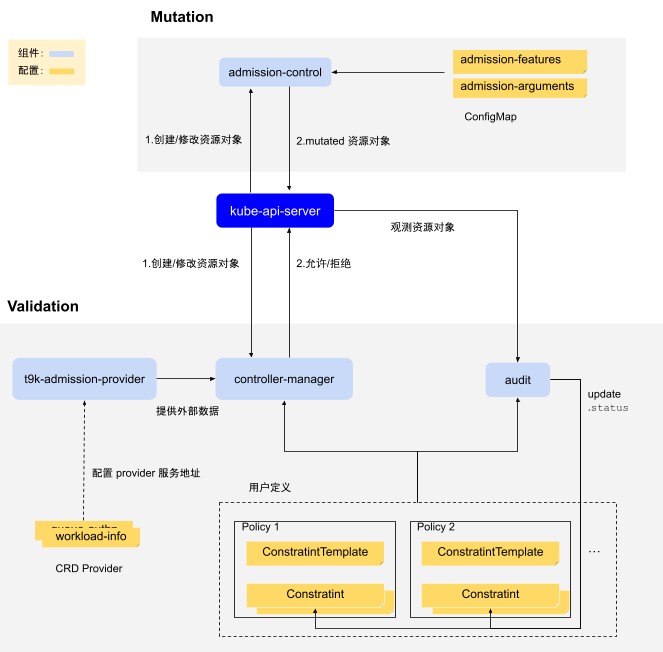

# 准入控制

T9k Admission 根据准入规则（验证规则+变更规则）对用户创建的特定资源对象进行验证、修改，以保证集群的正确性和稳定性。

T9k Admission 包含两部分：

* Validation：验证控制器。根据验证规则来检验用户的资源对象，拒绝非法的资源对象的创建/修改。
* Mutation：变更控制器。根据变更规则来对资源对象进行修改、验证，既可以将资源对象的某些字段设为规定值，也可以拒绝资源对象的创建/修改。

验证控制器和变更控制器通过两种不同的方式实现：

* 验证控制器通过 <a target="_blank" rel="noopener noreferrer" href="https://open-policy-agent.github.io/gatekeeper/website/docs">Gatekeeper</a> 实现，验证规则配置灵活，T9k 提供了一些默认的验证规则，管理员可以按需修改 T9k 验证规则，也可以定义新的验证规则。
* 变更控制器通过专门的 T9k Server 实现，提供固定的变更规则，管理员可以控制变更规则的开启/关闭、调整某些变更规则的参数。

<figure class="architecture">
  
  <figcaption>图 1：TensorStack AI 平台的 admission 机制概览。1）Validation 采用 [GateKeeper](https://open-policy-agent.github.io/gatekeeper/website/)；通过 ConstraintTemplate 和 Constraint 来定义验证规则，其中 Constraint 是 ConstraintTemplate 的实例；二者通过 CRD 的机制实现；2）Mutation 通过 T9k 的独立 server 实现，其配置信息存放在 2 个 configmap 中：admission-security, admission-sched</figcaption>
</figure>

## 验证控制器

验证控制器的组件主要分为两部分：

* Gatekeeper system：gatekeeper 系统服务，主要包含下列组件：
    * `audit`：Audit performs periodic evaluations of existing resources against constraints, detecting pre-existing misconfigurations.
    * `controller manager`：serves the valdating webhook that Kubernetes' API server calls as part of the admission process.
* T9k Admission Provider：https server，用于向 gatekeeper 提供 <a target="_blank" rel="noopener noreferrer" href="https://open-policy-agent.github.io/gatekeeper/website/docs/externaldata">external data</a>。详情见[参考]()。

配置文件：

* CRD Provider：通知 Gatekeeper system 如何访问 T9k Provider 服务。如何配置 provider 可以参考 <a target="_blank" rel="noopener noreferrer" href="https://open-policy-agent.github.io/gatekeeper/website/docs/externaldata/#providers">Gatekeeper 文档</a>。

验证规则：通过 ConstraintTemplate 和 Constraint 来定义验证规则，详情见[验证规则](./validation.md#验证规则)。

## 变更控制器

在集群中与变更控制器相关的资源对象有：

1. Deployment admission-control：运行变更控制器的服务器，提供 mutating webhook 以响应 Kuberetes‘ API server 的调用。
1. Service admission-webhook：将 deploy admission-control 的 Pod 提供的服务暴露出来。
1. MutatingWebhookConfiguration admission.tensorstack.dev：向 Kubernetes API Server 注册 mutating webhook 服务。

配置文件：

* ConfigMap admission-security：存储与安全相关的变更规则配置。
* ConfigMap admission-sched：存储与调度相关的变更规则配置。
