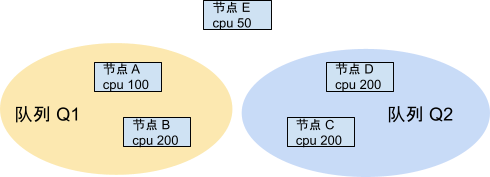
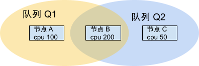

# 常见设置示例

下面说明了一些常见的资源设置策略，提供给管理员参考使用。

## 项目资源配额

推荐通过 [QuotaProfile](./project-resource-quota.md#quotaprofile) 来设置项目资源配额。管理员预先定义多个 QuotaProfiles，然后在为用户创建 Project 时，根据用户的资源权限、Project 的使用场景来配置 Project 的 QuotaProfile。

### 示例

集群资源量 {cpu: 2000, memory: 200Ti, nvidia.com/gpu: 200，nvidia.com/gpu.shared: 400}

集群内定义了 3 个 QuotaProfile：

1. QuotaProfile A：
    1. 资源量 {cpu: 10, memory: 1Ti, nvidia.com/gpu: 0，nvidia.com/gpu.shared: 0}
    1. 适用于资源量需求低，且不需要使用 GPU 的项目。将 nvidia.com/gpu 和 nvidia.com/gpu.shared 设为 0 可以禁止该项目使用 NVIDIA GPU。
1. QuotaProfile B：
    1. 资源量 {cpu: 100, memory: 10Ti, nvidia.com/gpu: 10，nvidia.com/gpu.shared: 0}
    1. 适用于中等资源量需求的项目，项目需要使用独占 GPU，禁止使用共享 GPU。
1. QuotaProfile C：
    1. 资源量 {cpu: 100, memory: 10Ti, nvidia.com/gpu: 0, nvidia.com/gpu.shared: 40}
    1. 适用于中等资源量需求的项目，项目需要使用共享 GPU，禁止使用独占 GPU。
1. QuotaProfile D：
    1. 资源量 {cpu: 1000, memory: 50Ti, nvidia.com/gpu: 50，nvidia.com/gpu.shared: 200}
    1. 适用于较大资源量需求的项目，并且项目同时需要使用独占 GPU 和共享 GPU。 
1. QuotaProfile E:
    1. 资源量 {memory: 50Ti, nvidia.com/gpu: 50}
    1. 只限制内存和独占 GPU 的使用数量，不限制其他资源
1. QuotaProfile F：
    1. 资源量 {persistentvolumeclaims：10，pod：50}
    1. 限制 PVC 和 Pod 的数量

集群内需要新增下列项目：

1. 新增项目 P1，对资源需求量低，且不允许使用 GPU。将 P1 的 QuotaProfile 设为 A。
1. 新增项目 P2，只需要使用独占 GPU。将 P2 的 QuotaProfile 设为 B。
1. 新增项目 P3，只需要使用共享 GPU。将 P3 的 QuotaProfile 设为 C。
1. 新增项目 P4，对资源的需求量较高，并同时需要使用独占 GPU 和共享 GPU。将 P4 的 QuotaProfile 设为 D。
1. 新增项目 P5，只限制内存和独占 GPU 的使用数量。将 P5 的 QuotaProfile 设为 E。
1. 新增项目 P6，想要限制 PVC 和 Pod 的数量。将 P6 的 QuotaProfile 设为 F。

### 规范

为项目设置资源配额时，需要遵守下列规范：

1. 尽量为每个项目都设置资源配额。
1. 所有项目设置的资源配额总和，一般不应该超过集群总资源的 150% （管理员可根据实际运行情况进行调整）。

制定这个规范的目的：

1. 提高资源利用率，同时不过度 oversubscription，以减少集群中 Pending Pod 的数量。
1. 禁止单个项目过度使用集群资源，维护集群资源分配的公平性。

## 队列设置

管理员可以通过设置队列来管理集群资源，具体操作如下：

1. 创建多个队列，并设置队列的[节点权限](./t9k-scheduler.md#节点权限)、[资源配额](./t9k-scheduler.md#资源配额)来划分集群资源。
1. 根据集群内用户、项目所需资源情况，设置队列的[使用权限](./t9k-scheduler.md#使用权限)。

### 节点权限和资源配额

下面是为队列设置节点权限和资源配额的示例。

<aside class="note">
<div class="title">注意</div>

* 为了简化讨论，下文使用了单个节点进行讨论。但应当理解，这里的 “节点 A、B、C、D、E” 等应分别对应不同的节点组。
* 仅讨论了 CPU 资源，其他资源类型类似。

</aside>

<aside class="note info">
<div class="title">oversubscription 策略</div>

oversubscription 是一种在资源管理中常用的策略，它允许系统分配的资源超过物理可用资源的总量。这种策略的主要目的是提高资源利用率，从而最大化系统的性能和效率。

可针对不同计算资源，应用 oversubscription，例如：

1. CPU 过量使用（CPU overcommit）。这允许分配给工作负载的 CPU 数量超过物理 CPU 的数量。这是基于不同工作负载往往不会 100% 使用CPU的情况。
1. 内存过量使用（memory overcommit）。这允许分配给工作负载的内存总量超过物理内存容量。这依赖于操作系统的交换和页面共享功能来管理内存使用。

通过 oversubscription，可以在相同的硬件资源上运行更多的工作负载，提高资源利用效率。但是,如果使用不当，也可能导致性能下降或系统不稳定。因此，需要合理设置 oversubscription 比率，并密切监控资源使用情况。同时也需要在不同应用场景中权衡资源过量使用带来的风险和收益。

</aside>

#### 示例 1：队列资源不重合



队列 Q1 可以使用节点 A 和 B，队列 Q2 可以使用节点 C 和 D；队列之间无重合节点，通常有下面 2 种配置方案：

1. oversubscription：Q1 资源配额 > 300，Q2 资源配额 > 400。队列资源配额 > 实际可用的资源总量。
2. no oversubscription：Q1 资源配额 300 ，Q2 资源配额 400。队列资源配额 = 实际可用的资源总量。

#### 示例 2：队列资源重合



队列 Q1 可以使用节点 A 和 B，队列 Q2 可以使用节点 B 和 C，两个队列均可以使用节点 B。

配额设置除了需要考虑 “示例1” 中的 oversubscription 策略外，通常会有下面 3 种配置方法：

1. shared + oversubscription：
    * 资源设置：Q1 资源配额 300 = 100（节点 A 资源量）+ 200（节点 B 资源量），Q2 资源配额 250 = 50（节点 C 资源量）+ 200（节点 B 资源量）。
    * 说明：这种设置提供了比较多的自由度，但很可能导致节点B的资源全部被 Q1 的工作负载占用，如果 Q1 的工作负载不释放资源，Q2 的工作负载则无法使用节点 B 上的资源。
2. partially shared + no oversubscription：
    * 资源设置：Q1 资源配额 200 = 100（节点 A 资源量）+ 100（节点 B 资源量），Q2 资源配额 150 = 50（节点 C 资源量） + 100（节点 B 资源量）。
    * 说明：对于节点 B，我们为 Q1 和 Q2 设置的资源配额 100 + 100 = 节点 B 的实际资源量，当队列 Q2 处于空闲状态时，节点 B 上总有 100 cpu 不能被使用。
3. partially shared + oversubscription：
    * 资源设置：Q1 资源配额 250 = 100（节点 A 资源量）+ 150（节点 B 资源量），Q2 资源配额 200 = 50（节点 C 资源量） + 150（节点 B 资源量）。
    * 说明：我们为 Q1 和 Q2 设置的资源配额 150 + 150 > 节点 B 的实际资源量，但对单个队列设置的资源量 150 < 节点 B 的实际资源量。这种折衷的设置可以保证队列 Q1 无法占据节点 B 的所有资源，也能提高节点的资源利用率。

#### 总结

管理员可以根据使用需求来自定义队列的资源配额，通常需要考虑下面几点：

1. oversubscription 过多更容易导致资源冲突，即队列的资源配额尚未达到上限，但集群剩余资源已经不足了，导致使用该队列的用户创建工作负载失败。
1. no oversubscription 或 low oversubscription 可能会降低资源利用率，即队列的资源配额达到上限，用户无法在该队列中创建工作负载，但是集群内尚有空闲资源未被使用。
1. 当集群内增加/减少队列数量时，推荐更新队列的资源配额/节点权限，以适配当前集群状态，从而提高集群资源的使用率。

### 局限性

队列是调度器 t9k-scheduler 提供的机制，如果使用其它调度器，例如 kube-scheduler 则无法使用。如需要，集群管理员可以通过配置[验证规则 — R027 Verify Workload Scheduler](./reference/t9k-verification-rules.md#r027---verify-workload-scheduler) 来限制用户可以使用的调度器，即强制要求必须使用 t9k-scheduler。

## 调度器

推荐的调度器设置如下：

```yaml
apiVersion: v1
data:
  scheduler.conf: |
    actions: "allocate,preempt"
    tiers:
    - plugins:
      - name: basic
      - name: resource
      - name: affinity
        arguments:
          weight: 10
      - name: predicates
      - name: binpack
        arguments:
          strategy: MostAllocated
          weight: 1
          resources: nvidia.com/gpu,nvidia.com/gpu.shared
          resources.cpu: 2
          resources.memory: 1
          resources.nvidia.com/gpu: 5
          resources.nvidia.com/gpu.shared: 5
kind: ConfigMap
metadata:
  name: scheduler-config
  namespace: t9k-system
```

其中需要注意的设置有：

1. actions preempt：在 actions 中添加 “preempt” 会触发调度器的抢占机制，请按需配置。
1. plugin binpack：binpack strategy 会影响节点的资源剩余状态，如果你希望工作负载优先被分配到已被分配资源的节点上，使得集群内有尽量多的空闲节点，请设置 strategy 为 MostAllocated；如果你希望工作负载可以均匀地分配到所有节点上，请设置 strategy 为 LeastAllocated。
