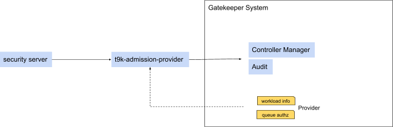

# T9k Admission Provider

T9k Admission Provider（下文简称 T9k Provider）运行了一个 HTTPs Server，用于向 Gatekeeper 提供 externaldata。

## 依赖关系



上图说明了 T9k Provider 与其他组件间的依赖关系：

* T9k Provider 会依赖 Security Server 提供的下列服务：
    * 列举 Project 的所有用户
    * 验证用户 A 是否有权限使用 Queue Q
* T9k Provider 默认提供两个 API：
    * workload info：解析工作负载。
    * queue authz：验证 namespace 的 owner 是否有权限使用 Queue。
* T9k Provider 向 Gatekeeper 提供服务，通过下列 Provider 进行配置：
    * workload info：通知 Gatekeeper 如何访问 T9k Provider workload info API。
    * queue authz：通知 Gatekeeper 如何访问 T9k Provider queue authz API。

## 命令行参数

T9k Provider 主要的命令行参数：

* security-server-host：表明 security server 地址。
* log-level：日志等级，可选等级有 debug, info, warn, error。

```yaml
$ kubectl -n t9k-system get deploy t9k-admission-provider \
  -o jsonpath-as-json='{.spec.template.spec.containers[0].args}'

[
    [
        "--cert-file=/etc/ssl/t9k-admission-provider/tls.crt",
        "--key-file=/etc/ssl/t9k-admission-provider/tls.key",
        "--security-server-host=https://security-console-server.t9k-system:8081",
        "--log-level=info"
    ]
]
```

## K8s 资源对象

在 K8s 中运行 T9k Provider 的相关资源对象如下：

```bash
$ kubectl -n t9k-system get svc,pod -l app=t9k-admission-provider
NAME                             TYPE        CLUSTER-IP      EXTERNAL-IP   PORT(S)   AGE
service/t9k-admission-provider   ClusterIP   10.233.53.165   <none>        443/TCP   46d

NAME                                          READY   STATUS    RESTARTS   AGE
pod/t9k-admission-provider-779bd676b5-4klms   1/1     Running   0          19d
```
