# 用户及安全管理

TensorStack AI 平台的安全系统主要包括以下组件：

* Security Console：提供项目管理、用户管理、用户组管理、API Key 管理、队列使用控制管理等功能。
* Keycloak：一个开源的身份和访问管理（IAM，Identity and Access Management）服务器，提供认证（Authentication）和授权（Authorization）功能，支持从 LDAP 服务器中同步用户数据，并在 Keycloak 中管理这些用户的身份和权限。
* LDAP：一个开放标准的协议，用于访问和管理目录服务中存储的信息（例如用户、用户组、组织结构等）。平台支持接入已存在的 LDAP 服务器或部署一个新的 OpenLDAP 服务器。
* PEP Proxy：提供安全访问控制（PEP，Policy Enforcement Point）功能，作为反向代理部署在每个需要保护的资源服务器（Resource Server，例如 Notebook、Build Console 等）之前，要求必须持有有效且权限足够的凭证才能访问，支持的访问凭证种类有 Cookie（可通过 Web 登录得到）、Token（可通过 T9k CLI 登录得到）、API Key（任意用户均可创建 API Key 以便将自身的部分权限分享给其他人）。

<figure class="architecture">
  
  <figcaption>图 1：TensorStack AI 平台的安全系统架构示意图。1）PEP Proxy、Security Console、Keycloak、LDAP 协同提供平台的身份和访问管理功能，其中 LDAP 负责管理用户数据、Keycloak 负责管理权限数据、Security Console 负责对外提供具体 API、PEP Proxy 负责保护每个资源服务器；2）集群管理员通过 Cluster Admin 管理用户、用户组、项目，普通用户通过 Account Console 分享自己的项目、创建 API Key；3）普通用户通过 Web 登录获取 Cookie，或通过 T9k CLI 登录获取 Token，或持有其他用户分享给自己的 API Key，即可访问平台，PEP Proxy 将对 Cookie、Token、API Key 进行权限验证，检查用户是否拥有足够的权限</figcaption>
</figure>
