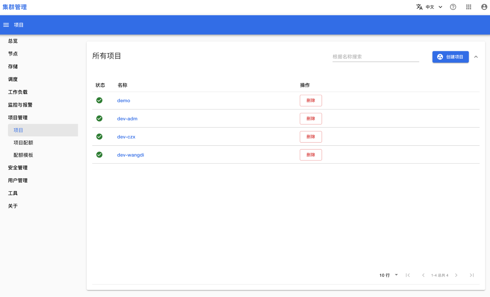
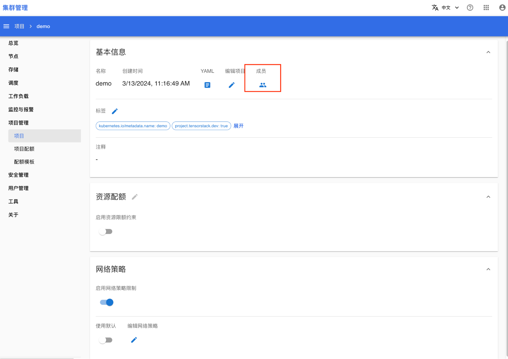
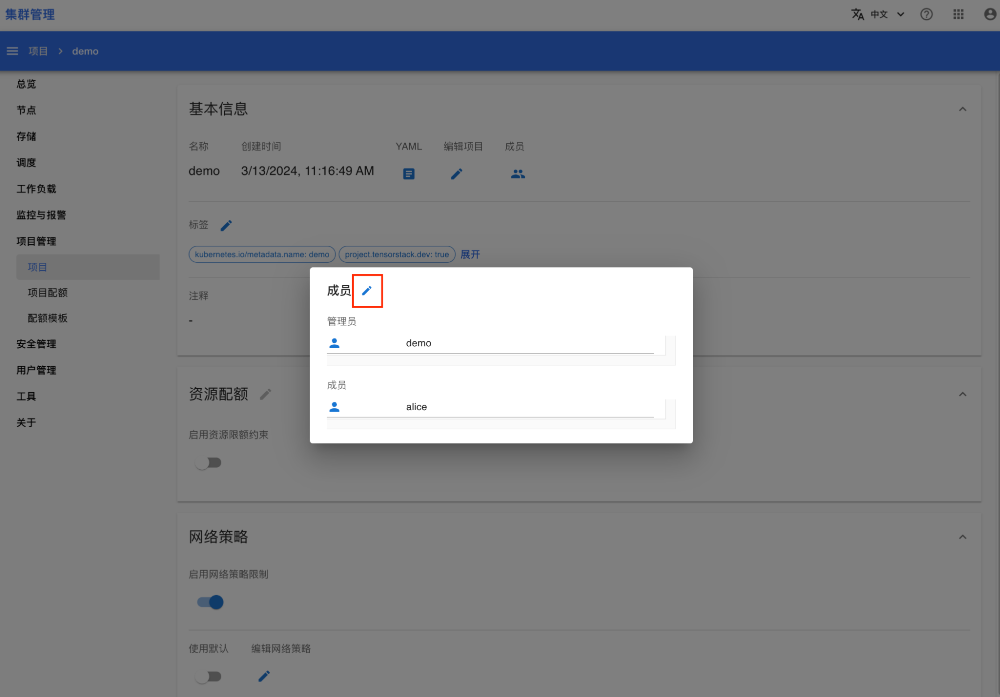
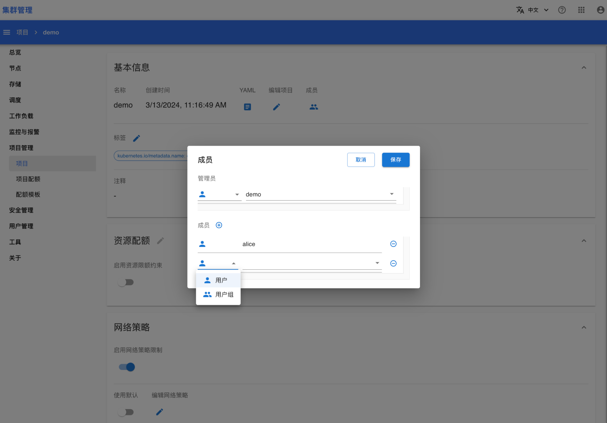
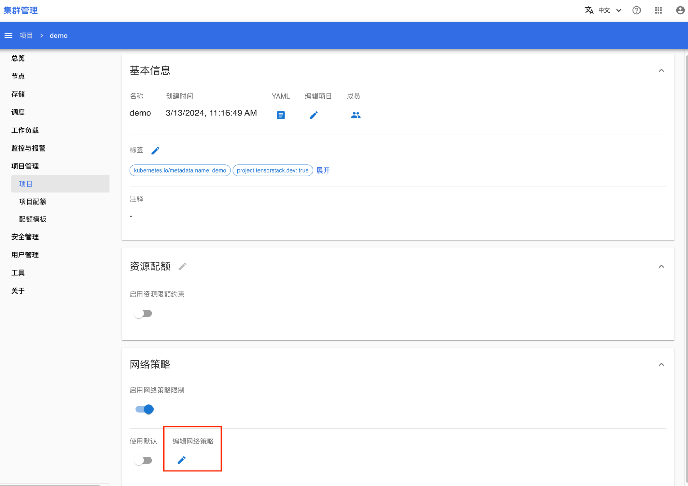
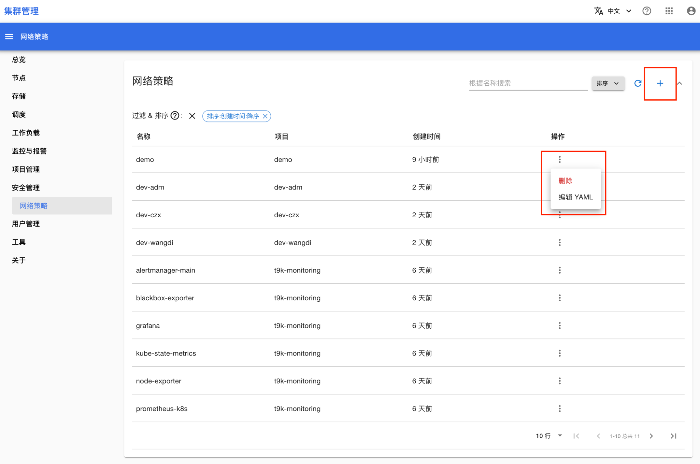

# 项目管理

## 管理员和成员

每个项目必须拥有一个管理员，可以拥有多个成员。其中，管理员必须是一个用户，成员可以是一个用户或一个用户。例如，项目 demo 的管理员是用户 alice，成员包括用户 bob、carol 和用户组 engineers。

进入集群管理控制台，在左侧导航菜单中点击**项目管理 > 项目**进入项目管理页面，然后点击某个项目的名称进入项目详情页面：

<figure class="screenshot">
  
</figure>

点击**成员图标**，查看该项目的所有成员：

<figure class="screenshot">
  
</figure>

点击**编辑按钮**，可以修改管理员、添加或删除成员：

<figure class="screenshot">
  
</figure>

<figure class="screenshot">
  
</figure>

## 网络策略

管理员可以限制一个 Pod 能够通信的实体，可基于命名空间、标签、IP 地址、端口等信息来进行限制，包括上行方向（egress）和下行方向（ingress）。此功能通过创建一个 <a target="_blank" rel="noopener noreferrer" href="https://kubernetes.io/docs/concepts/services-networking/network-policies/">Kuberentes Network Policy</a> 资源实现。

### 管理项目网络策略

默认情况下，每个项目会创建如下 NetworkPolicy（以 demo 项目为例）：

```yaml
kind: NetworkPolicy
apiVersion: networking.k8s.io/v1
metadata:
 name: demo
 namespace: demo
spec:
 podSelector: {}
 ingress:
   - from:
       - namespaceSelector:
           matchLabels:
             kubernetes.io/metadata.name: t9k-system
       - namespaceSelector:
           matchLabels:
             kubernetes.io/metadata.name: kube-system
       - namespaceSelector:
           matchLabels:
             kubernetes.io/metadata.name: istio-system
       - namespaceSelector:
           matchLabels:
             kubernetes.io/metadata.name: t9k-monitoring
       - namespaceSelector:
           matchLabels:
             kubernetes.io/metadata.name: knative-serving
       - namespaceSelector:
           matchLabels:
             kubernetes.io/metadata.name: demo
 policyTypes:
   - Ingress
```

其中：

* 只对下行（ingress）流量做限制，不对上行（egress）流量做限制。
* 下行方向仅允许来自 t9k-system、kube-system、istio-system、t9k-monitoring、knative-serving 以及该项目本身的网络请求。

在项目详情页面，点击**编辑网络策略**，可以修改上述默认网络策略：

<figure class="screenshot">
  
</figure>

在弹出的编辑框中修改 NetworkPolicy 模板，点击**保存**即可（点击**恢复**可以回退至原始版本）：

<figure class="screenshot">
  
</figure>

### 管理所有网络策略

进入集群管理控制台，在左侧导航菜单中点击**安全管理 > 网络策略**进入网络策略管理页面：

<figure class="screenshot">
  
</figure>

这里列出了集群中所有的 NetworkPolicy 资源，您可以在此创建、编辑、删除 NetworkPolicy。
