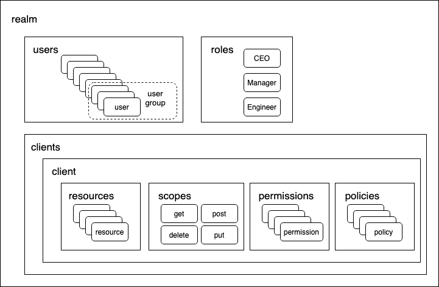

# Keycloak

## Keycloak 概念

平台使用 <a target="_blank" rel="noopener noreferrer" href="https://www.keycloak.org/">Keycloak</a> 作为身份和访问管理（IAM）服务器，用于存储用户身份以及访问控制策略。理解 Keycloak 的运行需要用到以下术语：

* user：user 是登录的实体，拥有邮箱、用户名、密码等属性，可以属于某个用户组，可以被分配某个 role。
* role：role 是 user 的类型，例如项目经理、开发工程师、运维工程师等。管理员可以给某个 role 分配一些权限，那么这个 role 下的所有 user 就都拥有这些权限。
* realm：用于管理 user、role、访问控制策略的集合。user 从属于 realm，不同的 realm 之间是互相隔离的。
* client：用于给 user 认证和授权的实体。管理员可以在一个 realm 中创建一些 client，通常每个使用 Keycloak 服务的应用使用不同的 client。以下的 resource、scope、policy、permission 都从属于 client。
* resource：受保护的资源，可以是 endpoint, HTML page, 单个对象，一组同类型对象等。resource 的所有者可以是某个 client，也可以是某个 user。
    * 如果所有者是 client，那么其权限控制逻辑通过下面的 permission 和 policy 来控制。
    * 如果所有者是 user，那么所有者可以分享该 resource 的部分 scope 给其他 user，只有所有者和被分享者能够访问该 resource。
* scope：可以针对某个 resource 进行的操作，例如 create/read/update/delete。
* permission：当某个 user 试图在某个 resource 上进行某个 scope 对应的操作时，permission 将该操作与某个 policy 对应起来，如果该 policy 的评估结果是通过，该 user 才能进行该操作。
* policy：policy 定义了访问某个 resource 的某个 scope 必须满足的条件。Keycloak 提供丰富的 policy 类型，例如基于 role（RBAC）、基于 resource attribute（ABAC）、基于 user 或者上述几种的组合。

这些术语之间的关系如下图所示：

<figure class="architecture">
  
  <figcaption>图 1：Keycloak 中各个概念的关系示意图。realm 包括 user、group、role、client 等资源，client 包括 resource、scope、permission、policy 等资源</figcaption>
</figure>

## Keycloak 配置

基于 Keycloak 提供的上述机制，平台在 Keycloak 中创建一个 realm，名为 t9k-realm，其中：

* user 和 user group 从 LDAP 中同步数据。
* 创建四个 role，名为 cluster-admin、cluster-monitor、cost-admin、cost-monitor，其中：
    * cluster-admin 是平台的管理员，拥有最高权限。
    * cluster-monitor 是平台的监控管理员，拥有查看平台整体运行情况的权限。
    * cost-admin 是计费系统的管理员，拥有查看各个项目费用、编辑资源价格的权限。
    * cost-monitor 是计费系统的监控管理员，拥有查看各个项目费用的权限。
* 创建两个 client，名为 t9k-client、t9k-aistore，其中：
    * t9k-client 供 Account Console、Build Console、Cluster Admin、Cost、Deploy Console、Workflow 等控制台使用。
    * t9k-aistore 供 AssetHub、ExperimentManager 等控制台使用。

<figure class="architecture">
  
  <figcaption>图 2：role 之间的包含关系。例如，如果某用户是 cost-admin，那么其自动拥有 cost-monitor 的权限</figcaption>
</figure>

下面详细展示 t9k-client 和 t9k-aistore 中的配置：

* 在 t9k-client 中：
    * 创建下列 resource：
        * 创建一个名为 cluster 的 resource，与 admin、monitor 等 scope 相关联，用于集群相关的权限验证
        * 创建一个名为 cost 的 resource，与 admin、monitor 等 scope 相关联，用于计费相关的权限验证
        * 对于每个 Project 创建一个 resource，名为 /project:<project-name>，与 admin、use 等 scope 相关联，用于 Project 相关的权限验证
        * 对于每个 Queue 创建一个 resource，名为 /queue:<queue-name>，不关联任何 scope，用于 queue 相关的权限验证
    * 创建下列 scope：
        * admin：表示具有某个 resource 的“管理”权限
        * monitor：表示具有某个 resource 的“监控”权限
        * use：表示具有某个 resource 的“使用”权限
    * 创建下列 policy：
        * cluster-admin：要求拥有 cluster-admin role
        * cluster-monitor：要求拥有 cluster-monitor role
        * cost-admin：要求拥有 cost-admin role
        * cost-monitor：要求拥有 cost-monitor role
        * DenyAll：拒绝所有
        * 对于每个 user，创建一个名为 user:<user-name> 的 policy，要求是对应 user
        * 对于每个 group，创建一个名为 group:<group-name> 的 policy，要求属于对应的 group
    * 创建下列 permission：
        * cluster-admin-permission：要拥有 cluster resource 的 admin scope 权限，必须符合 cluser-admin policy
        * cluster-monitor-permission：要拥有 cluster resource 的 monitor scope 权限，必须符合 cluser-monitor policy
        * cost-admin-permission：要拥有 cost resource 的 admin scope 权限，必须符合 cost-admin policy
        * cost-monitor-permission：要拥有 cost resource 的 monitor scope 权限，必须符合 cost-monitor policy
        * 对于每个 Project，创建两个 permission：
            * project:<project-name>:admin：要拥有 /project:<project-name> resource 的 admin scope 权限，必须符合一些 policy，例如 user:<user-name>，用于指定一个 Project 的管理员
            * project:<project-name>:use：要拥有 /project:<project-name> resource 的 use scope 权限，必须符合一些 policy，例如 user:<user-name>，用于将一个 Project 分享给一些用户
        * 对于每个 Queue，创建一个 permission：
            * queue:<queue-name>：要拥有 /queue:<queue-name> resource 的权限，必须符合一些 policy，例如 user:<username>、group:<group-name>，用于限制一个 queue 只能被某些用户、用户组使用
* 在 t9k-aistore 中：
    * 创建下列 resource：
        * Default Resource，与 view、edit 等 scope 相关联
    * 创建下列 scope：
        * view
        * edit
    * 创建下列 policy：
        * Default Policy：允许所有
    * 创建下列 permission：
        * grant-all：要拥有 Default Resource 的 view、edit scope 权限，必须符合 Default Policy
        * 注：这里可以认为是用户总是可以 edit/view 自己的资源，所以是 grant-all。用不同的 scope 只是为了在获取 RPT 的时候能携带不同的 scope，方便 API Key 限制权限
    * 注：t9k-aistore client 主要用于记录 API Key 包含的权限，用户使用 AssetHub、ExperimentManager 等产品时，具体文件权限的管理在 aistore server 中实现

<figure class="architecture">
  
  <figcaption>图 3：平台在 Keycloak 中的配置示意图。以 t9k-client 为例，其中展示了 resource 与 scope 的关联，policy 和 user、role 的关联。permission 关联了 resource、scope、policy 三者，较为复杂，未在图中画出</figcaption>
</figure>
