# 用户管理

通过集群管理（Cluster Admin）控制台，管理员可以管理用户、用户组，以及限制队列的使用权限。通过账户管理（Account Management）控制台，每个用户可以管理自己的 API Key。

## 用户

### 创建用户

进入集群管理控制台，在左侧导航菜单中点击**用户管理 > 用户**进入用户管理页面，然后点击右上角的**创建用户**来创建一个用户：

<figure class="screenshot">
  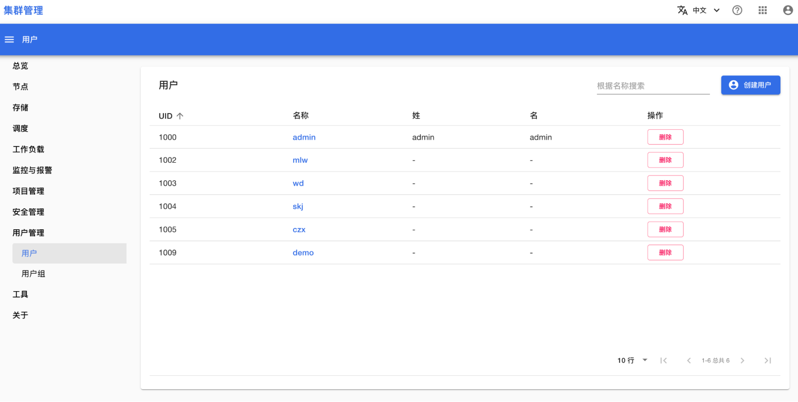
</figure>

必填项包括用户名、主用户组、密码。在平台中，每个用户**必须**属于一个主用户组，并且**可以**属于多个其他用户组。

<figure class="screenshot">
  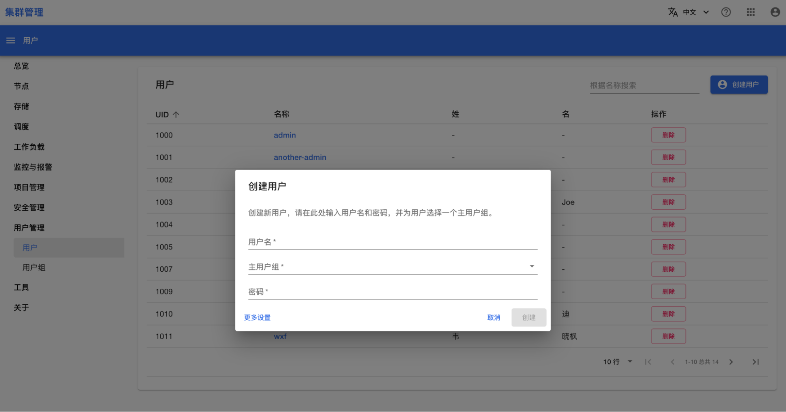
</figure>

另外，您也可以点击**更多设置**来填写一些可选项。例如，为用户指定一个用户 ID（如果不填写此项，默认会为用户生成一个可用 ID）。

<figure class="screenshot">
  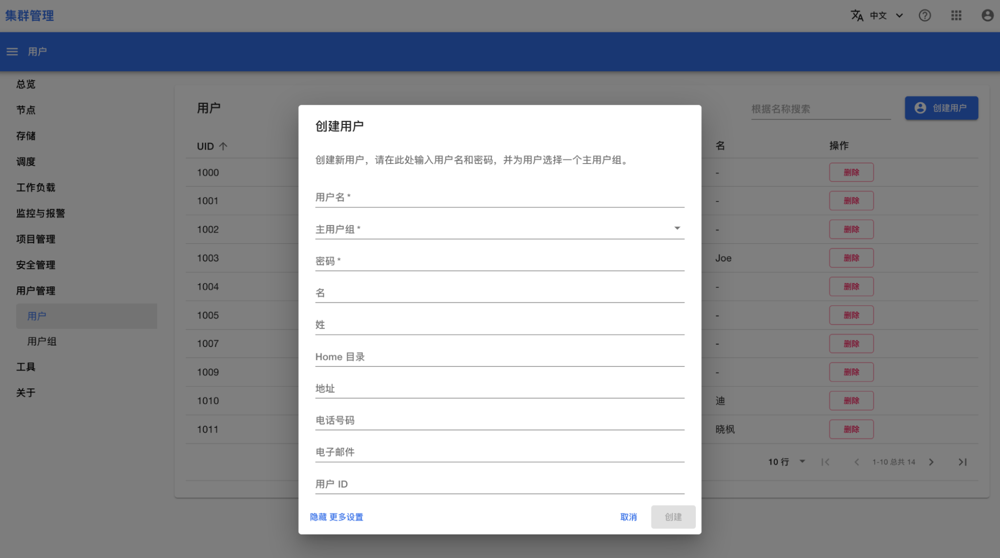
</figure>

### 加入用户组

在用户管理页面，点击一个用户的名称进入该用户的详情页面：

<figure class="screenshot">
  
</figure>

在平台中，每个用户**必须**属于一个主用户组，并且**可以**属于多个其他用户组。您可以通过点击**设为主用户组**、**离开**、**加入**等按钮管理该用户所在的所有用户组：

<figure class="screenshot">
  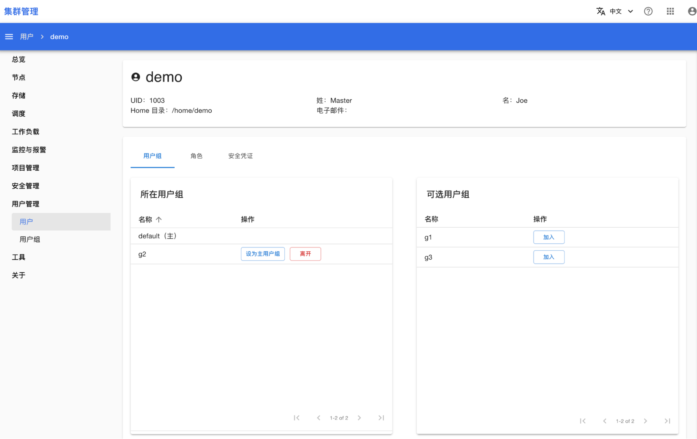
</figure>

### 授予用户权限

在用户详情页面点击**角色**，来为该用户设置一些角色，授予该用户这些角色的权限：

<figure class="screenshot">
  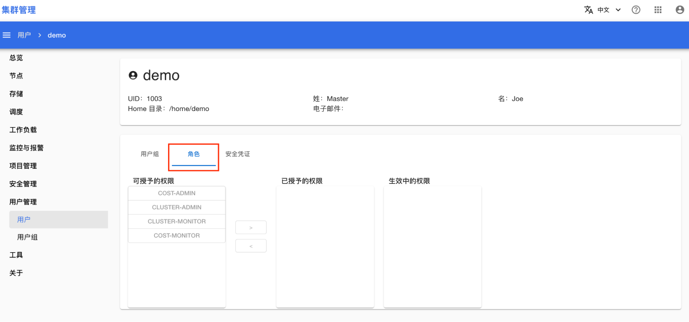
</figure>

点击角色名称，然后点击 **>**，即可授予权限：

<figure class="screenshot">
  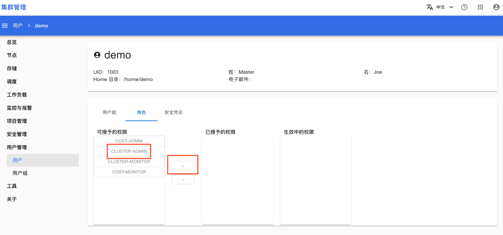
</figure>

可供选择的角色有：

* cluster-admin：平台的管理员，拥有最高权限。
* cluster-monitor：平台的监控管理员，拥有查看平台整体运行情况的权限。
* cost-admin：计费系统的管理员，拥有查看各个项目费用、编辑资源价格的权限。
* cost-monitor：计费系统的监控管理员，拥有查看各个项目费用的权限。

### 重设用户密码

在用户详情页面点击安全凭证，来为该用户重新设置密码（注：无需原密码）：

<figure class="screenshot">
  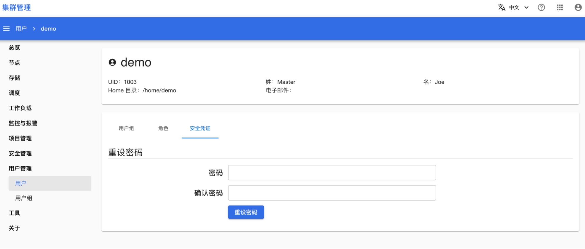
</figure>

## 用户组

### 创建用户组

进入集群管理控制台，在左侧导航菜单中点击**用户管理 > 用户组**进入用户组管理页面，然后点击右上角的创建用户组来创建一个用户组：

<figure class="screenshot">
  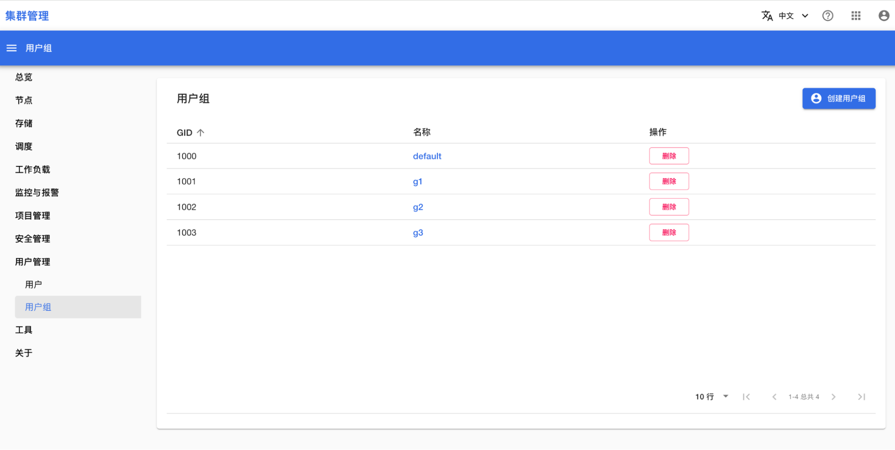
</figure>

填写用户组名称，然后点击**创建**即可：

<figure class="screenshot">
  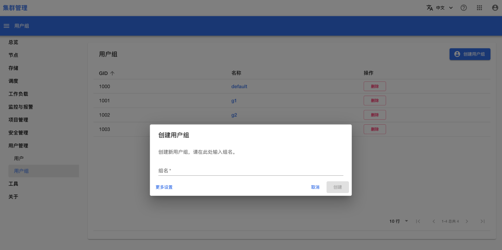
</figure>

另外，您也可以点击**更多设置**来填写一些可选项。例如，为用户组指定一个 ID（如果不填写此项，默认会为用户组生成一个可用 ID）。

<figure class="screenshot">
  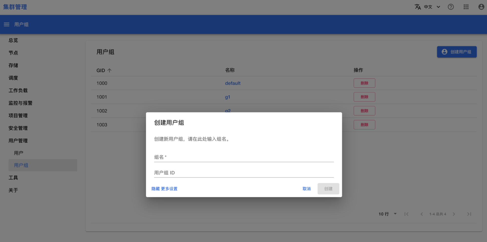
</figure>

### 添加用户

在用户组管理页面，点击一个用户组的名称，进入该用户组的详情页面：

<figure class="screenshot">
  
</figure>

您可以通过点击**移出用户组、加入用户组**等按钮，管理该用户组中包含哪些用户：

<figure class="screenshot">
  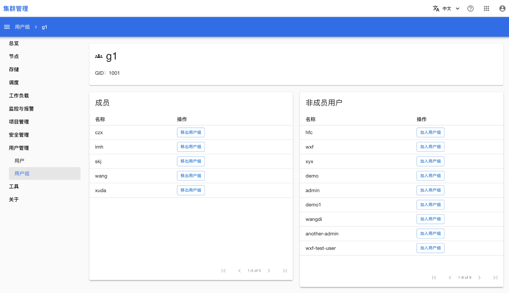
</figure>

## 队列

管理员可以限制一个队列能被哪些用户/项目使用：

* 如果工作负载所在的项目的管理员属于限制范围，那么该工作负载可以使用队列。
* 或者，如果工作负载所在的项目属于限制范围，那么该工作负载可以使用队列。

### 限制用户、用户组

进入集群管理控制台，在左侧导航菜单中点击**调度 > 队列**进入队列管理页面，然后点击一个队列的名称进入该队列的详情页面：

<figure class="screenshot">
  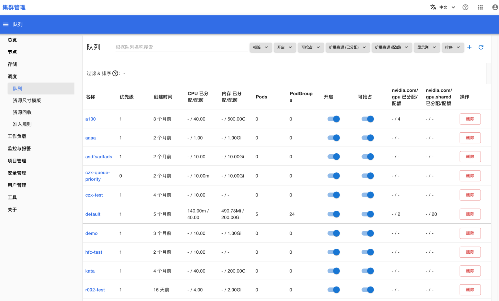
</figure>

在队列详情页面，您可以查看该队列目前能被哪些用户、用户组使用：

<figure class="screenshot">
  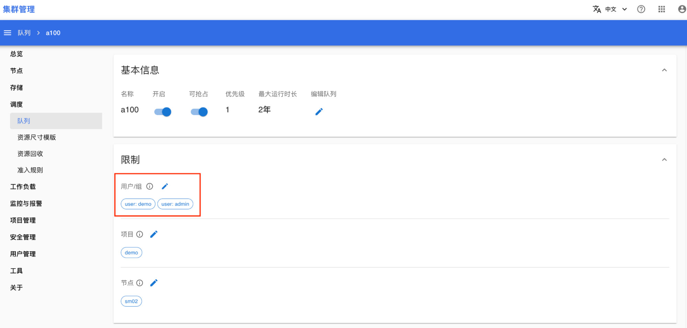
</figure>

点击**编辑按钮**，您可以编辑能够使用该队列的用户、用户组：

<figure class="screenshot">
  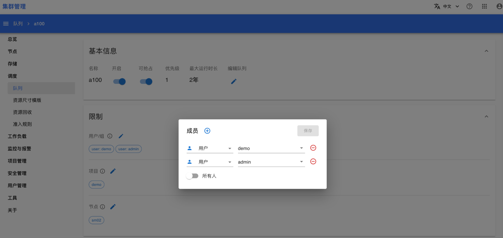
</figure>

### 限制项目

在队列详情页面，您可以查看该队列目前能被哪些项目使用：

<figure class="screenshot">
  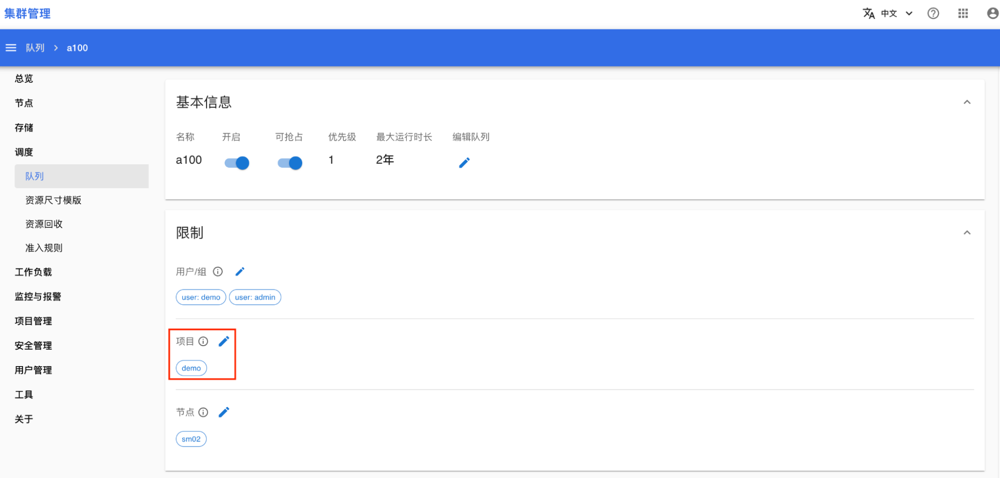
</figure>

点击**编辑按钮**，您可以编辑能够使用该队列的项目：

<figure class="screenshot">
  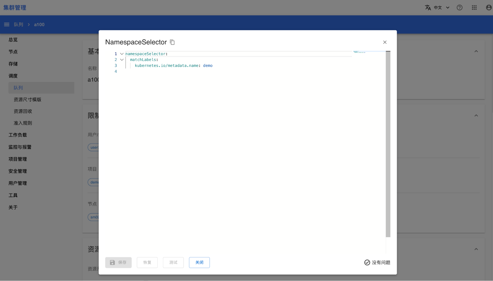
</figure>

目前支持通过标签来过滤项目。由于每个项目默认附带一个标签 `kubernetes.io/metadata.name: <project-name>`，您可以在上述编辑框中填写如下内容来限制该队列仅能被 project1、project2、project3 使用：

```yaml
namespaceSelector:
 matchExpressions:
   - key: kubernetes.io/metadata.name
     operator: In
     values:
       - project1
       - project2
       - project3
```

## API Key

每个用户都可以在账号管理控制台创建 API Key，将自己的部分权限封装为一个 Key，方便地共享给其他用户。其他用户可以在 T9K CLI、Python SDK 中使用 API Key。

## 创建 API Key

进入账号管理控制台，在左侧导航菜单中点击**账号 > API Key** 进入 API Key 管理页面：

<figure class="screenshot">
  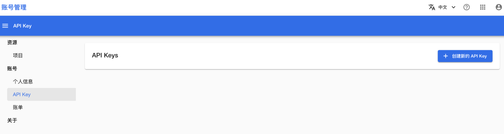
</figure>

点击**创建新的 API Key** 进入 API Key 创建页面：

<figure class="screenshot">
  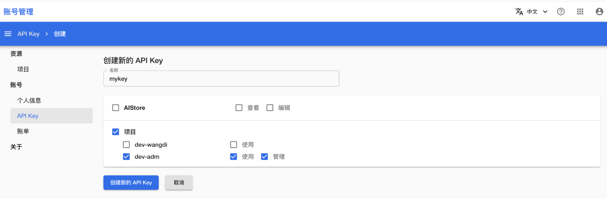
</figure>

勾选您想要分享的权限，然后点击**创建新的 API Key** 即可。

### 使用 API Key

请参考<a target="_blank" rel="noopener noreferrer" href="https://t9k.github.io/user-manuals/latest/tasks/use-api-key.html">用户手册</a>。
