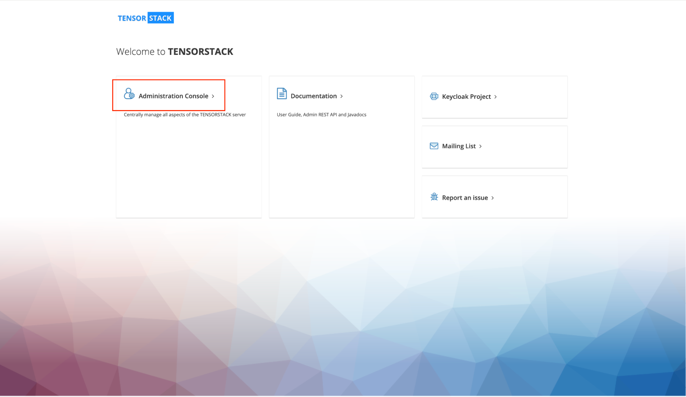
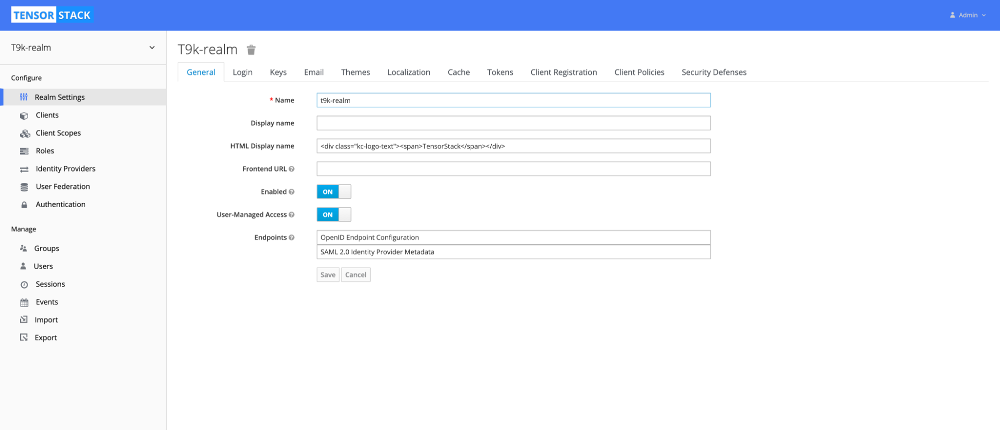
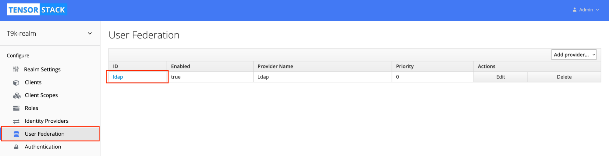
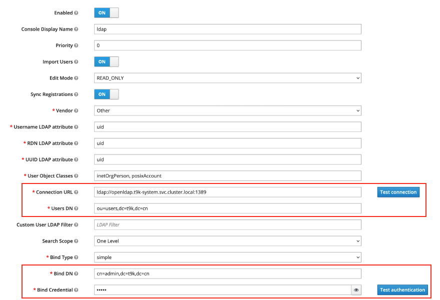
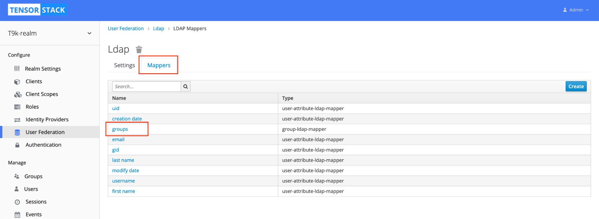
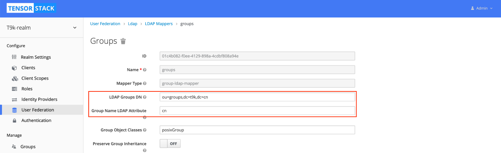

# 查看运行状态

## LDAP

如果您使用的是自行部署的 LDAP 服务器，请查看其对应的管理手册。

如果您使用的是平台提供的 OpenLDAP 服务器，运行以下命令查看 LDAP 运行状态：

```bash
$ kubectl get pods -n t9k-system -l app.kubernetes.io/name=openldap
NAME                        READY   STATUS    RESTARTS   AGE
openldap-7bbfc86447-qkjwv   1/1     Running   0          27d
```

查看日志：

```bash
$ kubectl logs -n t9k-system -l app.kubernetes.io/name=openldap --tail 100 -f
65e067b6.015ed61f 0x7ff5e10fb700 conn=1324 op=0 BIND dn="cn=admin,dc=t9k,dc=cn" method=128
65e067b6.01601428 0x7ff5e10fb700 conn=1324 op=0 BIND dn="cn=admin,dc=t9k,dc=cn" mech=SIMPLE bind_ssf=0 ssf=0
65e067b6.01620ea8 0x7ff5f17e4700 conn=1322 op=1 SRCH base="ou=users,dc=t9k,dc=cn" scope=1 deref=3 filter="(&(objectClass=*)(uid=demo))"
65e067b6.01620fc3 0x7ff5e1bfd700 conn=1323 op=1 SRCH base="ou=users,dc=t9k,dc=cn" scope=1 deref=3 filter="(&(objectClass=*)(uid=demo))"
65e067b6.01649e0d 0x7ff5f17e4700 conn=1322 op=1 SRCH attr=uid mail uidNumber gidNumber sn cn objectclass createTimestamp modifyTimestamp
65e067b6.0164ec7a 0x7ff5e10fb700 conn=1324 op=0 RESULT tag=97 err=0 qtime=0.000031 etime=0.000456 text=
65e067b6.01656a4f 0x7ff5e1bfd700 conn=1323 op=1 SRCH attr=uid mail uidNumber gidNumber sn cn objectclass createTimestamp modifyTimestamp
```

## Keycloak

Keycloak 中的的相关概念以及平台如何配置 Keycloak 详见[参考：Keycloak](./reference/keycloak.md)。

### 查看运行状态

Keycloak 组件包括一个服务器和一个 PostgreSQL 数据库，运行以下命令查看 Keycloak 运行状态：

```bash
$ kubectl get pods -n t9k-system -l app=keycloak
NAME                                   READY   STATUS    RESTARTS   AGE
keycloak-d6b8cfd94-856x7               1/1     Running   0          18h
keycloak-postgresql-76b66864bd-x4c7q   1/1     Running   0          18d
```

查看日志：

```bash
$ kubectl logs -n t9k-system keycloak-d6b8cfd94-856x7 --tail 100 -f
$ kubectl logs -n t9k-system keycloak-postgresql-76b66864bd-x4c7q --tail 100 -f
```

### 查看配置

在 Keycloak UI 中，点击 **Administration Console** 进入管理控制台：

<figure class="screenshot">
  
</figure>

您可以在此查看 Keycloak 的所有配置：

<figure class="screenshot">
  
</figure>

<u>一般情况下，请勿修改 Keycloak 配置！</u>

### 修改 LDAP 配置

如果您需要修改 LDAP 配置（例如使用自行部署的 LDAP 服务），请按照以下步骤执行。

进入 Keycloak UI，选择 **User Federation > ldap** 进入 LDAP 配置页面：

<figure class="screenshot">
  
</figure>

按照 LDAP 服务的实际情况填写 LDAP User Federation 配置：

<figure class="screenshot">
  
</figure>

<u>红框标记以外的字段请勿修改，否则可能会导致用户管理服务错误；修改内容应与 LDAP 实际部署情况对应。</u>

#### Groups Mapper

如果 groups 的 DN 发生改变，需要修改 Groups Mapper：

<figure class="screenshot">
  
</figure>

<figure class="screenshot">
  
</figure>

<u>红框标记以外的字段请勿修改，否则可能会导致用户管理服务错误；修改内容应与 LDAP 实际部署情况对应。</u>

## Security Console

### 查看运行状态

运行以下命令查看 Security Console 的运行状态：

```bash
$ kubectl get po -n t9k-system -l app=security-console-server
NAME                                       READY   STATUS    RESTARTS   AGE
security-console-server-689dd89d8f-j42bg   3/3     Running   0          23h
```

查看日志：

```bash
$ kubectl logs -n t9k-system -l app=security-console-server --tail 100 -f
I1 03/01 05:20:46 handler.go:96 security console/rbac-handler [GET /rbac-proxy/queues/evaluate?user=demo&queue=r003-test] http=HTTP/1.1
I1 03/01 05:21:04 handler.go:96 security console/rbac-handler [GET /rbac-proxy/projects/owner?projects=demo] http=HTTP/1.1
I4 03/01 05:21:04 cache.go:244 security console/rbac-handler [Refresh Cache]
```

### 查看配置

Security Console 的配置支持三种来源：命令行参数、环境变量和配置文件，优先级递减。

运行以下命令查看命令行参数和环境变量：

```bash
$ kubectl get pods -n t9k-system -l app=security-console-server -o yaml
```

运行以下命令查看配置文件：

```bash
$ kubectl -n t9k-system get cm security-console-config -o yaml
```

配置文件示例如下：

```yaml
kind: ConfigMap
metadata:
  name: security-console-config
  namespace: t9k-system
data:
  client-config.json: |-
    {
      "admin": {
        "username": "admin",
        "password": "<omitted>"
      },
      "keycloak": {
        "host": "https://auth.example.t9kcloud.cn",
        "realm": "t9k-realm",
        "userClaim": "preferred_username",
        "hideRoles": ["default-roles-t9k-realm", "offline_access", "uma_authorization"]
      },
      "log": {
        "v": 2,
        "logColors": true,
        "showErrorTrace": true
      },
      "resources": {
        "client": "t9k-client",
        "project": {"blacklist":["^t9k-"],"enabled":true,"gvr":{"group":"tensorstack.dev","resource":"projects","version":"v1beta1"}},
        "queue": {"enabled":true,"gvr":{"group":"scheduler.tensorstack.dev","resource":"queues","version":"v1beta1"},"namespace":"t9k-system"}
      },
      "apikey": {
        "sql": {
          "type": "postgresql",
          "postgresql": {
            "host": "keycloak-postgresql.t9k-system",
            "port": "5432",
            "database": "apikey",
            "user": "security_console",
            "password": "<omitted>"
          }
        },
        "clients": ["t9k-aistore", "t9k-client"]
      },
      "cookieSecret": "<omitted>",
      "clients": ["t9k-aistore", "t9k-client"]
    }
```

以 `admin.username` 为例，配置文件中的字段可以用对应命令行参数或环境变量进行设置：

* 命令行参数 `--admin.username=admin`，规则为：配置文件中的每一个字段，都可以用它在 json 中的路径作为命令行参数。
* 环境变量 `SECURITY_ADMIN_USERNAME=admin`，转换规则为：配置文件中的每一个字段，都可以用它在 json 中的路径加上 `security.` 前缀（`security.admin.username`），然后将所有字母大写，并用 `_` 替换 `.`（`SECURITY_ADMIN_USERNAME`），作为对应环境变量名。

配置说明：

* admin：keycloak 管理员账号。
* keycloak：keycloak 配置信息。
* log：日志配置，包括日志等级、日志显示样式。
* resources：是否支持管理 Project、Queue 的权限，以及两种资源的 GVR 等信息。
* apikey：
    * sql：记录 postgresql 服务器配置，用于存储 apikey。
    * clients：支持用 apikey 代表哪些 Keycloak Client 中的资源权限，举例来讲：如果删除 clients 中的 t9k-aistore，则无法在使用 apikey 访问 AssetHub 和 ExperimentManagement 中的数据。
* cookieSecret：cookie 加密用的密钥，建议使用 32 位随机字符串。
* clients：Security Console 负责哪些 Keycloak Client 的安全管理。

### 修改配置

如果管理员需要修改 Security Console 配置（如日志等级、替换 postgresql 服务等），建议只修改 ConfigMap 中的配置，原因是 ConfigMap 中的配置更有结构化，比较清楚：

```bash
$ kubectl -n t9k-system edit cm security-console-config
```

在修改完 ConfigMap 后，重启 Security Console 来使配置生效：

```bash
$ kubectl rollout restart deployment -n t9k-system --selector=app=security-console-server
```

执行以下命令，通过命令行参数和环境变量修改配置：

```bash
$ kubectl -n t9k-system edit deploy security-console-server
```

## PEP Proxy

每个受保护的资源服务器都运行了一个 PEP Proxy，资源服务器与 PEP Proxy 运行在同一个 Pod 的两个不同容器中。受保护的资源服务器包括：

* 系统级别：Build Console、Asset Hub、Experiment Management、Deploy Console、Workflow、Account Management、Cluster Admin 等所有 TensorStack 控制台的 Web 和 Server。
* 用户级别：每个 Notebook、Explorer、TensorBoard 等服务类型的工作负载。

以 Notebook 为例：

<figure class="architecture">
  
  <figcaption>图 2：Notebook 中的 PEP Proxy 示意图。用户通过浏览器访问 Notebook 时，PEP Proxy 首先接到请求，向 Keycloak 验证当前访问的用户是否拥有权限（例如，是否是 Notebook 所在项目的成员）。如果验证通过，转发请求到真正的 Notebook 容器，否则拒绝该请求</figcaption>
</figure>

以下面的 Notebook 为例：

```yaml
apiVersion: tensorstack.dev/v1beta1
kind: Notebook
metadata:
  creationTimestamp: "2024-01-30T09:38:13Z"
  generation: 9
  name: tutorial
  namespace: demo
  resourceVersion: "775312557"
  uid: bbc4817d-ba41-4b29-81c2-cefa3a3d376f
spec:
  ssh:
    authorized_keys: []
    enabled: false
    serviceType: ClusterIP
  suspend: false
  template:
    spec:
      containers:
      - command: []
        image: docker.io/t9kpublic/torch-2.1.0-notebook:1.78.7-sudo
        name: notebook
        resources:
          limits:
            cpu: "2"
            memory: 4Gi
          requests:
            cpu: "0.5"
            memory: 2Gi
        volumeMounts:
        - mountPath: /t9k/mnt
          name: workingdir
      volumes:
      - name: workingdir
        persistentVolumeClaim:
          claimName: tutorial
  type: jupyter
status:
  conditions:
  - lastProbeTime: "2024-03-01T08:47:49Z"
    lastTransitionTime: "2024-03-01T06:54:34Z"
    message: The Notebook is running
    status: "False"
    type: Suspended
  - lastProbeTime: "2024-03-01T08:47:49Z"
    lastTransitionTime: "2024-03-01T06:54:45Z"
    message: The Notebook is ready to serve
    status: "True"
    type: Ready
  - lastProbeTime: "2024-03-01T08:47:49Z"
    lastTransitionTime: "2024-03-01T07:56:48Z"
    message: The Notebook is idle
    status: "True"
    type: Idle
  phase: Running
  pod:
    phase: Running
    reference:
      name: managed-notebook-af483-0
      uid: 39e8c391-3a45-489c-930c-82847fe9d989
  url: https://proxy.nc201.kube.tensorstack.net/t9k/notebooks/projects/demo/name/tutorial/lab
```

### 查看 PEP Proxy 运行状态

其底层 Pod 名称为 `managed-notebook-af483-0`，运行以下命令查看运行状态：

```bash
$ kubectl get pod -n demo managed-notebook-af483-0
NAME                       READY   STATUS    RESTARTS   AGE
managed-notebook-af483-0   2/2     Running   0          130m
```

这里的 `2/2` 即表示该 Pod 有 2 个容器（PEP Proxy 容器和 Notebook 容器），均正常运行。

查看 PEP Proxy 日志：

```bash
$ kubectl logs -n demo managed-notebook-af483-0 -c pep-proxy
[2024/03/01 06:56:22] [keycloak_authz.go:54] Permission granted when user admin requests /project:demo
10.233.89.136:55468 - 3731cc0c-393c-4fdf-ae9a-a0b97b7535d4 - 8df824d1-ab3d-427e-ab4b-3f20a0eea3da [2024/03/01 06:56:22] proxy.nc201.kube.tensorstack.net GET / "/t9k/notebooks/projects/demo/name/tutorial/api/terminals?1709276182651" HTTP/1.1 "Mozilla/5.0 (Macintosh; Intel Mac OS X 10_15_7) AppleWebKit/537.36 (KHTML, like Gecko) Chrome/122.0.0.0 Safari/537.36" 200 63 0.019
[2024/03/01 06:56:23] [keycloak_authz.go:54] Permission granted when user admin requests /project:demo
10.233.89.136:55468 - 6631f068-f749-4476-ad52-5235931585f3 - 8df824d1-ab3d-427e-ab4b-3f20a0eea3da [2024/03/01 06:56:23] proxy.nc201.kube.tensorstack.net GET / "/t9k/notebooks/projects/demo/name/tutorial/api/sessions?1709276183095" HTTP/1.1 "Mozilla/5.0 (Macintosh; Intel Mac OS X 10_15_7) AppleWebKit/537.36 (KHTML, like Gecko) Chrome/122.0.0.0 Safari/537.36" 200 2 0.014
[2024/03/01 06:56:23] [keycloak_authz.go:54] Permission granted when user admin requests /project:demo
10.233.89.136:55468 - b114b21e-6fad-43c9-9b96-7f851275e31e - 8df824d1-ab3d-427e-ab4b-3f20a0eea3da [2024/03/01 06:56:23] proxy.nc201.kube.tensorstack.net GET / "/t9k/notebooks/projects/demo/name/tutorial/api/contents/tutorial-examples/build-image/build-image-on-platform?content=1&1709276183493" HTTP/1.1 "Mozilla/5.0 (Macintosh; Intel Mac OS X 10_15_7) AppleWebKit/537.36 (KHTML, like Gecko) Chrome/122.0.0.0 Safari/537.36" 200 1504 0.021
```

### 查看 PEP Proxy 配置

PEP Proxy 配置分为基本配置和 PEP 配置两部分，详见[参考：PEP Proxy 配置](./reference/pep-proxy-config.md)。

查看该 Pod 详情，黄色高亮部分即为基本配置：

<pre><div class="buttons"><button class="fa fa-copy clip-button" title="Copy to clipboard" aria-label="Copy to clipboard"><i class="tooltiptext"></i></button></div><code class="language-bash hljs">$ kubectl get pod -n demo managed-notebook-af483-0 -o yaml
apiVersion: v1
kind: Pod
metadata:
  annotations:
    cni.projectcalico.org/containerID: 4c056727d8d7f3c68883010df4345c934a79ba1746e7f9d8f2537f7cafece8d5
    cni.projectcalico.org/podIP: 10.233.117.148/32
    cni.projectcalico.org/podIPs: 10.233.117.148/32
  creationTimestamp: <span class="hljs-string">"2024-03-01T06:54:34Z"</span>
  generateName: managed-notebook-af483-
  labels:
    controller-revision-hash: managed-notebook-af483-97bbb8f68
    notebook.tensorstack.dev/name: tutorial
    statefulset.kubernetes.io/name: managed-notebook-tutorial
    statefulset.kubernetes.io/pod-name: managed-notebook-af483-0
    tensorstack.dev/component: notebook
    tensorstack.dev/component-type: user
  name: managed-notebook-af483-0
  namespace: demo
  ownerReferences:
  - apiVersion: apps/v1
    blockOwnerDeletion: <span class="hljs-literal">true</span>
    controller: <span class="hljs-literal">true</span>
    kind: StatefulSet
    name: managed-notebook-af483
    uid: 0f8f6c3e-d1f9-4143-98c4-150598359d23
  resourceVersion: <span class="hljs-string">"775142804"</span>
  uid: 39e8c391-3a45-489c-930c-82847fe9d989
spec:
  containers:
  - env:
    - name: NB_PREFIX
      value: /t9k/notebooks/projects/demo/name/tutorial/
    - name: ENABLE_SSH_SERVER
      value: <span class="hljs-string">"false"</span>
    - name: T9K_PLATFORM
      value: notebook
    - name: T9K_NAMESPACE
      value: t9k-system
    - name: T9K_S3IMAGE
      value: docker.io/t9kpublic/build-sdk:1.64.1
    - name: NVIDIA_VISIBLE_DEVICES
      value: void
    image: docker.io/t9kpublic/torch-2.1.0-notebook:1.78.7-sudo
    imagePullPolicy: IfNotPresent
    name: notebook
    ports:
    - containerPort: 8888
      name: http
      protocol: TCP
    readinessProbe:
      failureThreshold: 3
      httpGet:
        path: /t9k/notebooks/projects/demo/name/tutorial/api/status
        port: 8888
        scheme: HTTP
      initialDelaySeconds: 5
      periodSeconds: 10
      successThreshold: 1
      timeoutSeconds: 1
    resources:
      limits:
        cpu: <span class="hljs-string">"2"</span>
        memory: 4Gi
      requests:
        cpu: 500m
        memory: 2Gi
    terminationMessagePath: /dev/termination-log
    terminationMessagePolicy: File
    volumeMounts:
    - mountPath: /t9k/mnt
      name: workingdir
    - mountPath: /var/run/secrets/kubernetes.io/serviceaccount
      name: kube-api-access-j7hhf
      readOnly: <span class="hljs-literal">true</span>
    workingDir: /t9k/mnt
<span style="background-color: #FFFF00">  - args:
    - --http-address=0.0.0.0:4180
    - --upstream=http://127.0.0.1:8888/
    - --client-id=t9k-client
    - --redeem-url=https://proxy.nc201.kube.tensorstack.net/t9k/security/server/apis/v1/login/auth-code
    - --redirect-url=https://proxy.nc201.kube.tensorstack.net/t9k/notebooks/projects/demo/name/tutorial/oauth2/callback
    - --oidc-issuer-url=https://kc.kube.tensorstack.net/auth/realms/t9k-realm
    - --proxy-prefix=/t9k/notebooks/projects/demo/name/tutorial/oauth2
    - --pep-config=/t9kconfig/pep-config.yaml</span>
    <span class="hljs-built_in">command</span>:
    - /app/pep-proxy
    env:
    - name: NVIDIA_VISIBLE_DEVICES
      value: void
    image: docker.io/t9kpublic/pep-proxy:1.0.8
    imagePullPolicy: IfNotPresent
    name: pep-proxy
    ports:
    - containerPort: 4180
      name: proxy
      protocol: TCP
    resources:
      limits:
        cpu: 200m
        memory: 200Mi
      requests:
        cpu: 10m
        memory: 100Mi
    terminationMessagePath: /dev/termination-log
    terminationMessagePolicy: File
    volumeMounts:
    - mountPath: /t9kconfig
      name: pep-config
    - mountPath: /var/run/secrets/kubernetes.io/serviceaccount
      name: kube-api-access-j7hhf
      readOnly: <span class="hljs-literal">true</span>
  dnsPolicy: ClusterFirst
  enableServiceLinks: <span class="hljs-literal">true</span>
  hostname: managed-notebook-af483-0
  nodeName: pek01
  preemptionPolicy: PreemptLowerPriority
  priority: 0
  restartPolicy: Always
  schedulerName: default-scheduler
  securityContext:
    fsGroup: 2000
    fsGroupChangePolicy: OnRootMismatch
  serviceAccount: managed-project-sa
  serviceAccountName: managed-project-sa
  terminationGracePeriodSeconds: 30
  tolerations:
  - effect: NoExecute
    key: node.kubernetes.io/not-ready
    operator: Exists
    tolerationSeconds: 300
  - effect: NoExecute
    key: node.kubernetes.io/unreachable
    operator: Exists
    tolerationSeconds: 300
  volumes:
  - name: workingdir
    persistentVolumeClaim:
      claimName: tutorial
  - configMap:
      defaultMode: 420
      name: managed-notebook-af483
    name: pep-config
  - name: kube-api-access-j7hhf
    projected:
      defaultMode: 420
      sources:
      - serviceAccountToken:
          expirationSeconds: 3607
          path: token
      - configMap:
          items:
          - key: ca.crt
            path: ca.crt
          name: kube-root-ca.crt
      - downwardAPI:
          items:
          - fieldRef:
              apiVersion: v1
              fieldPath: metadata.namespace
            path: namespace
status:
  conditions:
  - lastProbeTime: null
    lastTransitionTime: <span class="hljs-string">"2024-03-01T06:54:34Z"</span>
    status: <span class="hljs-string">"True"</span>
    <span class="hljs-built_in">type</span>: Initialized
  - lastProbeTime: null
    lastTransitionTime: <span class="hljs-string">"2024-03-01T06:54:45Z"</span>
    status: <span class="hljs-string">"True"</span>
    <span class="hljs-built_in">type</span>: Ready
  - lastProbeTime: null
    lastTransitionTime: <span class="hljs-string">"2024-03-01T06:54:45Z"</span>
    status: <span class="hljs-string">"True"</span>
    <span class="hljs-built_in">type</span>: ContainersReady
  - lastProbeTime: null
    lastTransitionTime: <span class="hljs-string">"2024-03-01T06:54:34Z"</span>
    status: <span class="hljs-string">"True"</span>
    <span class="hljs-built_in">type</span>: PodScheduled
  containerStatuses:
  - containerID: docker://b0c52192ce705f4f0a9693f5bd43634780058ce2e4bb4f00cd850df479d1c124
    image: t9kpublic/torch-2.1.0-notebook:1.78.7-sudo
    imageID: docker-pullable://t9kpublic/torch-2.1.0-notebook@sha256:a8bb72374c9d33cf49a7ee72e7f801f7d4cbf951448ee47e0bd3a8aa2bf300ae
    lastState: {}
    name: notebook
    ready: <span class="hljs-literal">true</span>
    restartCount: 0
    started: <span class="hljs-literal">true</span>
    state:
      running:
        startedAt: <span class="hljs-string">"2024-03-01T06:54:37Z"</span>
  - containerID: docker://31294d2b4eba30456267df748abb1eac44c3df30e6c7b02ce0f6d276656ae2a7
    image: t9kpublic/pep-proxy:1.0.8
    imageID: docker-pullable://t9kpublic/pep-proxy@sha256:4e7366f1627f07e4bf6edef9d3e11f3f51f3e2a0e605e3d157e955b8aaf7892e
    lastState: {}
    name: pep-proxy
    ready: <span class="hljs-literal">true</span>
    restartCount: 0
    started: <span class="hljs-literal">true</span>
    state:
      running:
        startedAt: <span class="hljs-string">"2024-03-01T06:54:38Z"</span>
  hostIP: 100.64.4.165
  phase: Running
  podIP: 10.233.117.148
  podIPs:
  - ip: 10.233.117.148
  qosClass: Burstable
  startTime: <span class="hljs-string">"2024-03-01T06:54:34Z"</span>
</code></pre>

查看上述 Pod 绑定的 ConfigMap `managed-notebook-af483` 详情，其中存储了 PEP 配置：

```bash
$ kubectl get configmap -n demo managed-notebook-af483 -o yaml
apiVersion: v1
data:
  pep-config.yaml: |
    policyEnforcer:
      securityServerAddress: http://security-console-server.t9k-system:8080
      paths:
      - path: "/"
        resourceName: "/project:demo"
        methods:
        - method: "*"
          scope: ""
kind: ConfigMap
metadata:
  creationTimestamp: "2024-01-30T09:38:13Z"
  labels:
    tensorstack.dev/component: notebook
    tensorstack.dev/component-type: user
    tensorstack.dev/owner-kind: Notebook
    tensorstack.dev/owner-name: tutorial
  name: managed-notebook-af483
  namespace: demo
  ownerReferences:
  - apiVersion: tensorstack.dev/v1beta1
    blockOwnerDeletion: true
    controller: true
    kind: Notebook
    name: tutorial
    uid: bbc4817d-ba41-4b29-81c2-cefa3a3d376f
  resourceVersion: "716026628"
  uid: 19034602-d200-4c27-ab00-d39fb5b53de2
```
